# RingLab Backend Architecture Atlas

**A source-based study guide · updated 2 October 2026 · Flyway V1–V34**

This atlas describes main `3a8030a`, including the input-port refactor,
the explicit CSV importer, versioned gadget rule facts and internal recommendation
search decomposition, plus the local post-refactor hardening changes.
The original inspection preceded these changes; only affected
sections and diagrams have been patched. Java source, actual calls, implementations and the cumulative
migration schema take precedence over older prose. This is a static architecture inspection,
not a claim that a particular running database or deployed revision matches the checkout.

RingLab is one Quarkus application and one PostgreSQL database: a **modular monolith**.
Its features communicate through Java method calls inside the same process.

| Atlas inventory | Count |
| --- | ---: |
| Mermaid diagrams, each with a matching standalone source | 31 |
| Explicit HTTP operations | 45: 44 production + 1 DEV ONLY |
| REST resource classes | 16: 15 production + 1 DEV ONLY |
| Application classes named `*Service` | 19: 18 production + 1 DEV ONLY |
| Input ports / application implementations | 18 / 18 (one DEV ONLY) |
| Outbound ports / concrete implementations | 17 / 17 |
| Application database tables | 26 |
| JPA entity classes / MapStruct mapper interfaces | 14 / 4 |
| Top-level production Java files | 241 |

## Reading route

Read [system context](#1-system-context) and [layers](#2-layers-and-dependency-direction)
first. Use the [complete entry-point map](#3-complete-backend-entry-point-map) to choose
a feature, then follow its focused diagrams. Keep the [endpoint matrix](#16-endpoint-matrix)
and [class index](#17-class-responsibility-index) open while navigating IntelliJ.
The [request walkthroughs](#19-trace-this-request) turn the maps into concrete examples.

| Study question | Go to |
| --- | --- |
| What sits outside the backend? | [1. System context](#1-system-context) |
| What is a port, adapter or domain type? | [2. Layers](#2-layers-and-dependency-direction) |
| Which service does an endpoint call? | [3. Complete map](#3-complete-backend-entry-point-map) |
| Which implementation satisfies each port? | [4. Outbound contracts](#4-outbound-contracts-and-implementations) |
| How are builds published, edited, remixed, read and deleted? | [5. Builds](#5-build-lifecycle) |
| How do Strict and Balanced recommendations work? | [6. Auto-builder](#6-recommendation-flow) |
| Where do the displayed numbers come from? | [7. Stats](#7-base-and-passive-stats), [8. Scenario](#8-scenario-preview) |
| How do votes become Best rated and Top 3? | [9. Community](#9-community-and-ranking) |
| How do accounts, tokens and Google work? | [10. Authentication](#10-authentication-atlas) |
| How does private ownership affect recommendations? | [11. Collection](#11-collection-and-availability) |
| Where are comments, votes and bookmarks stored? | [12. Social features](#12-comments-votes-and-saved-builds) |
| What makes network calls? | [13. External services](#13-external-services) |
| What is the final relational schema? | [14. Database](#14-current-state-database) |
| Which objects are stored versus calculated? | [15. Domain model](#15-domain-model-map) |
| Where are rate limiting and errors handled? | [18. Cross-cutting concerns](#18-cross-cutting-concerns-and-verification) |

### Vocabulary and diagram legend

A **domain** type expresses a RingLab concept or calculation without framework dependencies.
An **application service** coordinates a use case, such as publishing a build.
An **input port** describes a capability RingLab provides to outside callers.
An **output port** describes a capability RingLab requires from infrastructure.
An **adapter** implements a boundary: REST translates HTTP into Java calls; a database adapter
translates repository operations into persistence operations. A **DTO** is a transport object
shaped for JSON. An **entity** is a JPA representation of stored data. A **mapper** converts
between entity and domain representations; it does not decide business policy.

| Visual style | Meaning |
| --- | --- |
| Blue | REST resource, transport conversion or HTTP helper |
| Amber | Application service, validation or orchestration |
| Green | Domain data, rule or calculation |
| Purple | Input/output port or boundary-owned result |
| Rose | Concrete outbound adapter, mapper or entity |
| Gray cylinder/box | Database table, external system or outside caller |
| Solid arrow | A call, explicit data flow, or persistence operation; read the label |
| Dashed arrow | An implementation binding, returned value, or explanatory association; read the label |

Most feature diagrams follow requests downward. Their arrows show **runtime flow**, not
necessarily Java dependency direction. The layer diagram explicitly shows compile-time
dependencies. ER diagrams use crow's-foot cardinality and PK/FK/UK annotations instead.
Nodes containing several names group a bounded responsibility; they do not invent a new class.
There is no implied execution order between sibling arrows.

All Mermaid blocks are also available as identical standalone `.mmd` sources in
[architecture/](architecture/). Each diagram has a source link for separate viewing or export.

## 1. System context

What does RingLab communicate with? Notice that only three external integration families
appear: Steam news, Google credential verification, and email delivery. Discord output is
formatted locally; Sonic Wiki and stat sheets are evidence used to prepare data/rules, not
runtime backend dependencies.

<!-- diagram: system-context -->
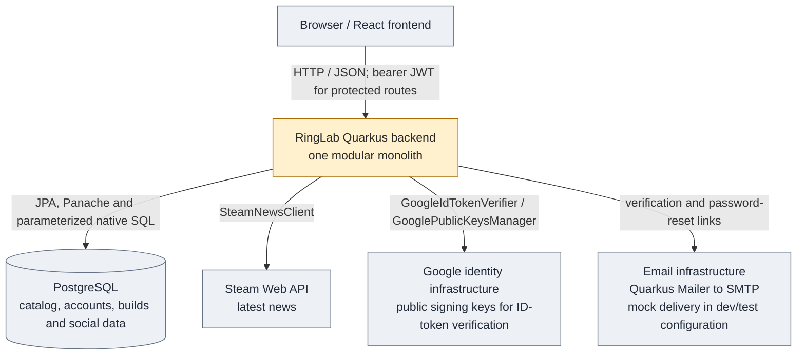
```mermaid
flowchart TB
  browser["Browser / React frontend"]:::outside
  backend["RingLab Quarkus backend<br/>one modular monolith"]:::app
  db[("PostgreSQL<br/>catalog, accounts, builds and social data")]:::outside
  steam["Steam Web API<br/>latest news"]:::outside
  google["Google identity infrastructure<br/>public signing keys for ID-token verification"]:::outside
  email["Email infrastructure<br/>Quarkus Mailer to SMTP<br/>mock delivery in dev/test configuration"]:::outside
  browser -->|"HTTP / JSON; bearer JWT for protected routes"| backend
  backend -->|"JPA, Panache and parameterized native SQL"| db
  backend -->|"SteamNewsClient"| steam
  backend -->|"GoogleIdTokenVerifier / GooglePublicKeysManager"| google
  backend -->|"verification and password-reset links"| email
  classDef app fill:#fff0ce,stroke:#a96b00,color:#272727
  classDef outside fill:#edf0f4,stroke:#657184,color:#202938
```

**How to read this:** every backend feature shares the same process and database. Google's
library verifies the supplied credential and may fetch public keys; this is not a backend
Google password login. No recommendation or stats request calls a remote game calculator.
[Diagram source](architecture/system-context.mmd).

## 2. Layers and dependency direction

Why can a service be tested without PostgreSQL? It receives an interface, while CDI supplies
the concrete implementation at runtime. This diagram separates source dependencies from
that implementation choice.

<!-- diagram: hexagonal-overview -->
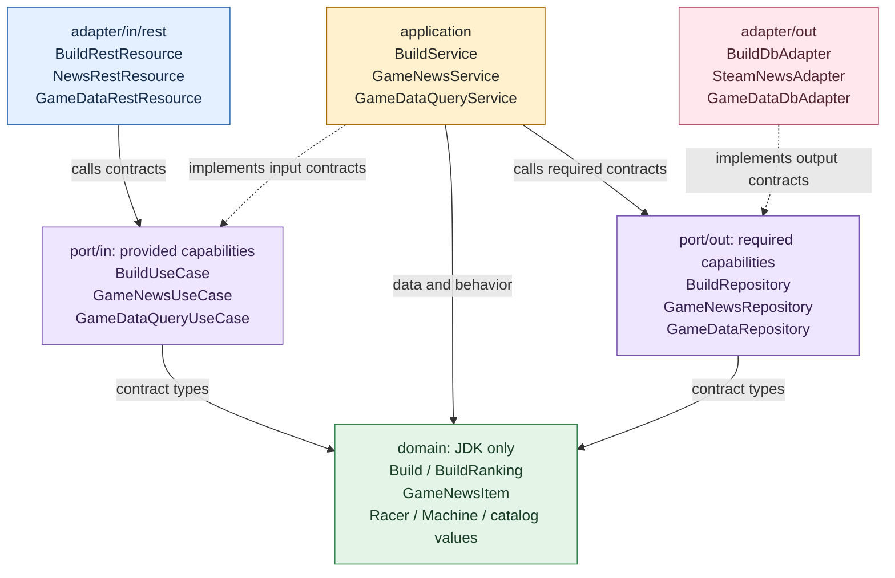
```mermaid
flowchart TB
  inbound["adapter/in/rest<br/>BuildRestResource<br/>NewsRestResource<br/>GameDataRestResource"]:::rest
  application["application<br/>BuildService<br/>GameNewsService<br/>GameDataQueryService"]:::app
  outbound["adapter/out<br/>BuildDbAdapter<br/>SteamNewsAdapter<br/>GameDataDbAdapter"]:::adapter
  inputs["port/in: provided capabilities<br/>BuildUseCase<br/>GameNewsUseCase<br/>GameDataQueryUseCase"]:::port
  outputs["port/out: required capabilities<br/>BuildRepository<br/>GameNewsRepository<br/>GameDataRepository"]:::port
  domain["domain: JDK only<br/>Build / BuildRanking<br/>GameNewsItem<br/>Racer / Machine / catalog values"]:::domain
  inbound -->|"calls contracts"| inputs
  application -.->|"implements input contracts"| inputs
  application -->|"calls required contracts"| outputs
  outbound -.->|"implements output contracts"| outputs
  inputs -->|"contract types"| domain
  application -->|"data and behavior"| domain
  outputs -->|"contract types"| domain
  classDef rest fill:#e4efff,stroke:#356db4,color:#142b49
  classDef app fill:#fff0ce,stroke:#a96b00,color:#272727
  classDef domain fill:#e4f5e8,stroke:#37834c,color:#183d24
  classDef port fill:#eee6ff,stroke:#7954b1,color:#35214f
  classDef adapter fill:#ffe7ed,stroke:#b45370,color:#502333
```

**How to read this:** `BuildService` knows builds must be stored, but does not know JPA or
PostgreSQL. It calls `BuildRepository`; `BuildDbAdapter` implements that contract. At runtime
the call reaches the adapter, although the adapter's Java dependency points toward the port.
The news path uses exactly the same boundary for HTTP infrastructure.
[Diagram source](architecture/hexagonal-overview.mmd).

The implemented architecture is pragmatic. Application code uses CDI and transaction
annotations; `AuthService` and `PasswordResetService` use Quarkus `BcryptUtil` directly.
REST calls feature-oriented input ports for capabilities, including catalog/rule queries,
account validity, verification delivery and saved-list vote summaries. Application services
implement those contracts; internal helpers retain direct collaboration. DB adapters
translate selected constraint failures into application exceptions. `RaceMapDbEntity`
converts itself with `toDomain()` instead of using MapStruct. These are actual boundaries,
not omissions from an idealized design.

Source trail: [architecture guard](../backend/src/test/java/dev/ringlab/ArchitectureTest.java),
[BuildService](../backend/src/main/java/dev/ringlab/application/build/BuildService.java),
[BuildDbAdapter](../backend/src/main/java/dev/ringlab/adapter/out/db/build/BuildDbAdapter.java).

### Input boundary and internal collaboration

The runtime path is deliberately symmetrical. The two dashed bindings below do not imply
that an interface imports its implementation. Both ports are framework-free; implementation
dependencies point inward. Input ports describe outside-facing capabilities, not every internal
method. Solvers, validators and calculators retain ordinary direct calls.

<!-- diagram: inbound-ports -->
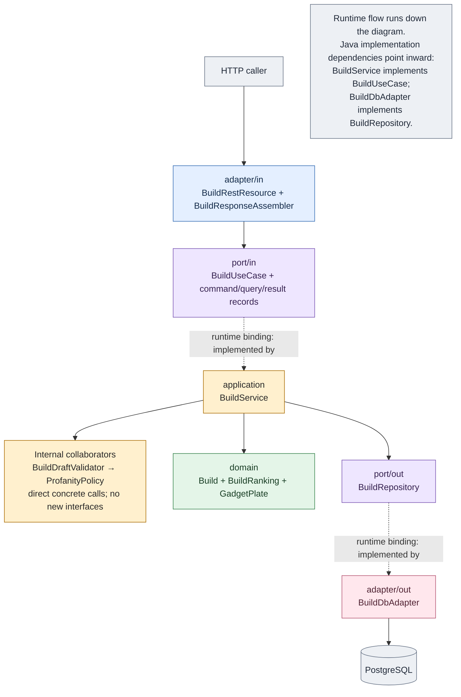
```mermaid
flowchart TB
  outside["HTTP caller"]:::outside --> resource["adapter/in<br/>BuildRestResource + BuildResponseAssembler"]:::rest
  resource --> input["port/in<br/>BuildUseCase + command/query/result records"]:::port
  input -.->|"runtime binding: implemented by"| service["application<br/>BuildService"]:::app
  service --> internal["Internal collaborators<br/>BuildDraftValidator → ProfanityPolicy<br/>direct concrete calls; no new interfaces"]:::app
  service --> domain["domain<br/>Build + BuildRanking + GadgetPlate"]:::domain
  service --> output["port/out<br/>BuildRepository"]:::port
  output -.->|"runtime binding: implemented by"| adapter["adapter/out<br/>BuildDbAdapter"]:::adapter
  adapter --> db[("PostgreSQL")]:::outside
  note["Runtime flow runs down the diagram.<br/>Java implementation dependencies point inward:<br/>BuildService implements BuildUseCase;<br/>BuildDbAdapter implements BuildRepository."]:::outside
  classDef rest fill:#e4efff,stroke:#356db4,color:#142b49
  classDef port fill:#eee6ff,stroke:#7954b1,color:#35214f
  classDef app fill:#fff0ce,stroke:#a96b00,color:#272727
  classDef domain fill:#e4f5e8,stroke:#37834c,color:#183d24
  classDef adapter fill:#ffe7ed,stroke:#b45370,color:#502333
  classDef outside fill:#edf0f4,stroke:#657184,color:#202938
```

[Diagram source](architecture/inbound-ports.mmd). The complete
[port-to-implementation-to-consumer table](architecture.md#input-port-bindings-and-consumers)
and [before-refactor audit](architecture.md#inbound-audit-and-preserved-sequencing) include all
resources and response/authentication helpers. `BuildUseCase.Draft/Filter/Query/Page`, social
page/results, base catalog/rule results and `CommunitySnapshot` are boundary-owned contracts.
REST request/response DTOs stay outside; `BuildService` explicitly converts the input filter
to the unchanged output repository filter.

The only intentional inbound dependencies on `application` are seven exact semantic errors
for transport validation/mapping. `ArchitectureTest` rejects all other application types and
all `port/out` dependencies from inbound adapters, including helpers. Rate limiting remains
adapter-local. Application-to-application collaboration, such as recommendation-to-collection,
does not use input ports. Outbound adapters cannot reach `port/in`.

## 3. Complete backend entry-point map

Where does a request go next? This overview includes all **16 REST resource classes** and
their input ports, implementations and transport helpers. Continue into the linked feature diagrams
for validation, domain calculations, ports and tables. `CurrentUser` is shared by protected
routes and expanded in the authentication diagram, rather than repeated on every edge.

<!-- diagram: backend-complete-map -->
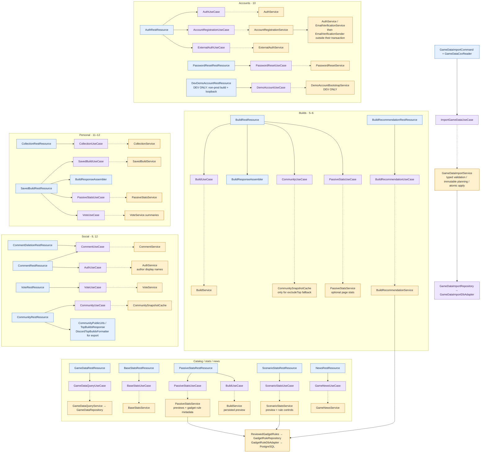
```mermaid
flowchart TB
  subgraph accounts["Accounts · 10"]
    direction LR
    ar["AuthRestResource"]:::rest --> auth["AuthUseCase"]:::port -.-> as["AuthService"]:::app
    ar --> registration["AccountRegistrationUseCase"]:::port -.-> coordinator["AccountRegistrationService"]:::app
    coordinator --> ev["AuthService / EmailVerificationService<br/>then EmailVerificationSender outside their transaction"]:::app
    ar --> external["ExternalAuthUseCase"]:::port -.-> ea["ExternalAuthService"]:::app
    pr["PasswordResetRestResource"]:::rest --> reset["PasswordResetUseCase"]:::port -.-> ps["PasswordResetService"]:::app
    dev["DevDemoAccountRestResource<br/>DEV ONLY: non-prod build + loopback"]:::rest --> demo["DemoAccountUseCase"]:::port -.-> ds["DemoAccountBootstrapService<br/>DEV ONLY"]:::app
  end
  subgraph builds["Builds · 5–6"]
    direction LR
    br["BuildRestResource"]:::rest --> build["BuildUseCase"]:::port -.-> bs["BuildService"]:::app
    br --> bra["BuildResponseAssembler"]:::rest
    br --> community["CommunityUseCase"]:::port -.-> cache["CommunitySnapshotCache<br/>only for excludeTop fallback"]:::app
    br --> passiveInput["PassiveStatsUseCase"]:::port -.-> passive["PassiveStatsService<br/>optional page stats"]:::app
    rec["BuildRecommendationRestResource"]:::rest --> recommendation["BuildRecommendationUseCase"]:::port -.-> recs["BuildRecommendationService"]:::app
  end
  subgraph personal["Personal · 11–12"]
    direction LR
    cr["CollectionRestResource"]:::rest --> collection["CollectionUseCase"]:::port -.-> cs["CollectionService"]:::app
    sr["SavedBuildRestResource"]:::rest --> saved["SavedBuildUseCase"]:::port -.-> ss["SavedBuildService"]:::app
    sr --> sra["BuildResponseAssembler"]:::rest
    sr --> savedStats["PassiveStatsUseCase"]:::port -.-> sps["PassiveStatsService"]:::app
    sr --> savedVotes["VoteUseCase"]:::port -.-> vp["VoteService.summaries"]:::app
  end
  subgraph social["Social · 9, 12"]
    direction LR
    cor["CommentRestResource"]:::rest --> comments["CommentUseCase"]:::port -.-> cos["CommentService"]:::app
    cor --> authors["AuthUseCase"]:::port -.-> uas["AuthService<br/>author display names"]:::app
    cdr["CommentDeletionRestResource"]:::rest --> comments
    vr["VoteRestResource"]:::rest --> votes["VoteUseCase"]:::port -.-> vs["VoteService"]:::app
    comr["CommunityRestResource"]:::rest --> snapshot["CommunityUseCase"]:::port -.-> comc["CommunitySnapshotCache"]:::app
    comr --> urls["CommunityPublicUrls / TopBuildsResponse<br/>DiscordTopBuildsFormatter for export"]:::rest
  end
  subgraph catalog["Catalog / stats / news"]
    direction LR
    gr["GameDataRestResource"]:::rest --> game["GameDataQueryUseCase"]:::port -.-> gp["GameDataQueryService → GameDataRepository"]:::app
    bsr["BaseStatsRestResource"]:::rest --> base["BaseStatsUseCase"]:::port -.-> bss["BaseStatsService"]:::app
    pssr["PassiveStatsRestResource"]:::rest --> psInput["PassiveStatsUseCase"]:::port -.-> pss["PassiveStatsService<br/>previews + gadget rule metadata"]:::app
    pssr --> persisted["BuildUseCase"]:::port -.-> pbs["BuildService<br/>persisted preview"]:::app
    scr["ScenarioStatsRestResource"]:::rest --> scenario["ScenarioStatsUseCase"]:::port -.-> scs["ScenarioStatsService<br/>preview + rule controls"]:::app
    nr["NewsRestResource"]:::rest --> news["GameNewsUseCase"]:::port -.-> ns["GameNewsService"]:::app
  end
  %% Invisible links stack independent feature panels; they are not calls.
  pss --> ruleLoader["ReviewedGadgetRules → GadgetRuleRepository<br/>GadgetRuleDbAdapter → PostgreSQL"]:::app
  scs --> ruleLoader
  recs --> ruleLoader
  command["GameDataImportCommand + GameDataCsvReader"]:::rest --> importInput["ImportGameDataUseCase"]:::port
  importInput -.-> importService["GameDataImportService<br/>typed validation / immutable planning / atomic apply"]:::app
  importService --> importOutput["GameDataImportRepository → GameDataImportDbAdapter"]:::port
  accounts ~~~ builds ~~~ personal ~~~ social ~~~ catalog
  classDef rest fill:#e4efff,stroke:#356db4,color:#142b49
  classDef app fill:#fff0ce,stroke:#a96b00,color:#272727
  classDef domain fill:#e4f5e8,stroke:#37834c,color:#183d24
  classDef port fill:#eee6ff,stroke:#7954b1,color:#35214f
```

**How to read this:** scroll through the feature panels, follow each resource's direct
left-to-right edge, then use its section. The vertical panel order is only a reading order.
Repeated labels represent the same class, not separate instances or microservices.
Rule-catalog endpoints use `PassiveStatsUseCase.rules` and `ScenarioStatsUseCase.rules`;
the application retrieves domain rule metadata. They do not calculate recommendations. The single development resource is excluded from `prod` builds.
[Diagram source](architecture/backend-complete-map.mmd).

The overview intentionally ends before every shared dependency. The next diagram supplies
all output-port bindings, and feature diagrams show exactly which of them each service calls.
There are **45 explicitly annotated method/path endpoints: 44 production and 1 development**.
Automatic HEAD/OPTIONS handling, framework management endpoints and test-only resources
are outside that count. In particular, `VerificationMailResource` lives under `src/test`
and is not a production API.

## 4. Outbound contracts and implementations

What concrete code handles an outbound operation? Every flat `port/out` interface has one
current runtime implementation. These dashed arrows mean **implemented by**, not direct
source imports from ports to adapters. The table later maps each storage adapter to entities.

<!-- diagram: outbound-adapters -->
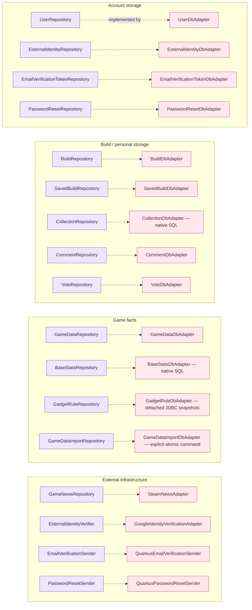
```mermaid
flowchart TB
  subgraph auth["Account storage"]
    direction LR
    u["UserRepository"]:::port -.->|"implemented by"| ua["UserDbAdapter"]:::adapter
    e["ExternalIdentityRepository"]:::port -.-> ea["ExternalIdentityDbAdapter"]:::adapter
    v["EmailVerificationTokenRepository"]:::port -.-> va["EmailVerificationTokenDbAdapter"]:::adapter
    p["PasswordResetRepository"]:::port -.-> pa["PasswordResetDbAdapter"]:::adapter
  end
  subgraph community["Build / personal storage"]
    direction LR
    b["BuildRepository"]:::port -.-> ba["BuildDbAdapter"]:::adapter
    s["SavedBuildRepository"]:::port -.-> sa["SavedBuildDbAdapter"]:::adapter
    c["CollectionRepository"]:::port -.-> ca["CollectionDbAdapter — native SQL"]:::adapter
    co["CommentRepository"]:::port -.-> coa["CommentDbAdapter"]:::adapter
    vo["VoteRepository"]:::port -.-> voa["VoteDbAdapter"]:::adapter
  end
  subgraph facts["Game facts"]
    direction LR
    g["GameDataRepository"]:::port -.-> ga["GameDataDbAdapter"]:::adapter
    st["BaseStatsRepository"]:::port -.-> sta["BaseStatsDbAdapter — native SQL"]:::adapter
    gr["GadgetRuleRepository"]:::port -.-> gra["GadgetRuleDbAdapter — detached JDBC snapshots"]:::adapter
    gi["GameDataImportRepository"]:::port -.-> gia["GameDataImportDbAdapter — explicit atomic command"]:::adapter
  end
  subgraph external["External infrastructure"]
    direction LR
    n["GameNewsRepository"]:::port -.-> na["SteamNewsAdapter"]:::adapter
    i["ExternalIdentityVerifier"]:::port -.-> ia["GoogleIdentityVerificationAdapter"]:::adapter
    m["EmailVerificationSender"]:::port -.-> ma["QuarkusEmailVerificationSender"]:::adapter
    r["PasswordResetSender"]:::port -.-> ra["QuarkusPasswordResetSender"]:::adapter
  end
  %% Layout only: stack the four independent binding panels.
  auth ~~~ community ~~~ facts ~~~ external
  classDef port fill:#eee6ff,stroke:#7954b1,color:#35214f
  classDef adapter fill:#ffe7ed,stroke:#b45370,color:#502333
```

**How to read this:** there are **17 ports and 17 concrete outbound implementations**:
13 storage adapters and 4 external adapters. Mail senders count as adapters despite their
names. `SteamNewsClient` is a library-generated HTTP client interface, not a second port
or an eighteenth concrete adapter. [Diagram source](architecture/outbound-adapters.mmd).

## 5. Build lifecycle

### 5.1 Create, edit and remix

How does a JSON draft become stored build data? Authentication supplies the actor;
`BuildService` owns use-case sequencing and ownership; `BuildDraftValidator` checks the
draft; domain rules check composition/plate fit. The three mutation variants share this
pipeline, but their identity/provenance behavior differs in the table below.

<!-- diagram: build-flow -->
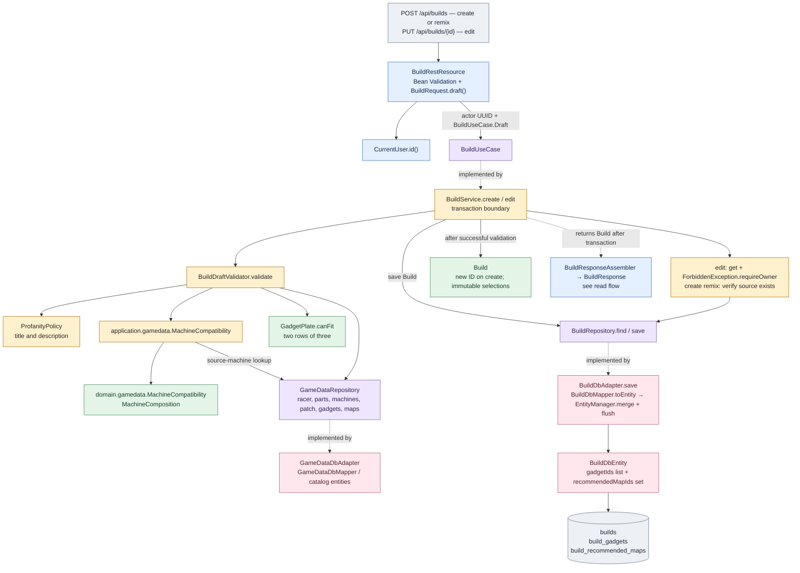
```mermaid
flowchart TB
  http["POST /api/builds — create or remix<br/>PUT /api/builds/{id} — edit"]:::outside
  rest["BuildRestResource<br/>Bean Validation + BuildRequest.draft()"]:::rest
  actor["CurrentUser.id()"]:::rest
  svc["BuildService.create / edit<br/>transaction boundary"]:::app
  existing["edit: get + ForbiddenException.requireOwner<br/>create remix: verify source exists"]:::app
  draft["BuildDraftValidator.validate"]:::app
  profanity["ProfanityPolicy<br/>title and description"]:::app
  compat["application.gamedata.MachineCompatibility"]:::app
  rules["domain.gamedata.MachineCompatibility<br/>MachineComposition"]:::domain
  plate["GadgetPlate.canFit<br/>two rows of three"]:::domain
  game["GameDataRepository<br/>racer, parts, machines, patch, gadgets, maps"]:::port
  ga["GameDataDbAdapter<br/>GameDataDbMapper / catalog entities"]:::adapter
  build["Build<br/>new ID on create; immutable selections"]:::domain
  repo["BuildRepository.find / save"]:::port
  db["BuildDbAdapter.save<br/>BuildDbMapper.toEntity → EntityManager.merge + flush"]:::adapter
  entity["BuildDbEntity<br/>gadgetIds list + recommendedMapIds set"]:::adapter
  tables[("builds<br/>build_gadgets<br/>build_recommended_maps")]:::outside
  response["BuildResponseAssembler → BuildResponse<br/>see read flow"]:::rest
  http --> rest
  rest --> actor
  rest -->|"actor UUID + BuildUseCase.Draft"| input["BuildUseCase"]:::port
  input -.->|"implemented by"| svc
  svc --> existing
  existing --> repo
  svc --> draft
  draft --> profanity
  draft --> compat
  compat --> rules
  draft --> plate
  draft --> game
  compat -->|"source-machine lookup"| game
  game -.->|"implemented by"| ga
  svc -->|"after successful validation"| build
  svc -->|"save Build"| repo
  repo -.->|"implemented by"| db
  db --> entity --> tables
  svc -.->|"returns Build after transaction"| response
  classDef rest fill:#e4efff,stroke:#356db4,color:#142b49
  classDef app fill:#fff0ce,stroke:#a96b00,color:#272727
  classDef domain fill:#e4f5e8,stroke:#37834c,color:#183d24
  classDef port fill:#eee6ff,stroke:#7954b1,color:#35214f
  classDef adapter fill:#ffe7ed,stroke:#b45370,color:#502333
  classDef outside fill:#edf0f4,stroke:#657184,color:#202938
```

**How to read this:** `create` and `edit` call the validator; the validator does not persist.
The actor helper reads `UserRepository` as expanded in [10.2](#102-login-jwt-and-current-user).
The REST resource calls response assembly after the service returns; the dashed return edge
does not mean the application imports the REST assembler. [Diagram source](architecture/build-flow.mmd).

| Path | Actual service sequence | What changes or stays fixed |
| --- | --- | --- |
| **Create** | `create(actor, draft)` → validate → optional remix-source lookup → construct `Build` → `save` | New UUID; authenticated author; title trimmed; new creation/update timestamps. |
| **Edit** | `edit(id, actor, draft)` → `get` → owner check → validate → construct replacement → `save` | Keeps ID, author, creation time and existing remix provenance; updates selections/text and update time. |
| **Remix** | The **same POST create endpoint**, with `remixedFromBuildId` | New independent build and authenticated author; source must exist. No separate remix endpoint or automatic server-side copy. The client submits the copied/edited draft. |

`BuildRequest` rejects explicit JSON null/non-array map selections. Omitted maps become
All maps on create and preserve the existing set on edit; an empty array deliberately means
All maps. The application validates distinct known map IDs. Map preferences do not influence
stats, compatibility or recommendations.

Publishing requires a known racer and patch, FRONT and REAR parts, and TIRE for non-BOOST
source-machine types. Parts can come from different machines **of the same racing type**.
BOOST uses FRONT/REAR only. Racer type is independent of machine type. Current gadget costs
must be known and within 1–3; duplicates are rejected. `GadgetPlate` tests a partition into
two rows, so three gadgets costing two slots each do not fit even though their sum is six.
The application `MachineCompatibility` facade converts the pure domain rule's
`IllegalArgumentException` into `ValidationException`.

Source trail: [resource](../backend/src/main/java/dev/ringlab/adapter/in/rest/build/BuildRestResource.java),
[request](../backend/src/main/java/dev/ringlab/adapter/in/rest/build/request/BuildRequest.java),
[service](../backend/src/main/java/dev/ringlab/application/build/BuildService.java),
[validator](../backend/src/main/java/dev/ringlab/application/build/BuildDraftValidator.java),
[plate](../backend/src/main/java/dev/ringlab/domain/build/GadgetPlate.java).

### 5.2 Read and response assembly

Why is a returned build richer than a `Build` record? Stored IDs cross the repository port,
then the inbound assembler resolves display data. It does not expose `BuildDbEntity`.
Single-item assembly reads votes itself; list assembly reuses already fetched summaries.

<!-- diagram: build-read-flow -->
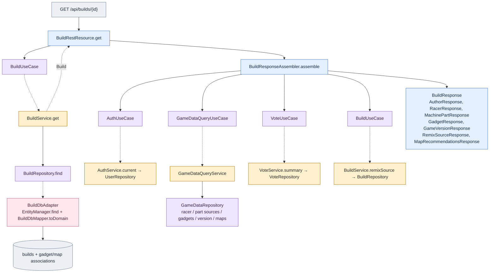
```mermaid
flowchart TB
  h["GET /api/builds/{id}"]:::outside --> r["BuildRestResource.get"]:::rest
  r --> input["BuildUseCase"]:::port -.-> s["BuildService.get"]:::app
  s --> p["BuildRepository.find"]:::port
  p -.-> a["BuildDbAdapter<br/>EntityManager.find + BuildDbMapper.toDomain"]:::adapter
  a --> t[("builds + gadget/map associations")]:::outside
  s -.->|"Build"| r
  r --> x["BuildResponseAssembler.assemble"]:::rest
  x --> auth["AuthUseCase"]:::port -.-> u["AuthService.current → UserRepository"]:::app
  x --> catalog["GameDataQueryUseCase"]:::port -.-> query["GameDataQueryService"]:::app --> g["GameDataRepository<br/>racer / part sources / gadgets / version / maps"]:::port
  x --> votes["VoteUseCase"]:::port -.-> v["VoteService.summary → VoteRepository"]:::app
  x --> remixes["BuildUseCase"]:::port -.-> remix["BuildService.remixSource → BuildRepository"]:::app
  x --> dto["BuildResponse<br/>AuthorResponse, RacerResponse, MachinePartResponse<br/>GadgetResponse, GameVersionResponse<br/>RemixSourceResponse, MapRecommendationsResponse"]:::rest
  classDef rest fill:#e4efff,stroke:#356db4,color:#142b49
  classDef app fill:#fff0ce,stroke:#a96b00,color:#272727
  classDef port fill:#eee6ff,stroke:#7954b1,color:#35214f
  classDef adapter fill:#ffe7ed,stroke:#b45370,color:#502333
  classDef outside fill:#edf0f4,stroke:#657184,color:#202938
```

**How to read this:** `BuildService.get` supplies identity/selection data; the REST assembler
adds public names and score facts. `assembleAll` loads the map catalog at most once per page,
but other author/catalog/provenance lookups remain straightforward per-build lookups.
[Diagram source](architecture/build-read-flow.mmd).

Source trail: [BuildResponseAssembler](../backend/src/main/java/dev/ringlab/adapter/in/rest/build/BuildResponseAssembler.java),
[BuildDbEntity](../backend/src/main/java/dev/ringlab/adapter/out/db/build/BuildDbEntity.java),
[BuildDbMapper](../backend/src/main/java/dev/ringlab/adapter/out/db/build/BuildDbMapper.java).

### 5.3 Search, ranking and pagination

Who filters, sorts and counts? PostgreSQL filters and supplies candidate facts; `BuildService`
ranks the complete matching set, slices a page, and restores rank order after hydration.
The current default is `rated`, not `newest`. Search covers title **and selected catalog names**.

<!-- diagram: search-flow -->
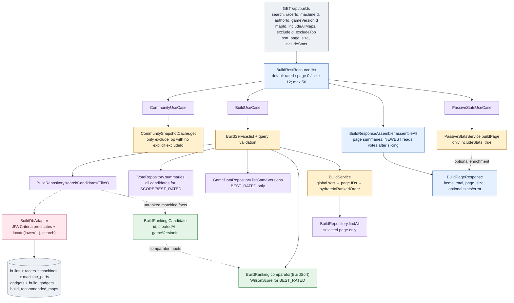
```mermaid
flowchart TB
  h["GET /api/builds<br/>search, racerId, machineId, authorId, gameVersionId<br/>mapId, includeAllMaps, excludeId, excludeTop<br/>sort, page, size, includeStats"]:::outside
  r["BuildRestResource.list<br/>default rated / page 0 / size 12; max 50"]:::rest
  cache["CommunitySnapshotCache.get<br/>only excludeTop with no explicit excludeId"]:::app
  s["BuildService.list + query validation"]:::app
  p["BuildRepository.searchCandidates(Filter)"]:::port
  a["BuildDbAdapter<br/>JPA Criteria predicates + locate(lower(...), search)"]:::adapter
  db[("builds + racers + machines + machine_parts<br/>gadgets + build_gadgets + build_recommended_maps")]:::outside
  facts["BuildRanking.Candidate<br/>id, createdAt, gameVersionId"]:::domain
  votes["VoteRepository.summaries<br/>all candidates for SCORE/BEST_RATED"]:::port
  versions["GameDataRepository.listGameVersions<br/>BEST_RATED only"]:::port
  rank["BuildRanking.comparator(BuildSort)<br/>WilsonScore for BEST_RATED"]:::domain
  page["BuildService<br/>global sort → page IDs → hydrateInRankedOrder"]:::app
  full["BuildRepository.findAll<br/>selected page only"]:::port
  assembly["BuildResponseAssembler.assembleAll<br/>page summaries; NEWEST reads votes after slicing"]:::rest
  optional["PassiveStatsService.buildPage<br/>only includeStats=true"]:::app
  out["BuildPageResponse<br/>items, total, page, size; optional stats/error"]:::rest
  h --> r
  r --> community["CommunityUseCase"]:::port -.-> cache
  r --> input["BuildUseCase"]:::port -.-> s
  s --> p
  p -.-> a --> db
  p -.->|"unranked matching facts"| facts
  s --> votes
  s --> versions
  s --> rank
  facts -.->|"comparator inputs"| rank
  s --> page --> full
  r --> assembly
  r --> passive["PassiveStatsUseCase"]:::port -.-> optional
  assembly --> out
  optional -.->|"optional enrichment"| out
  classDef rest fill:#e4efff,stroke:#356db4,color:#142b49
  classDef app fill:#fff0ce,stroke:#a96b00,color:#272727
  classDef domain fill:#e4f5e8,stroke:#37834c,color:#183d24
  classDef port fill:#eee6ff,stroke:#7954b1,color:#35214f
  classDef adapter fill:#ffe7ed,stroke:#b45370,color:#502333
  classDef outside fill:#edf0f4,stroke:#657184,color:#202938
```

**How to read this:** the candidate query has no ranking/pagination promise. The page total
is the size of the filtered candidate list before slicing, including an out-of-range empty
page. Hydration order from the DB is unspecified, so the service rebuilds it from page IDs.
[Diagram source](architecture/search-flow.mmd).

Search is a case-insensitive literal substring over title, racer name, selected parts'
source-machine names and selected gadget names. Blank search is ignored; `%` and `_` stay
literal because Criteria uses `locate`, not `LIKE`. `machineId` matches any selected part's
source. Map filtering combines explicit membership with optionally including empty/All maps.
Explicit excluded IDs take precedence over the cached Top 3 fallback and are applied before
counting/ranking. Optional stats failure preserves the build page and supplies a safe error.

This implementation holds all matching candidate facts in memory and sorts them globally.
Only full builds are page-bounded; total ranking work is not bounded by the page size.
See [9](#9-community-and-ranking) for exact comparator order.

### 5.4 Delete

What disappears when the author deletes a build? The service checks ownership; persistence
removes the entity and relational constraints handle dependent rows. Remixes survive.

<!-- diagram: build-delete-flow -->
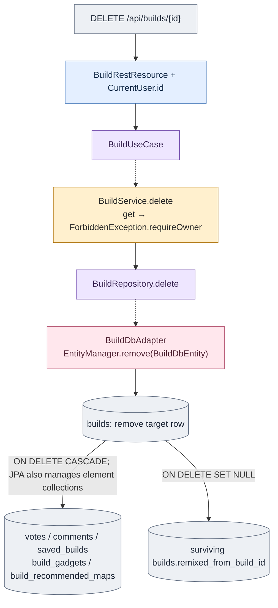
```mermaid
flowchart TB
  h["DELETE /api/builds/{id}"]:::outside --> r["BuildRestResource + CurrentUser.id"]:::rest
  r --> input["BuildUseCase"]:::port -.-> s["BuildService.delete<br/>get → ForbiddenException.requireOwner"]:::app
  s --> p["BuildRepository.delete"]:::port
  p -.-> a["BuildDbAdapter<br/>EntityManager.remove(BuildDbEntity)"]:::adapter
  a --> b[("builds: remove target row")]:::outside
  b -->|"ON DELETE CASCADE; JPA also manages element collections"| deps[("votes / comments / saved_builds<br/>build_gadgets / build_recommended_maps")]:::outside
  b -->|"ON DELETE SET NULL"| remix[("surviving builds.remixed_from_build_id")]:::outside
  classDef rest fill:#e4efff,stroke:#356db4,color:#142b49
  classDef app fill:#fff0ce,stroke:#a96b00,color:#272727
  classDef port fill:#eee6ff,stroke:#7954b1,color:#35214f
  classDef adapter fill:#ffe7ed,stroke:#b45370,color:#502333
  classDef outside fill:#edf0f4,stroke:#657184,color:#202938
```

**How to read this:** no REST deletion loop calls vote/comment services. The DB constraints
provide the final deletion behavior. Top 3 has no write-triggered invalidation, so an older
snapshot can remain visible until refresh after expiry. Concurrent same-author edits have
no optimistic version field and use last-write-wins behavior.
[Diagram source](architecture/build-delete-flow.mmd).

## 6. Recommendation flow

### 6.1 HTTP to detached facts to proposal

What does Calculate Recommendation read, and what does it save? It authenticates the user,
loads a chosen-patch catalog and private exclusions, then searches immutable in-memory
facts. **NO BUILD IS PERSISTED.** There is no `BuildRepository` dependency in this use case.

<!-- diagram: recommendation-flow -->
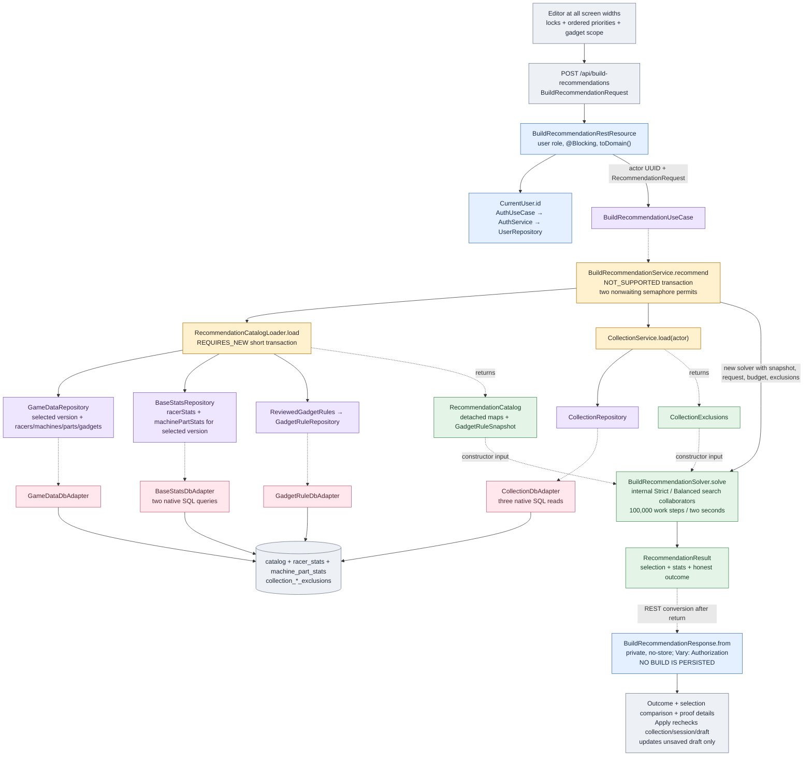
```mermaid
flowchart TB
  ui["Editor at all screen widths<br/>locks + ordered priorities + gadget scope"]:::outside
  view["Outcome + selection comparison + proof details<br/>Apply rechecks collection/session/draft<br/>updates unsaved draft only"]:::outside
  h["POST /api/build-recommendations<br/>BuildRecommendationRequest"]:::outside
  r["BuildRecommendationRestResource<br/>user role, @Blocking, toDomain()"]:::rest
  actor["CurrentUser.id<br/>AuthUseCase → AuthService → UserRepository"]:::rest
  s["BuildRecommendationService.recommend<br/>NOT_SUPPORTED transaction<br/>two nonwaiting semaphore permits"]:::app
  loader["RecommendationCatalogLoader.load<br/>REQUIRES_NEW short transaction"]:::app
  col["CollectionService.load(actor)"]:::app
  gp["GameDataRepository<br/>selected version + racers/machines/parts/gadgets"]:::port
  sp["BaseStatsRepository<br/>racerStats + machinePartStats for selected version"]:::port
  cp["CollectionRepository"]:::port
  ga["GameDataDbAdapter"]:::adapter
  sa["BaseStatsDbAdapter<br/>two native SQL queries"]:::adapter
  ca["CollectionDbAdapter<br/>three native SQL reads"]:::adapter
  db[("catalog + racer_stats + machine_part_stats<br/>collection_*_exclusions")]:::outside
  cat["RecommendationCatalog<br/>detached maps + GadgetRuleSnapshot"]:::domain
  exc["CollectionExclusions"]:::domain
  solver["BuildRecommendationSolver.solve<br/>internal Strict / Balanced search collaborators<br/>100,000 work steps / two seconds"]:::domain
  result["RecommendationResult<br/>selection + stats + honest outcome"]:::domain
  response["BuildRecommendationResponse.from<br/>private, no-store; Vary: Authorization<br/>NO BUILD IS PERSISTED"]:::rest
  ui --> h --> r
  r --> actor
  r -->|"actor UUID + RecommendationRequest"| input["BuildRecommendationUseCase"]:::port
  input -.-> s
  s --> loader
  loader --> gp
  loader --> sp
  loader --> rules["ReviewedGadgetRules → GadgetRuleRepository"]:::port
  rules -.-> ruleAdapter["GadgetRuleDbAdapter"]:::adapter --> db
  gp -.-> ga
  sp -.-> sa
  ga --> db
  sa --> db
  loader -.->|"returns"| cat
  s --> col --> cp
  cp -.-> ca --> db
  col -.->|"returns"| exc
  s -->|"new solver with snapshot, request, budget, exclusions"| solver
  cat -.->|"constructor input"| solver
  exc -.->|"constructor input"| solver
  solver --> result
  result -.->|"REST conversion after return"| response
  response --> view
  classDef rest fill:#e4efff,stroke:#356db4,color:#142b49
  classDef app fill:#fff0ce,stroke:#a96b00,color:#272727
  classDef domain fill:#e4f5e8,stroke:#37834c,color:#183d24
  classDef port fill:#eee6ff,stroke:#7954b1,color:#35214f
  classDef adapter fill:#ffe7ed,stroke:#b45370,color:#502333
  classDef outside fill:#edf0f4,stroke:#657184,color:#202938
```

**How to read this:** catalog I/O finishes before CPU search. Collection loading is a
separate service transaction; these are not one atomic snapshot of catalog plus ownership.
The two-second solver budget starts when the solver is constructed, after those reads.
Title, description, map preferences, vote counts and ScenarioContext do not enter the solver.
Applying a proposal changes the client's draft; publishing later follows section 5.
[Diagram source](architecture/recommendation-flow.mmd).

The editor exposes recommendations at every viewport width. `useEditorRecommendationLocks`
preserves locks across resizing; `useBuildRecommendation` owns cancellation, account/draft/
configuration checks and collection revision validation. Canceled Apply refreshes cannot
write a draft or replace newer errors. `RecommendationSelectionComparison` presents the
same Added/Changed/Kept rows in both modes, omitting Current for incomplete totals.
`RecommendationExplanation` separates all six outcomes, active priority order, proven
Balanced stages and collapsed technical details. It never runs the optimizer in React.
Scenario Preview continues through its own endpoint and calculator.

### 6.2 Strict and Balanced inside the solver

How does the solver choose a candidate? Both modes preserve hard constraints and reuse the
same passive evaluator. Strict can choose component maxima independently within fixed type
groups. Balanced streams survivor passes because its loss floors concern the complete loadout.
`BuildRecommendationSolver` retains validation/reference orchestration, mode dispatch and result
wording. Its package-private collaborators are internal domain implementation, with no
new ports, services or repositories. `RecommendationCandidates` keeps legal/evaluable candidate
preparation together; `RecommendationStatsEvaluator` owns full-selection and subset passive evaluation;
`RecommendationCandidateOrder` owns active lexicographic comparison, convenience ties and
incumbent tracking. Strict and Balanced retain separate search code and shared unchanged
budgets. Gadget-subset traversal is shared; no generic search framework is used.
The shared traversal now accepts `GadgetRecommendationScope`: `KEEP_CURRENT`
(default) evaluates only the exact current ordered gadget plate per type;
`OPTIMIZE_UNLOCKED` enumerates subsets extending explicit gadget locks.
The REST field is `gadgetScope`; the UI includes it in configuration identity.
Both scopes evaluate passive-adjusted candidate totals before Balanced thresholds are applied.

<!-- diagram: recommendation-solver -->
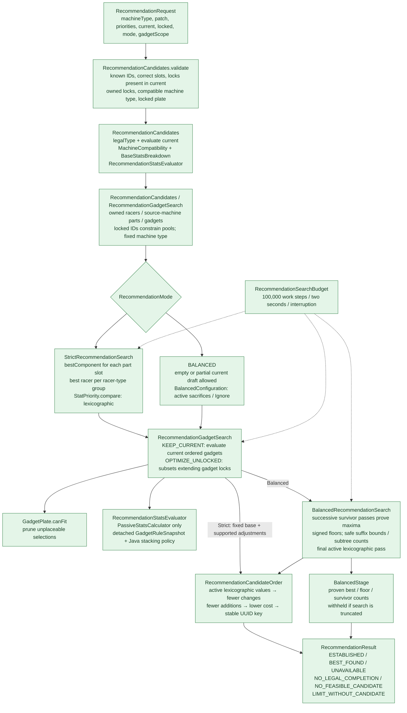
```mermaid
flowchart TB
  req["RecommendationRequest<br/>machineType, patch, priorities, current, locked, mode, gadgetScope"]:::domain
  validate["RecommendationCandidates.validate<br/>known IDs, correct slots, locks present in current<br/>owned locks, compatible machine type, locked plate"]:::domain
  baseline["RecommendationCandidates<br/>legalType + evaluate current<br/>MachineCompatibility + BaseStatsBreakdown<br/>RecommendationStatsEvaluator"]:::domain
  pools["RecommendationCandidates / RecommendationGadgetSearch<br/>owned racers / source-machine parts / gadgets<br/>locked IDs constrain pools; fixed machine type"]:::domain
  branch{"RecommendationMode"}:::domain
  strict["StrictRecommendationSearch<br/>bestComponent for each part slot<br/>best racer per racer-type group<br/>StatPriority.compare: lexicographic"]:::domain
  balanced["BALANCED<br/>empty or partial current draft allowed<br/>BalancedConfiguration: active sacrifices / Ignore"]:::domain
  subsets["RecommendationGadgetSearch<br/>KEEP_CURRENT: evaluate current ordered gadgets<br/>OPTIMIZE_UNLOCKED: subsets extending gadget locks"]:::domain
  plate["GadgetPlate.canFit<br/>prune unplaceable selections"]:::domain
  calc["RecommendationStatsEvaluator<br/>PassiveStatsCalculator only<br/>detached GadgetRuleSnapshot + Java stacking policy"]:::domain
  components["BalancedRecommendationSearch<br/>successive survivor passes prove maxima<br/>signed floors; safe suffix bounds / subtree counts<br/>final active lexicographic pass"]:::domain
  compare["RecommendationCandidateOrder<br/>active lexicographic values → fewer changes<br/>fewer additions → lower cost → stable UUID key"]:::domain
  result["RecommendationResult<br/>ESTABLISHED / BEST_FOUND / UNAVAILABLE<br/>NO_LEGAL_COMPLETION / NO_FEASIBLE_CANDIDATE<br/>LIMIT_WITHOUT_CANDIDATE"]:::domain
  req --> validate --> baseline --> pools --> branch
  branch --> strict
  branch --> balanced
  strict --> subsets
  balanced --> subsets
  subsets --> plate
  subsets --> calc
  subsets -->|"Strict: fixed base + supported adjustments"| compare
  subsets -->|"Balanced"| components --> compare
  compare --> result
  components --> stages["BalancedStage<br/>proven best / floor / survivor counts<br/>withheld if search is truncated"]:::domain
  stages --> result
  budget["RecommendationSearchBudget<br/>100,000 work steps / two seconds / interruption"]:::domain
  budget -.-> strict
  budget -.-> subsets
  budget -.-> components
  classDef domain fill:#e4f5e8,stroke:#37834c,color:#183d24
```

**How to read this:** the solver has no I/O. A valid current selection can seed the best
candidate only when it has the requested machine type and is available to the actor.
It can still supply reference stats when excluded from the candidate pool. Every returned
candidate respects locks, availability and the plate. Budget exhaustion never proves there
is no solution. [Diagram source](architecture/recommendation-solver.mmd).

In plain English, **Strict** compares the first requested stat, then the next only on a tie,
until all five are compared. A lower-priority improvement cannot compensate for an earlier
loss. The current additive, type-dependent passive rules let it choose the best complete
base contribution per component, grouped by racer type, then jointly enumerate gadgets.
This reduction is specific to the implemented rules.

**Balanced** is sequential constrained lexicographic optimization using per-priority sacrifice
thresholds over the surviving candidate set. Each pass proves the next active maximum `b`,
then applies `b - abs(b) * loss / 100` with exact `BigDecimal` arithmetic. Final survivors
compare active values in user order, then shared convenience/UUID ties. Ignore never affects
filtering or comparison; all Ignore uses convenience only. Empty and partial drafts work.
Suffix upper bounds prune impossible completions; lower bounds allow counting entire surviving
subtrees and selecting their best representative. Otherwise the search recurses. ESTABLISHED
publishes proven stage counts and thresholds; BEST_FOUND withholds all stage claims.

The supported patch is `1.4.1`; the current imported passive ruleset label is
`crossworlds-1.4.1-passive-2026-09-28.5`. Unknown base values and unreviewed numerical effects
do not compete as zero or base-only values. Recommendations optimize base stats plus
reviewed always-active passive stat adjustments. Race-state and triggered effects are
intentionally excluded and remain available in Scenario Preview. Utility benefits never
score. Current stats are presentation only and never define thresholds. Recommendation
domain code cannot depend on Scenario types; the preview's assumptions remain separate.
The new proposal is a selection,
not a persistent `Build`, and has no author or publication identity.

Source trail: [orchestration](../backend/src/main/java/dev/ringlab/application/build/BuildRecommendationService.java),
[loader](../backend/src/main/java/dev/ringlab/application/build/RecommendationCatalogLoader.java),
[solver](../backend/src/main/java/dev/ringlab/domain/build/recommendation/BuildRecommendationSolver.java),
[BalancedStage](../backend/src/main/java/dev/ringlab/domain/build/recommendation/BalancedStage.java),
[Strict guide](auto-builder.md), [Balanced guide](balanced-auto-builder.md).

## 7. Base and passive stats

### 7.1 The three-layer numerical pipeline

Which numbers are stored, and which are calculated? Versioned racer/part contributions
and reviewed passive/scenario rule facts are persisted in PostgreSQL. Git-managed CSVs
maintain those facts through the explicit importer; Java owns interpretation, arithmetic,
review permissions and interactions. All combined results are transient. This data flow does not claim that
`PassiveStatsService` calls `ScenarioStatsService`.

<!-- diagram: stats-flow -->
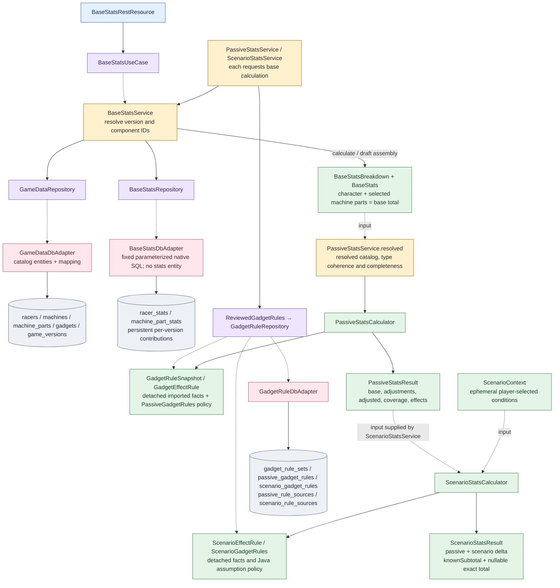
```mermaid
flowchart TB
  endpoints["BaseStatsRestResource"]:::rest
  consumers["PassiveStatsService / ScenarioStatsService<br/>each requests base calculation"]:::app
  base["BaseStatsService<br/>resolve version and component IDs"]:::app
  gp["GameDataRepository"]:::port
  sp["BaseStatsRepository"]:::port
  ga["GameDataDbAdapter<br/>catalog entities + mapping"]:::adapter
  sa["BaseStatsDbAdapter<br/>fixed parameterized native SQL; no stats entity"]:::adapter
  catalog[("racers / machines / machine_parts / gadgets / game_versions")]:::outside
  numbers[("racer_stats / machine_part_stats<br/>persistent per-version contributions")]:::outside
  breakdown["BaseStatsBreakdown + BaseStats<br/>character + selected machine parts = base total"]:::domain
  ps["PassiveStatsService.resolved<br/>resolved catalog, type coherence and completeness"]:::app
  pr["GadgetRuleSnapshot / GadgetEffectRule<br/>detached imported facts + PassiveGadgetRules policy"]:::domain
  pc["PassiveStatsCalculator"]:::domain
  po["PassiveStatsResult<br/>base, adjustments, adjusted, coverage, effects"]:::domain
  sr["ScenarioEffectRule / ScenarioGadgetRules<br/>detached facts and Java assumption policy"]:::domain
  ctx["ScenarioContext<br/>ephemeral player-selected conditions"]:::domain
  sc["ScenarioStatsCalculator"]:::domain
  so["ScenarioStatsResult<br/>passive + scenario delta<br/>knownSubtotal + nullable exact total"]:::domain
  endpoints --> input["BaseStatsUseCase"]:::port -.-> base
  consumers --> base
  consumers --> reviewed["ReviewedGadgetRules → GadgetRuleRepository"]:::port
  reviewed -.-> ruleAdapter["GadgetRuleDbAdapter"]:::adapter
  ruleAdapter --> ruleTables[("gadget_rule_sets / passive_gadget_rules / scenario_gadget_rules<br/>passive_rule_sources / scenario_rule_sources")]:::outside
  reviewed -.-> pr
  reviewed -.-> sr
  base --> gp
  base --> sp
  gp -.-> ga --> catalog
  sp -.-> sa --> numbers
  base -->|"calculate / draft assembly"| breakdown
  breakdown -.->|"input"| ps
  ps --> pc
  pc --> pr
  pc --> po
  po -.->|"input supplied by ScenarioStatsService"| sc
  ctx -.->|"input"| sc
  sc --> sr
  sc --> so
  classDef rest fill:#e4efff,stroke:#356db4,color:#142b49
  classDef app fill:#fff0ce,stroke:#a96b00,color:#272727
  classDef domain fill:#e4f5e8,stroke:#37834c,color:#183d24
  classDef port fill:#eee6ff,stroke:#7954b1,color:#35214f
  classDef adapter fill:#ffe7ed,stroke:#b45370,color:#502333
  classDef outside fill:#edf0f4,stroke:#657184,color:#202938
```

**How to read this:** gray tables provide source data; green rule snapshots are detached domain inputs;
green result records are constructed per calculation. Nothing writes computed totals back
to builds. The individual endpoint/service call paths are expanded below and in section 8.
[Diagram source](architecture/stats-flow.mmd).

### 7.2 Base and passive endpoint paths

How are persisted builds and incomplete drafts treated? They share the arithmetic but use
different base assembly entry points. Draft previews show the subtotal of selected components;
canonical persisted/base breakdowns preserve missing required contributions as unknown.

<!-- diagram: passive-flow -->
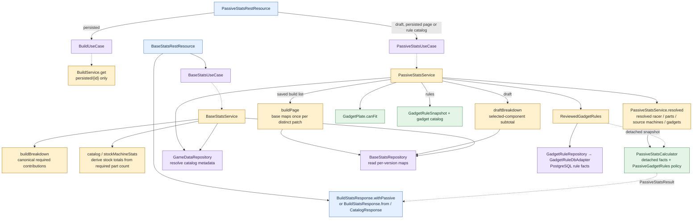
```mermaid
flowchart TB
  br["BaseStatsRestResource"]:::rest
  pr["PassiveStatsRestResource"]:::rest
  bs["BuildService.get<br/>persisted/{id} only"]:::app
  base["BaseStatsService"]:::app
  passive["PassiveStatsService"]:::app
  build["buildBreakdown<br/>canonical required contributions"]:::app
  draft["draftBreakdown<br/>selected-component subtotal"]:::app
  page["buildPage<br/>base maps once per distinct patch"]:::app
  cat["catalog / stockMachineStats<br/>derive stock totals from required part count"]:::app
  resolved["PassiveStatsService.resolved<br/>resolved racer / parts / source machines / gadgets"]:::app
  plate["GadgetPlate.canFit"]:::domain
  calc["PassiveStatsCalculator<br/>detached facts + PassiveGadgetRules policy"]:::domain
  dto["BuildStatsResponse.withPassive<br/>or BuildStatsResponse.from / CatalogResponse"]:::rest
  game["GameDataRepository<br/>resolve catalog metadata"]:::port
  stats["BaseStatsRepository<br/>read per-version maps"]:::port
  br --> baseInput["BaseStatsUseCase"]:::port -.-> base
  base --> build
  base --> cat
  base --> game
  base --> stats
  pr -->|"persisted"| builds["BuildUseCase"]:::port -.-> bs
  pr -->|"draft, persisted page or rule catalog"| input["PassiveStatsUseCase"]:::port -.-> passive
  passive -->|"rules"| metadata["GadgetRuleSnapshot + gadget catalog"]:::domain
  passive --> reviewed["ReviewedGadgetRules"]:::app
  reviewed --> rulePort["GadgetRuleRepository → GadgetRuleDbAdapter<br/>PostgreSQL rule facts"]:::port
  reviewed -.->|"detached snapshot"| calc
  passive -->|"draft"| draft
  passive -->|"saved build list"| page
  passive --> game
  passive --> plate
  draft --> stats
  page --> stats
  passive --> resolved --> calc
  calc -.->|"PassiveStatsResult"| dto
  br --> dto
  classDef rest fill:#e4efff,stroke:#356db4,color:#142b49
  classDef app fill:#fff0ce,stroke:#a96b00,color:#272727
  classDef domain fill:#e4f5e8,stroke:#37834c,color:#183d24
  classDef port fill:#eee6ff,stroke:#7954b1,color:#35214f
```

**How to read this:** `draftBreakdown` and `buildPage` are methods of `BaseStatsService`.
`resolved` is a static application method that can reuse already loaded metadata; it does
not call repositories. `buildPage` in `PassiveStatsService` loads the catalog once and calls
`base.buildPage`; the resource first loads a build for the persisted-ID endpoint.
[Diagram source](architecture/passive-flow.mmd).

| Entry point | Resolution and output |
| --- | --- |
| `GET /api/stats/catalog?gameVersionId=…` | Requires an existing version. Reads two stats maps, parts and machines; returns racer/part maps plus derived stock-machine totals. |
| `GET /api/stats/build` | `base.buildBreakdown`: validates supplied IDs/part slots; no version gives unknown breakdown. Missing racer/front/rear makes the relevant canonical contribution unknown; absent tire adds nothing. |
| `GET /api/stats/passive-build` | `passive.draft`: validates distinct gadgets and plate, then `base.draftBreakdown`. Omitted selected components use zero subtotal; incomplete selection is still marked PARTIAL when appropriate. |
| `GET /api/stats/persisted/{id}` | `BuildService.get` → `PassiveStatsService.buildPage(List.of(build))`; uses the stored patch and selections. |
| Build/saved list enrichment | Same passive page pipeline, batching base reads by patch. Optional failure remains separate from the build data response. |
| `GET /api/stats/gadget-rules` | `PassiveStatsUseCase.rules → PassiveStatsService` combines `game.listGadgets()` and `GadgetRuleSnapshot.forGadget`, loaded through `ReviewedGadgetRules → GadgetRuleRepository`; REST only converts the result. |

`BaseStats` uses exact decimal addition and propagates null per stat field. Missing source
rows mean unknown, not zero. There is no implicit latest-patch fallback. V22/V24 explicitly
copy source values into known patch snapshots; identical stored numbers do not imply a
runtime fallback or independently verified historical differences.

Passive coverage is `CALCULATED`, `PARTIAL`, `UNSUPPORTED_VERSION` or `INVALID_LOADOUT`.
An effect can be `APPLIED`, `NOT_MATCHED`, `REQUIRES_SELECTION`, `CONDITIONAL`, `NON_STAT`
or `UNSUPPORTED`. The closed additive-v1 policy admits 23 reviewed numerical
effect identities and sums their independently resolved signed vectors, including
overlaps. Evidence is SUPPORTED_BY_COMMUNITY_CALCULATOR, not official verification.
Unknown effects remain unsupported. The imported fact snapshot is unchanged;
calculation notes name the separate Java policy.
Raw stat arithmetic has no invented 100-point clamp or conversion from physical speed.

Source trail: [BaseStatsService](../backend/src/main/java/dev/ringlab/application/gamedata/BaseStatsService.java),
[PassiveStatsService](../backend/src/main/java/dev/ringlab/application/gamedata/PassiveStatsService.java),
[BaseStatsDbAdapter](../backend/src/main/java/dev/ringlab/adapter/out/db/gamedata/BaseStatsDbAdapter.java),
[PassiveStatsCalculator](../backend/src/main/java/dev/ringlab/domain/gamedata/PassiveStatsCalculator.java),
[passive evidence](passive-gadget-sources.md).

## 8. Scenario Preview

Where do Lap 1 and Water enter? `ScenarioStatsService` resolves IDs, calculates the passive
baseline once, then passes that result and an ephemeral `ScenarioContext` into the domain
scenario calculator. It does not load or update a build by ID.

<!-- diagram: scenario-flow -->
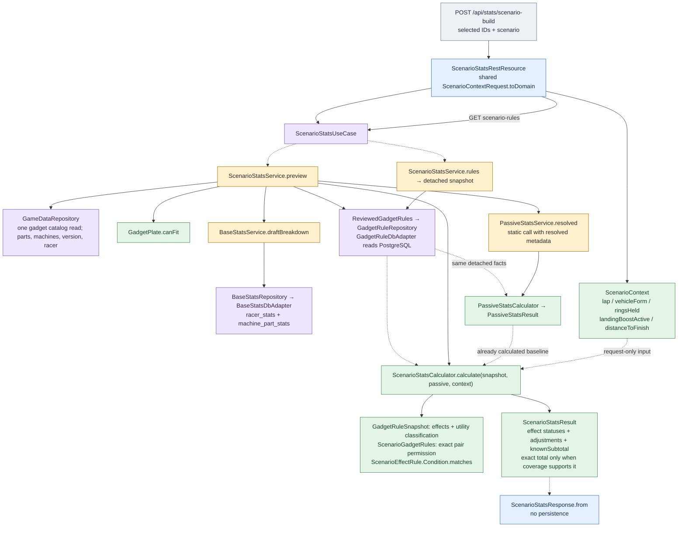
```mermaid
flowchart TB
  h["POST /api/stats/scenario-build<br/>selected IDs + scenario"]:::outside
  r["ScenarioStatsRestResource<br/>shared ScenarioContextRequest.toDomain"]:::rest
  s["ScenarioStatsService.preview"]:::app
  game["GameDataRepository<br/>one gadget catalog read; parts, machines, version, racer"]:::port
  plate["GadgetPlate.canFit"]:::domain
  base["BaseStatsService.draftBreakdown"]:::app
  source["BaseStatsRepository → BaseStatsDbAdapter<br/>racer_stats + machine_part_stats"]:::port
  passive["PassiveStatsService.resolved<br/>static call with resolved metadata"]:::app
  pc["PassiveStatsCalculator → PassiveStatsResult"]:::domain
  ctx["ScenarioContext<br/>lap / vehicleForm / ringsHeld<br/>landingBoostActive / distanceToFinish"]:::domain
  sc["ScenarioStatsCalculator.calculate(snapshot, passive, context)"]:::domain
  rules["GadgetRuleSnapshot: effects + utility classification<br/>ScenarioGadgetRules: exact pair permission<br/>ScenarioEffectRule.Condition.matches"]:::domain
  result["ScenarioStatsResult<br/>effect statuses + adjustments + knownSubtotal<br/>exact total only when coverage supports it"]:::domain
  dto["ScenarioStatsResponse.from<br/>no persistence"]:::rest
  h --> r --> input["ScenarioStatsUseCase"]:::port -.-> s
  r -->|"GET scenario-rules"| input
  input -.-> metadata["ScenarioStatsService.rules → detached snapshot"]:::app
  s --> reviewed["ReviewedGadgetRules → GadgetRuleRepository<br/>GadgetRuleDbAdapter reads PostgreSQL"]:::port
  reviewed -.->|"same detached facts"| pc
  reviewed -.-> sc
  metadata --> reviewed
  r --> ctx
  s --> game
  s --> plate
  s --> base --> source
  s --> passive --> pc
  s --> sc
  pc -.->|"already calculated baseline"| sc
  ctx -.->|"request-only input"| sc
  sc --> rules
  sc --> result -.-> dto
  classDef rest fill:#e4efff,stroke:#356db4,color:#142b49
  classDef app fill:#fff0ce,stroke:#a96b00,color:#272727
  classDef domain fill:#e4f5e8,stroke:#37834c,color:#183d24
  classDef port fill:#eee6ff,stroke:#7954b1,color:#35214f
  classDef outside fill:#edf0f4,stroke:#657184,color:#202938
```

**How to read this:** `ScenarioStatsService` calls `BaseStatsService` and the static
`PassiveStatsService.resolved`; it does not inject/call `passive.draft` or recompute passive
arithmetic in the scenario calculator. The context never becomes a `Build` field or DB row.
[Diagram source](architecture/scenario-flow.mmd).

All five context fields can be unknown. Unknown differs from a specified condition that
does not activate an effect. REST validates integral numeric inputs before conversion;
domain bounds validate the resulting context. These input bounds are not game-effect caps.
`GET /api/stats/scenario-rules` calls `ScenarioStatsUseCase.rules → ScenarioStatsService`,
which retrieves the detached snapshot's ordered scenario effects through `GadgetRuleRepository`; REST returns control
metadata, with no repository or service call.

The current ruleset is `crossworlds-1.4.1-scenario-2026-10-01.1`. It allows the explicitly
user-approved **assumption** that Quick Starter and Sea Dog's `other-0` effects add:
Lap 1 + WATER gives +40 to each stat when that pair is otherwise supported. This is not
new evidence of game behavior, and permission is not transitive to a third effect or to
nonzero passive modifiers. Unknown/unverified numeric interactions leave `total` null
and preserve `knownSubtotal`; unsupported utility effects are described separately.

Source trail: [ScenarioStatsService](../backend/src/main/java/dev/ringlab/application/gamedata/ScenarioStatsService.java),
[calculator](../backend/src/main/java/dev/ringlab/domain/gamedata/ScenarioStatsCalculator.java),
[rules](../backend/src/main/java/dev/ringlab/domain/gamedata/ScenarioGadgetRules.java),
[evidence and assumption history](scenario-preview-evidence.md).

## 9. Community and ranking

How do Explore and Top 3 share ranking without sharing all eligibility rules? Both call
the domain `BuildRanking` comparator. Top 3 additionally applies read-only eligibility,
assembles detached entries, and caches a snapshot. No vote mutation directly calls the cache.

<!-- diagram: community-flow -->
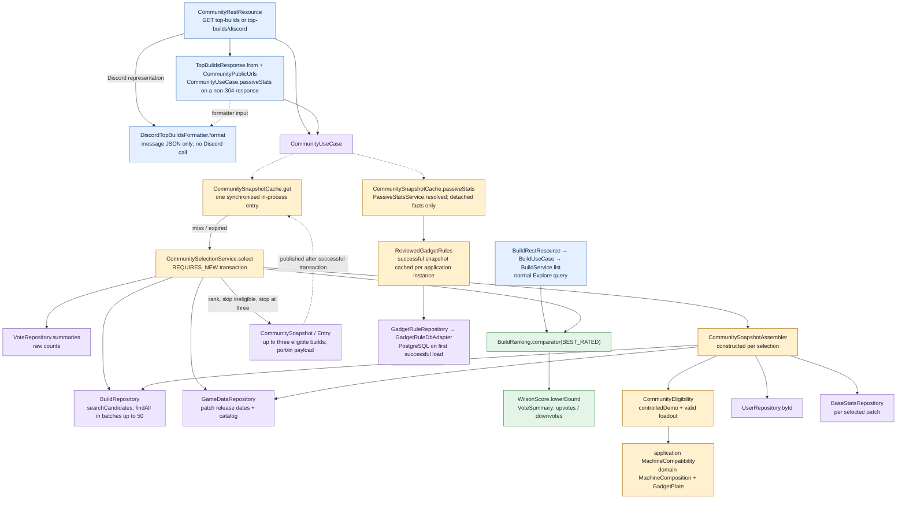
```mermaid
flowchart TB
  browse["BuildRestResource → BuildUseCase → BuildService.list<br/>normal Explore query"]:::rest
  rest["CommunityRestResource<br/>GET top-builds or top-builds/discord"]:::rest
  cache["CommunitySnapshotCache.get<br/>one synchronized in-process entry"]:::app
  service["CommunitySelectionService.select<br/>REQUIRES_NEW transaction"]:::app
  bp["BuildRepository<br/>searchCandidates; findAll in batches up to 50"]:::port
  vp["VoteRepository.summaries<br/>raw counts"]:::port
  gp["GameDataRepository<br/>patch release dates + catalog"]:::port
  ranking["BuildRanking.comparator(BEST_RATED)"]:::domain
  wilson["WilsonScore.lowerBound<br/>VoteSummary: upvotes / downvotes"]:::domain
  assembler["CommunitySnapshotAssembler<br/>constructed per selection"]:::app
  eligible["CommunityEligibility<br/>controlledDemo + valid loadout"]:::app
  rules["application MachineCompatibility<br/>domain MachineComposition + GadgetPlate"]:::app
  up["UserRepository.byId"]:::port
  sp["BaseStatsRepository<br/>per selected patch"]:::port
  snapshot["CommunitySnapshot / Entry<br/>up to three eligible builds; port/in payload"]:::port
  dto["TopBuildsResponse.from + CommunityPublicUrls<br/>CommunityUseCase.passiveStats on a non-304 response"]:::rest
  formatter["DiscordTopBuildsFormatter.format<br/>message JSON only; no Discord call"]:::rest
  browse --> ranking
  rest --> input["CommunityUseCase"]:::port -.-> cache -->|"miss / expired"| service
  service --> bp
  service --> vp
  service --> gp
  service --> ranking --> wilson
  service --> assembler
  assembler --> eligible --> rules
  assembler --> gp
  assembler --> up
  assembler --> sp
  assembler -->|"optional remix source"| bp
  service -->|"rank, skip ineligible, stop at three"| snapshot
  snapshot -.->|"published after successful transaction"| cache
  rest --> dto
  dto --> input
  input -.-> projection["CommunitySnapshotCache.passiveStats<br/>PassiveStatsService.resolved; detached facts only"]:::app
  projection --> reviewed["ReviewedGadgetRules<br/>successful snapshot cached per application instance"]:::app
  reviewed --> rulePort["GadgetRuleRepository → GadgetRuleDbAdapter<br/>PostgreSQL on first successful load"]:::port
  rest -->|"Discord representation"| formatter
  dto -.->|"formatter input"| formatter
  classDef rest fill:#e4efff,stroke:#356db4,color:#142b49
  classDef app fill:#fff0ce,stroke:#a96b00,color:#272727
  classDef domain fill:#e4f5e8,stroke:#37834c,color:#183d24
  classDef port fill:#eee6ff,stroke:#7954b1,color:#35214f
```

**How to read this:** persistence supplies candidate identity/time/patch and vote counts;
domain code decides their order. The application decides whether an already ranked build
is suitable for the showcase. The REST layer then constructs either public JSON or Discord
message JSON. [Diagram source](architecture/community-flow.mmd).

| Sort | Exact order in `BuildRanking` |
| --- | --- |
| `newest` / `NEWEST` | Creation time descending, textual UUID ascending. |
| `score` / `SCORE` | Upvotes minus downvotes descending, then newest ordering. |
| `rated` / `BEST_RATED` | Wilson lower bound descending; patch release date descending with unspecified/unknown last; at Wilson zero, fewer downvotes; creation time descending; textual UUID ascending. |

`WilsonScore` uses `Z = 1.96` and returns zero for no votes or no upvotes. It is calculated
from counts, never stored as a build score. `CommunityEligibility` excludes exact controlled
fixture title patterns/prefixes, including `[Optimizer Demo]`, `[Map Demo]`, legacy demo
prefixes and the current `[Demo · …] …` form. This avoids showcasing controlled examples.
An ordinary title containing “demo” or a demo-account author alone is not the exclusion rule.
Normal browsing does not invoke this policy.

Eligibility requires coherent required slots and valid gadgets/plate, an existing racer,
and an existing patch if specified. Unknown numerical stats alone do not disqualify a build.
No one-per-author rule exists. `CommunitySnapshotAssembler` calculates base breakdowns
directly from contribution maps; `CommunityUseCase.passiveStats`, implemented by the cache, reuses static
application resolution when the response is assembled.

The cache lifetime defaults to 60 seconds, configurable from 1–300 seconds. It starts at
computation start; there is no mutation-triggered invalidation. A failed load does not replace
the stored snapshot, but that failing request propagates the failure rather than serving
stale data automatically. Both representations share the cached revision with distinct
ETag suffixes; conditional GET can return 304. Any query parameter is rejected.

Source trail: [selection](../backend/src/main/java/dev/ringlab/application/community/CommunitySelectionService.java),
[assembler](../backend/src/main/java/dev/ringlab/application/community/CommunitySnapshotAssembler.java),
[eligibility](../backend/src/main/java/dev/ringlab/application/community/CommunityEligibility.java),
[ranking](../backend/src/main/java/dev/ringlab/domain/build/ranking/BuildRanking.java),
[cache](../backend/src/main/java/dev/ringlab/application/community/CommunitySnapshotCache.java).

## 10. Authentication atlas

### 10.1 Registration and email verification

Where are account activation and mail delivery separated? Registration stores an unverified
user and a token digest atomically. `AccountRegistrationService` sends verification email
**after** the existing application transaction returns; its register/resend methods use
`NOT_SUPPORTED`. Clicking the link invokes the existing transactional verification service.

<!-- diagram: auth-flow -->
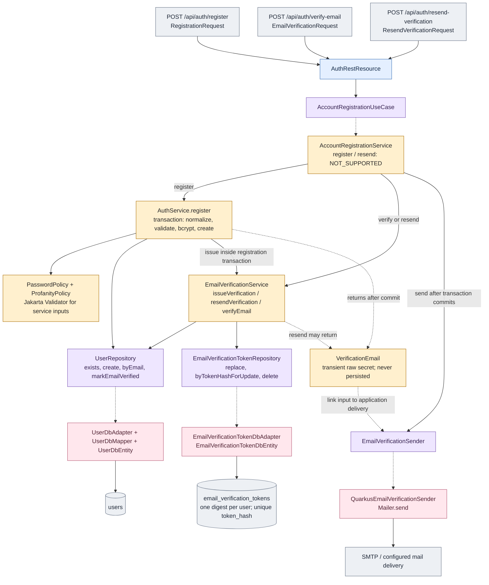
```mermaid
flowchart TB
  register["POST /api/auth/register<br/>RegistrationRequest"]:::outside
  verify["POST /api/auth/verify-email<br/>EmailVerificationRequest"]:::outside
  resend["POST /api/auth/resend-verification<br/>ResendVerificationRequest"]:::outside
  rest["AuthRestResource"]:::rest
  auth["AuthService.register<br/>transaction: normalize, validate, bcrypt, create"]:::app
  policy["PasswordPolicy + ProfanityPolicy<br/>Jakarta Validator for service inputs"]:::app
  ev["EmailVerificationService<br/>issueVerification / resendVerification / verifyEmail"]:::app
  up["UserRepository<br/>exists, create, byEmail, markEmailVerified"]:::port
  tp["EmailVerificationTokenRepository<br/>replace, byTokenHashForUpdate, delete"]:::port
  ua["UserDbAdapter + UserDbMapper + UserDbEntity"]:::adapter
  ta["EmailVerificationTokenDbAdapter<br/>EmailVerificationTokenDbEntity"]:::adapter
  users[("users")]:::outside
  tokens[("email_verification_tokens<br/>one digest per user; unique token_hash")]:::outside
  mail["VerificationEmail<br/>transient raw secret; never persisted"]:::app
  sender["EmailVerificationSender"]:::port
  adapter["QuarkusEmailVerificationSender<br/>Mailer.send"]:::adapter
  smtp["SMTP / configured mail delivery"]:::outside
  register --> rest
  verify --> rest
  resend --> rest
  rest --> input["AccountRegistrationUseCase"]:::port
  input -.-> coordinator["AccountRegistrationService<br/>register / resend: NOT_SUPPORTED"]:::app
  coordinator -->|"register"| auth
  auth --> policy
  auth --> up
  auth -->|"issue inside registration transaction"| ev
  coordinator -->|"verify or resend"| ev
  ev --> up
  ev --> tp
  up -.-> ua --> users
  tp -.-> ta --> tokens
  auth -.->|"returns after commit"| mail
  ev -.->|"resend may return"| mail
  coordinator -->|"send after transaction commits"| sender
  mail -.->|"link input to application delivery"| sender
  sender -.-> adapter --> smtp
  classDef rest fill:#e4efff,stroke:#356db4,color:#142b49
  classDef app fill:#fff0ce,stroke:#a96b00,color:#272727
  classDef port fill:#eee6ff,stroke:#7954b1,color:#35214f
  classDef adapter fill:#ffe7ed,stroke:#b45370,color:#502333
  classDef outside fill:#edf0f4,stroke:#657184,color:#202938
```

**How to read this:** registration returns a check-email message, not a login session.
The token has 32 random bytes, a persisted SHA-256 digest and a 24-hour lifetime. Verification
locks the matching token row, checks expiry, marks the user verified, and deletes the token
on success. No plaintext token or password is part of stored token data.
[Diagram source](architecture/auth-flow.mmd).

Username and email normalization use lowercase; passwords are not trimmed. `PasswordPolicy`
enforces 8–72 characters and at most 72 UTF-8 bytes for new passwords. Registration and reset
use it; login preserves its separate legacy acceptance bounds. Duplicate username/email
checks exist in the service and PostgreSQL uniqueness remains the concurrency boundary.

Resend only issues a token for an unverified local-password account. Ineligible addresses
receive the same check-email response. A verification mail delivery failure becomes a safe
503 after the account/token transaction has committed; it does not roll back registration.
The code attempts token deletion on expired verification before throwing an unchecked
validation exception; do not interpret that path as a guaranteed committed cleanup.

### 10.2 Login, JWT and current user

What does a protected request trust? Quarkus/SmallRye validates the JWT and role;
`CurrentUser.id()` then checks the subject against a current database account and its
authentication version. This lookup is separate from ownership checks inside use cases.

<!-- diagram: auth-session-flow -->
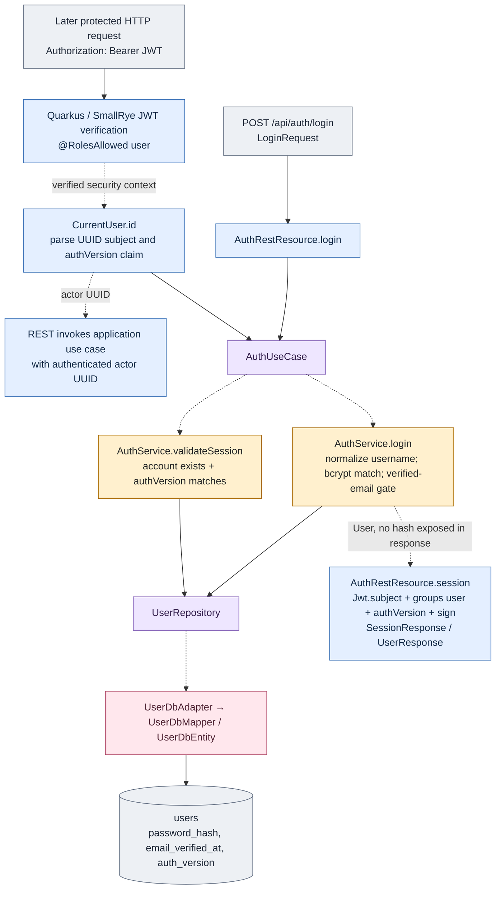
```mermaid
flowchart TB
  login["POST /api/auth/login<br/>LoginRequest"]:::outside
  rest["AuthRestResource.login"]:::rest
  svc["AuthService.login<br/>normalize username; bcrypt match; verified-email gate"]:::app
  port["UserRepository"]:::port
  db["UserDbAdapter → UserDbMapper / UserDbEntity"]:::adapter
  table[("users<br/>password_hash, email_verified_at, auth_version")]:::outside
  jwt["AuthRestResource.session<br/>Jwt.subject + groups user + authVersion + sign<br/>SessionResponse / UserResponse"]:::rest
  next["Later protected HTTP request<br/>Authorization: Bearer JWT"]:::outside
  framework["Quarkus / SmallRye JWT verification<br/>@RolesAllowed user"]:::rest
  actor["CurrentUser.id<br/>parse UUID subject and authVersion claim"]:::rest
  usecase["REST invokes application use case<br/>with authenticated actor UUID"]:::rest
  login --> rest --> input["AuthUseCase"]:::port -.-> svc --> port
  port -.-> db --> table
  svc -.->|"User, no hash exposed in response"| jwt
  next --> framework
  framework -.->|"verified security context"| actor
  actor --> input
  input -.-> validate["AuthService.validateSession<br/>account exists + authVersion matches"]:::app --> port
  actor -.->|"actor UUID"| usecase
  classDef rest fill:#e4efff,stroke:#356db4,color:#142b49
  classDef app fill:#fff0ce,stroke:#a96b00,color:#272727
  classDef port fill:#eee6ff,stroke:#7954b1,color:#35214f
  classDef adapter fill:#ffe7ed,stroke:#b45370,color:#502333
  classDef outside fill:#edf0f4,stroke:#657184,color:#202938
```

**How to read this:** `CurrentUser` itself does not verify a raw JWT signature; it consumes
the framework-provided JWT and performs account/version checks. Services receive UUIDs,
not HTTP headers. The diagram does not impose an undocumented ordering on framework
security, filters and parameter validation. [Diagram source](architecture/auth-session-flow.mmd).

Wrong credentials return an authentication error; unverified accounts with correct passwords
are forbidden. `GET /api/auth/me` calls `AuthService.current(actor.id())`. Logout only validates
the actor; the client disposes of its token. There is no token table, refresh endpoint or
per-token logout revocation. Configured issued-token lifespan is one hour. A password reset
increments `users.auth_version`, making prior versions fail `CurrentUser` checks. Missing
version claims are treated as version zero for compatibility.

### 10.3 Google sign-in and explicit linking

How does a Google identity become a RingLab account? The external verifier returns trusted
identity facts. The application then finds the provider/subject mapping or applies its
account creation/linking rules. It does not treat an arbitrary matching email as sufficient.

<!-- diagram: auth-google-flow -->
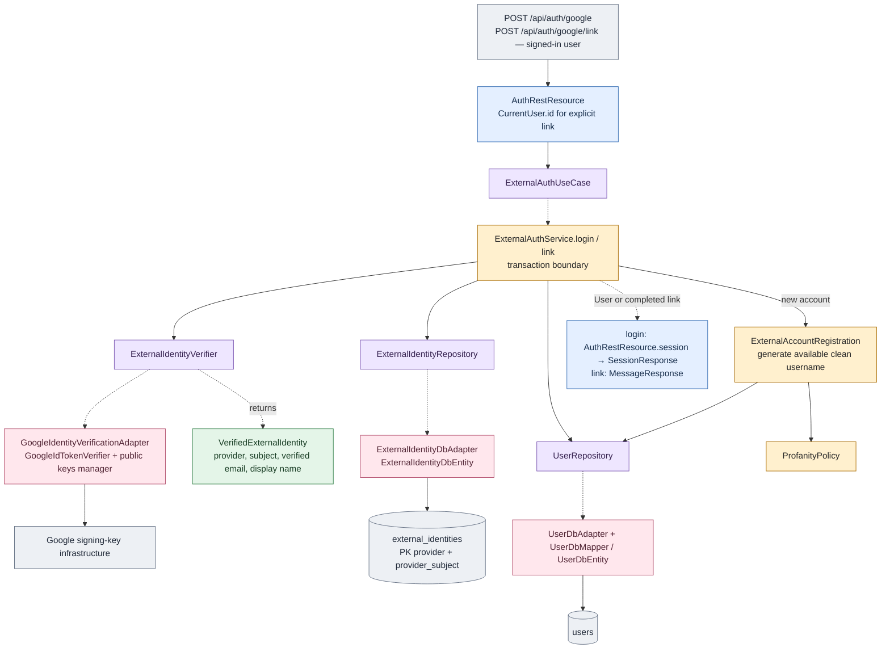
```mermaid
flowchart TB
  h["POST /api/auth/google<br/>POST /api/auth/google/link — signed-in user"]:::outside
  r["AuthRestResource<br/>CurrentUser.id for explicit link"]:::rest
  s["ExternalAuthService.login / link<br/>transaction boundary"]:::app
  verifier["ExternalIdentityVerifier"]:::port
  google["GoogleIdentityVerificationAdapter<br/>GoogleIdTokenVerifier + public keys manager"]:::adapter
  provider["Google signing-key infrastructure"]:::outside
  identity["VerifiedExternalIdentity<br/>provider, subject, verified email, display name"]:::domain
  mapping["ExternalIdentityRepository"]:::port
  mapdb["ExternalIdentityDbAdapter<br/>ExternalIdentityDbEntity"]:::adapter
  mapt[("external_identities<br/>PK provider + provider_subject")]:::outside
  users["UserRepository"]:::port
  udb["UserDbAdapter + UserDbMapper / UserDbEntity"]:::adapter
  ut[("users")]:::outside
  create["ExternalAccountRegistration<br/>generate available clean username"]:::app
  profanity["ProfanityPolicy"]:::app
  output["login: AuthRestResource.session → SessionResponse<br/>link: MessageResponse"]:::rest
  h --> r --> input["ExternalAuthUseCase"]:::port -.-> s
  s --> verifier
  verifier -.-> google --> provider
  verifier -.->|"returns"| identity
  s --> mapping
  mapping -.-> mapdb --> mapt
  s --> users
  s -->|"new account"| create
  create --> profanity
  create --> users
  users -.-> udb --> ut
  s -.->|"User or completed link"| output
  classDef rest fill:#e4efff,stroke:#356db4,color:#142b49
  classDef app fill:#fff0ce,stroke:#a96b00,color:#272727
  classDef domain fill:#e4f5e8,stroke:#37834c,color:#183d24
  classDef port fill:#eee6ff,stroke:#7954b1,color:#35214f
  classDef adapter fill:#ffe7ed,stroke:#b45370,color:#502333
  classDef outside fill:#edf0f4,stroke:#657184,color:#202938
```

**How to read this:** existing provider/subject mappings load their user. A new Google
account is passwordless and email-verified at creation. Auto-linking an existing account by
email is limited to an already verified account with the exact `@gmail.com` suffix; otherwise
the user must sign in and explicitly link a matching email. Linking is idempotent for the
same user and rejects an identity already attached elsewhere.
[Diagram source](architecture/auth-google-flow.mmd).

The adapter configures expected audience and zero acceptable time skew, delegates token
verification to Google's library, then requires bounded subject/email and a verified-email
claim. Invalid credentials become `AuthenticationException`; unconfigured verification or
key-fetch I/O failure becomes `ExternalServiceUnavailableException`. No Google credential
or provider password is persisted by these adapters. Actual public-key fetch timing and
caching belong to the Google library, not a RingLab polling loop.

### 10.4 Forgot/reset password

Why does reset delivery sit inside a transaction? Replacing a recovery token should roll
back if sending fails. This differs deliberately from registration delivery. Consumption
serializes on the user row and rechecks the token after acquiring the lock.

<!-- diagram: auth-password-reset-flow -->
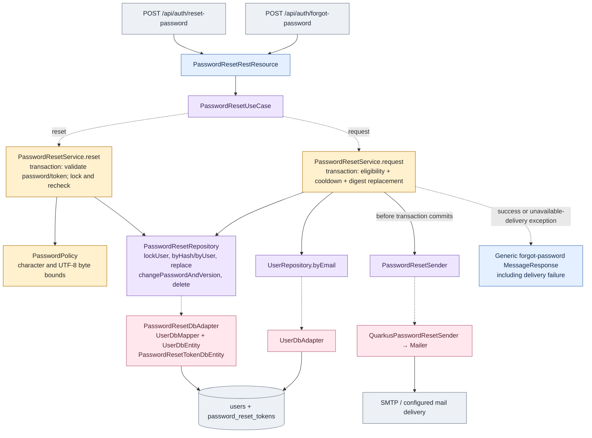
```mermaid
flowchart TB
  forgot["POST /api/auth/forgot-password"]:::outside
  reset["POST /api/auth/reset-password"]:::outside
  rest["PasswordResetRestResource"]:::rest
  issue["PasswordResetService.request<br/>transaction: eligibility + cooldown + digest replacement"]:::app
  consume["PasswordResetService.reset<br/>transaction: validate password/token; lock and recheck"]:::app
  policy["PasswordPolicy<br/>character and UTF-8 byte bounds"]:::app
  users["UserRepository.byEmail"]:::port
  up["UserDbAdapter"]:::adapter
  repo["PasswordResetRepository<br/>lockUser, byHash/byUser, replace<br/>changePasswordAndVersion, delete"]:::port
  adapter["PasswordResetDbAdapter<br/>UserDbMapper + UserDbEntity<br/>PasswordResetTokenDbEntity"]:::adapter
  tables[("users + password_reset_tokens")]:::outside
  sender["PasswordResetSender"]:::port
  mail["QuarkusPasswordResetSender → Mailer"]:::adapter
  smtp["SMTP / configured mail delivery"]:::outside
  response["Generic forgot-password MessageResponse<br/>including delivery failure"]:::rest
  forgot --> rest --> input["PasswordResetUseCase"]:::port
  input -.->|"request"| issue
  reset --> rest
  input -.->|"reset"| consume
  issue --> users
  users -.-> up --> tables
  issue --> repo
  consume --> policy
  consume --> repo
  repo -.-> adapter --> tables
  issue -->|"before transaction commits"| sender
  sender -.-> mail --> smtp
  issue -.->|"success or unavailable-delivery exception"| response
  classDef rest fill:#e4efff,stroke:#356db4,color:#142b49
  classDef app fill:#fff0ce,stroke:#a96b00,color:#272727
  classDef port fill:#eee6ff,stroke:#7954b1,color:#35214f
  classDef adapter fill:#ffe7ed,stroke:#b45370,color:#502333
  classDef outside fill:#edf0f4,stroke:#657184,color:#202938
```

**How to read this:** only verified local-password accounts qualify. The digest is stored,
not the raw link secret. Successful reset changes the password hash, increments `authVersion`
and deletes the token atomically. It returns a message asking the client to log in; it does
not issue a new session automatically. [Diagram source](architecture/auth-password-reset-flow.mmd).

The adapter refreshes the user after a pessimistic lock and projects token scalars, avoiding
stale managed data after lock waits. The service verifies the digest again after locking.
Mail failure throws an unchecked application exception to roll back replacement; the REST
resource catches it, logs one warning without provider details, and returns the generic
forgot-password confirmation. TTL/cooldown are configuration inputs; no values or secrets
from an environment are reproduced here.

### 10.5 Development-only account bootstrap

`POST /api/dev-fixtures/demo-accounts` is implemented by `DevDemoAccountRestResource` and
`DemoAccountBootstrapService`, both `@UnlessBuildProfile("prod")`. The resource checks the
immediate peer is loopback; it does not use bearer-user authentication. The service validates
reserved demo identities, checks existing matching accounts are already verified or creates verified accounts
through `UserRepository`. The resource signs returned demo sessions. It is a fixture boundary,
not a production registration alternative. No fixture call was made while creating this atlas.

Source trail: [auth package](../backend/src/main/java/dev/ringlab/application/auth/),
[CurrentUser](../backend/src/main/java/dev/ringlab/adapter/in/rest/auth/CurrentUser.java),
[Google adapter](../backend/src/main/java/dev/ringlab/adapter/out/google/GoogleIdentityVerificationAdapter.java),
[reset adapter](../backend/src/main/java/dev/ringlab/adapter/out/db/auth/PasswordResetDbAdapter.java),
[recovery guide](password-recovery.md).

## 11. Collection and availability

What does “not owned” store? The database stores exclusions only. No row means owned,
including for future catalog additions. Updating ownership changes private availability,
while recommendations consume a detached exclusion snapshot on their next calculation.

<!-- diagram: collection-flow -->
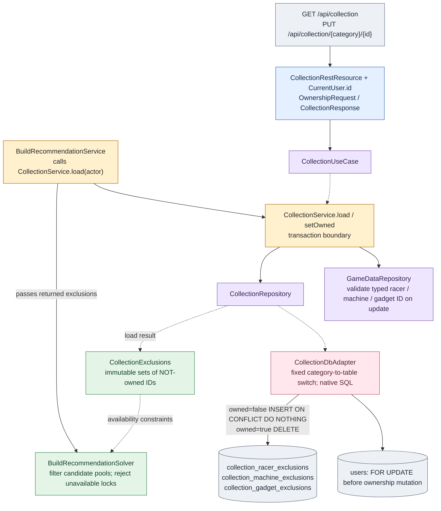
```mermaid
flowchart TB
  h["GET /api/collection<br/>PUT /api/collection/{category}/{id}"]:::outside
  r["CollectionRestResource + CurrentUser.id<br/>OwnershipRequest / CollectionResponse"]:::rest
  s["CollectionService.load / setOwned<br/>transaction boundary"]:::app
  game["GameDataRepository<br/>validate typed racer / machine / gadget ID on update"]:::port
  p["CollectionRepository"]:::port
  a["CollectionDbAdapter<br/>fixed category-to-table switch; native SQL"]:::adapter
  lock[("users: FOR UPDATE before ownership mutation")]:::outside
  tables[("collection_racer_exclusions<br/>collection_machine_exclusions<br/>collection_gadget_exclusions")]:::outside
  ex["CollectionExclusions<br/>immutable sets of NOT-owned IDs"]:::domain
  recommendation["BuildRecommendationService<br/>calls CollectionService.load(actor)"]:::app
  solver["BuildRecommendationSolver<br/>filter candidate pools; reject unavailable locks"]:::domain
  h --> r --> input["CollectionUseCase"]:::port -.-> s
  s --> game
  s --> p
  p -.-> a
  a --> lock
  a -->|"owned=false INSERT ON CONFLICT DO NOTHING<br/>owned=true DELETE"| tables
  p -.->|"load result"| ex
  recommendation --> s
  recommendation -->|"passes returned exclusions"| solver
  ex -.->|"availability constraints"| solver
  classDef rest fill:#e4efff,stroke:#356db4,color:#142b49
  classDef app fill:#fff0ce,stroke:#a96b00,color:#272727
  classDef domain fill:#e4f5e8,stroke:#37834c,color:#183d24
  classDef port fill:#eee6ff,stroke:#7954b1,color:#35214f
  classDef adapter fill:#ffe7ed,stroke:#b45370,color:#502333
  classDef outside fill:#edf0f4,stroke:#657184,color:#202938
```

**How to read this:** `CollectionCategory` is exactly `RACER`, `MACHINE`, `GADGET`.
Machine availability belongs to a source machine and affects all its parts in the solver.
There is no `CollectionDbEntity`; the adapter constructs `CollectionExclusions` from SQL rows.
[Diagram source](architecture/collection-flow.mmd).

Responses are private and non-cacheable. The authenticated actor selects the account; the
client cannot supply a different owner. Table-name concatenation uses a fixed enum switch,
while user/item values are bound parameters. Ownership updates serialize on the user's row.
Collection exclusions do not rewrite builds, block manual publishing, change vote ranking,
or alter community eligibility. A current unavailable selection may still be evaluated as
a reference, but cannot become the available recommendation incumbent.

In React, CollectionProvider normalizes exclusion arrays to sorted distinct IDs.
Only a successful authoritative read with changed sets advances the revision for
the current account/session. Focus and recommendation Apply share an in-flight
read; its result includes data, revision and session identity. Apply compares that
snapshot directly, without waiting for a React render, and preserves draft/lock/
configuration/session checks plus final selected-item ownership validation.
Identical reads do not stale proposals; failures and pending mutations block Apply.

Source trail: [CollectionService](../backend/src/main/java/dev/ringlab/application/collection/CollectionService.java),
[CollectionDbAdapter](../backend/src/main/java/dev/ringlab/adapter/out/db/CollectionDbAdapter.java),
[CollectionExclusions](../backend/src/main/java/dev/ringlab/domain/collection/CollectionExclusions.java),
[V33](../backend/src/main/resources/db/migration/V33__collection_exclusions.sql).

## 12. Comments, votes and saved builds

### 12.1 Flat comments

Where are comment ownership and target existence checked? The application checks them,
and the adapter persists one flat comment row. Author display-name resolution occurs in
the REST response conversion, not in the `Comment` domain record.

<!-- diagram: comments-flow -->
```mermaid
flowchart TB
  h["GET / POST /api/builds/{id}/comments<br/>DELETE /api/comments/{id}"]:::outside
  r["CommentRestResource<br/>CommentDeletionRestResource"]:::rest
  actor["CurrentUser.id<br/>create / delete only"]:::rest
  s["CommentService<br/>list / create / delete"]:::app
  build["BuildService.get<br/>list and create only"]:::app
  policy["ProfanityPolicy for create<br/>ForbiddenException.requireOwner for delete"]:::app
  p["CommentRepository"]:::port
  a["CommentDbAdapter<br/>Panache list/count/find/persist/delete"]:::adapter
  m["CommentDbMapper ↔ CommentDbEntity"]:::adapter
  db[("comments")]:::outside
  user["AuthService.current<br/>response author names"]:::app
  dto["CommentResponse / CommentPageResponse"]:::rest
  h --> r
  r --> actor
  r --> input["CommentUseCase"]:::port -.-> s
  s --> build
  s --> policy
  s --> p
  p -.-> a --> m --> db
  r --> auth["AuthUseCase"]:::port -.-> user
  r --> dto
  classDef rest fill:#e4efff,stroke:#356db4,color:#142b49
  classDef app fill:#fff0ce,stroke:#a96b00,color:#272727
  classDef port fill:#eee6ff,stroke:#7954b1,color:#35214f
  classDef adapter fill:#ffe7ed,stroke:#b45370,color:#502333
  classDef outside fill:#edf0f4,stroke:#657184,color:#202938
```

**How to read this:** list and create verify the target build; delete loads the comment and
checks its author, without a `BuildService.get` call. DB pagination orders by creation time
then ID ascending and returns a separate total. Comments are plain, flat text with no parent
relationship. [Diagram source](architecture/comments-flow.mmd).

### 12.2 Vote add/change/remove

How does one upvote become ranking input? `VoteService` validates the target/value and calls
an atomic upsert. It returns fresh count facts and the user's vote. Ranking is calculated
later by browse/community code; the vote service does not maintain score counters.

<!-- diagram: votes-flow -->
```mermaid
flowchart TB
  h["GET / PUT / DELETE /api/builds/{id}/vote"]:::outside
  r["VoteRestResource + CurrentUser.id"]:::rest
  s["VoteService.get / put / remove<br/>mutations transactional"]:::app
  b["BuildService.get<br/>target existence"]:::app
  v["Vote<br/>value must be -1 or +1"]:::domain
  p["VoteRepository<br/>put / remove / summary / value"]:::port
  a["VoteDbAdapter<br/>native upsert; JPQL counts and deletion"]:::adapter
  e["VoteDbEntity"]:::adapter
  t[("votes<br/>UNIQUE user_id + build_id<br/>CHECK value IN -1,1")]:::outside
  summary["VoteSummary<br/>score = upvotes - downvotes"]:::domain
  out["VoteUseCase.Result → VoteResponse<br/>score, upvotes, downvotes, myVote"]:::rest
  h --> r --> input["VoteUseCase"]:::port -.-> s
  s --> b
  s -->|"PUT constructs"| v
  s --> p
  p -.-> a
  a -->|"JPQL"| e --> t
  a -->|"INSERT ON CONFLICT DO UPDATE"| t
  p -.->|"count result"| summary
  s -.->|"returned result"| out
  classDef rest fill:#e4efff,stroke:#356db4,color:#142b49
  classDef app fill:#fff0ce,stroke:#a96b00,color:#272727
  classDef domain fill:#e4f5e8,stroke:#37834c,color:#183d24
  classDef port fill:#eee6ff,stroke:#7954b1,color:#35214f
  classDef adapter fill:#ffe7ed,stroke:#b45370,color:#502333
  classDef outside fill:#edf0f4,stroke:#657184,color:#202938
```

**How to read this:** PUT adds or replaces the actor's single vote; DELETE is a no-op for an
absent vote and returns updated facts. `myVote = 0` means absent. `put`/`remove` call `get`
after mutation, which checks build existence again. No Vote mapper exists. PostgreSQL's
unique constraint is the final concurrency boundary.
[Diagram source](architecture/votes-flow.mmd).

### 12.3 Private saved builds

Does Save copy the build? It inserts a private bookmark with a save timestamp. Listing then
loads the live public builds. Unlike public ranking, bookmark chronology is sorted and
paginated in the database.

<!-- diagram: saved-builds-flow -->
```mermaid
flowchart TB
  h["GET /api/saved-builds<br/>GET /api/saved-builds/status<br/>PUT / DELETE /api/saved-builds/{id}"]:::outside
  r["SavedBuildRestResource + CurrentUser.id"]:::rest
  s["SavedBuildService"]:::app
  bp["BuildRepository<br/>find for save; findAll for list"]:::port
  validator["BuildDraftValidator.validateMapFilter<br/>list only"]:::app
  p["SavedBuildRepository"]:::port
  a["SavedBuildDbAdapter<br/>upsert + Criteria + JPQL"]:::adapter
  shared["BuildDbAdapter.filters<br/>shared literal catalog/map filtering"]:::adapter
  e["SavedBuildDbEntity + BuildDbEntity"]:::adapter
  t[("saved_builds + builds and filter relations")]:::outside
  v["VoteRepository.summaries<br/>live page counts"]:::port
  assembly["BuildResponseAssembler.assembleAll"]:::rest
  stats["PassiveStatsService.buildPage"]:::app
  dto["SavedPage / SavedStatus / SavedResult<br/>private, no-store"]:::rest
  h --> r --> input["SavedBuildUseCase"]:::port -.-> s
  s --> bp
  s --> validator
  s --> p
  p -.-> a
  a --> shared
  a --> e --> t
  r --> votes["VoteUseCase"]:::port -.-> voteService["VoteService.summaries"]:::app --> v
  r --> assembly
  r --> passive["PassiveStatsUseCase"]:::port -.-> stats
  r --> dto
  classDef rest fill:#e4efff,stroke:#356db4,color:#142b49
  classDef app fill:#fff0ce,stroke:#a96b00,color:#272727
  classDef port fill:#eee6ff,stroke:#7954b1,color:#35214f
  classDef adapter fill:#ffe7ed,stroke:#b45370,color:#502333
  classDef outside fill:#edf0f4,stroke:#657184,color:#202938
```

**How to read this:** the service checks build existence through `BuildRepository` directly,
not through `BuildService`. Repeated saves preserve the original `saved_at` using
`ON CONFLICT DO NOTHING`. Removal is idempotent and does not require the build to exist.
Status accepts at most 50 distinct IDs. [Diagram source](architecture/saved-builds-flow.mmd).

Saved lists order `savedAt DESC, buildId ASC`; filters include literal search, patch and map.
The service hydrates bookmarked IDs and keeps bookmark order. The REST resource adds votes,
normal public build responses and passive page stats. Bookmark state does not enter public
ranking, snapshots, or recommendation scoring. Deleting the source build cascades its bookmarks.

Source trail: [CommentService](../backend/src/main/java/dev/ringlab/application/comment/CommentService.java),
[VoteService](../backend/src/main/java/dev/ringlab/application/vote/VoteService.java),
[SavedBuildService](../backend/src/main/java/dev/ringlab/application/build/SavedBuildService.java),
[SavedBuildDbAdapter](../backend/src/main/java/dev/ringlab/adapter/out/db/build/SavedBuildDbAdapter.java),
[saved-build guide](saved-builds.md).

## 13. External services

Which paths leave the process, and where are failures translated? Steam uses a typed REST
client, Google uses a verification library, and both mail adapters use Quarkus Mailer.
No external call is hidden inside a domain calculator.

<!-- diagram: external-services -->
```mermaid
flowchart TB
  subgraph news["Steam news"]
    direction TB
    nr["NewsRestResource"]:::rest --> newsInput["GameNewsUseCase"]:::port -.-> ns["GameNewsService.latest — request five"]:::app
    ns --> np["GameNewsRepository"]:::port
    np -.-> na["SteamNewsAdapter<br/>validate response; map GameNewsItem"]:::adapter
    na --> nc["SteamNewsClient<br/>GET /ISteamNews/GetNewsForApp/v2/"]:::adapter
    nc --> steam["Steam API"]:::outside
    na -.->|"transport / HTTP / malformed data"| ne["ExternalServiceUnavailableException<br/>safe News unavailable → HTTP 503"]:::app
  end
  subgraph identity["Google identity"]
    direction TB
    es["ExternalAuthService"]:::app --> ip["ExternalIdentityVerifier"]:::port
    ip -.-> ia["GoogleIdentityVerificationAdapter"]:::adapter
    ia --> google["Google library + signing-key infrastructure"]:::outside
    ia -.->|"invalid credential"| invalid["AuthenticationException → HTTP 401"]:::app
    ia -.->|"unconfigured / key I/O unavailable"| unavailable["ExternalServiceUnavailableException → HTTP 503"]:::app
  end
  subgraph mail["Email"]
    direction TB
    ar["AuthRestResource"]:::rest --> accountInput["AccountRegistrationUseCase"]:::port
    accountInput -.-> registration["AccountRegistrationService<br/>after registration/resend transaction"]:::app --> ep["EmailVerificationSender"]:::port
    ep -.-> ea["QuarkusEmailVerificationSender"]:::adapter
    ps["PasswordResetService<br/>inside request transaction"]:::app --> rp["PasswordResetSender"]:::port
    rp -.-> ra["QuarkusPasswordResetSender"]:::adapter
    ea --> smtp["Quarkus Mailer → SMTP<br/>or configured mock mailbox"]:::outside
    ra --> smtp
  end
  %% Layout only: these external systems do not call one another.
  news ~~~ identity ~~~ mail
  classDef rest fill:#e4efff,stroke:#356db4,color:#142b49
  classDef app fill:#fff0ce,stroke:#a96b00,color:#272727
  classDef port fill:#eee6ff,stroke:#7954b1,color:#35214f
  classDef adapter fill:#ffe7ed,stroke:#b45370,color:#502333
  classDef outside fill:#edf0f4,stroke:#657184,color:#202938
```

**How to read this:** the news domain object contains only ID, title, URL and publication
time. Article content is not returned. Steam calls use configured 2-second connection and
3-second read timeouts, with no RingLab retries, cache or persistence. Mail failure handling
belongs to the caller described in section 10, rather than a generic retry service.
[Diagram source](architecture/external-services.mmd).

`SteamNewsAdapter` accepts only HTTP(S) URLs with a host and converts epoch seconds to
`Instant`. Its warning omits the external body. Google public-key networking is indirect
through its library; a network round trip is not guaranteed on each sign-in. SMTP delivery
depends on runtime configuration; dev/test defaults are mock. No real provider was contacted
to validate this documentation. `DiscordTopBuildsFormatter` has **no outbound port/client**
and never posts the returned message.

Source trail: [Steam adapter/client](../backend/src/main/java/dev/ringlab/adapter/out/steam/),
[Google adapter](../backend/src/main/java/dev/ringlab/adapter/out/google/GoogleIdentityVerificationAdapter.java),
[mail adapters](../backend/src/main/java/dev/ringlab/adapter/out/mail/).

## 14. Current-state database

This is the schema after **all migrations V1–V34**, reconciled with the current entities
and native SQL. There are **26 application tables**. Flyway's own schema-history table is
infrastructure metadata and is excluded from that count. The four ER panels form one
current-state model; repeated anchor tables are the same tables across panels.

### 14.1 Builds and community relationships

How is a build connected to accounts, catalog selections and social rows? Notice that
builds reference parts, not a stock `machine_id`; gadgets are ordered while map choices
are a set. Optional patch/tire/remix links are shown with optional cardinality.

<!-- diagram: database-erd -->
```mermaid
erDiagram
  direction LR
  users ||--o{ builds : authors
  racers ||--o{ builds : selected
  machine_parts ||--o{ builds : front_and_rear
  machine_parts |o--o{ builds : optional_tire
  game_versions |o--o{ builds : selected_patch
  builds |o--o{ builds : remix_source_SET_NULL
  builds ||--o{ build_gadgets : CASCADE
  gadgets ||--o{ build_gadgets : selected
  builds ||--o{ build_recommended_maps : CASCADE
  race_maps ||--o{ build_recommended_maps : RESTRICT
  builds ||--o{ votes : CASCADE
  users ||--o{ votes : casts
  builds ||--o{ comments : CASCADE
  users ||--o{ comments : writes
  builds ||--o{ saved_builds : CASCADE
  users ||--o{ saved_builds : CASCADE
  builds {
    uuid id PK
    varchar title
    text description
    uuid author_id FK
    uuid racer_id FK
    uuid front_part_id FK
    uuid rear_part_id FK
    uuid tire_part_id FK "nullable"
    uuid game_version_id FK "nullable legacy data"
    uuid remixed_from_build_id FK "nullable"
    timestamptz created_at
    timestamptz updated_at
  }
  build_gadgets {
    uuid build_id PK,FK
    int position PK "nonnegative ordered index"
    uuid gadget_id FK
  }
  build_recommended_maps {
    uuid build_id PK,FK
    uuid map_id PK,FK
  }
  votes {
    uuid id PK
    uuid user_id FK "unique with build_id"
    uuid build_id FK
    smallint value "CHECK -1 or 1"
  }
  comments {
    uuid id PK
    uuid build_id FK
    uuid author_id FK
    varchar text "max 2000"
    timestamptz created_at
  }
  saved_builds {
    uuid user_id PK,FK
    uuid build_id PK,FK
    timestamptz saved_at "default clock_timestamp"
  }
```

**How to read this:** `front_and_rear` abbreviates **two separate mandatory foreign keys**
to `machine_parts`; it is not a join table. Empty map associations mean All maps. The gadget
PK enforces one entry per build/position, not uniqueness of gadget IDs: duplicate prevention
is application validation. The DB does not enforce machine-type coherence or plate packing.
[Diagram source](architecture/database-erd.mmd).

### 14.2 Authentication tables

How are external identity and one-time tokens attached to a user? Each token table permits
at most one row per account. Provider/subject identifies an external identity independently
of the user's email.

<!-- diagram: database-auth -->
```mermaid
erDiagram
  direction TB
  users ||--o{ external_identities : CASCADE
  users ||--o| email_verification_tokens : CASCADE
  users ||--o| password_reset_tokens : CASCADE
  users {
    uuid id PK
    varchar username UK
    varchar email UK
    varchar password_hash "nullable for external accounts"
    timestamptz email_verified_at "nullable"
    int auth_version "nonnegative; default 0"
    timestamptz created_at
  }
  external_identities {
    varchar provider PK
    varchar provider_subject PK
    uuid user_id FK
    timestamptz created_at
  }
  email_verification_tokens {
    uuid user_id PK,FK
    varchar token_hash UK "SHA-256 digest"
    timestamptz expires_at
    timestamptz created_at
  }
  password_reset_tokens {
    uuid user_id PK,FK
    varchar token_hash UK "SHA-256 digest"
    timestamptz created_at
    timestamptz expires_at "CHECK after created_at"
  }
```

**How to read this:** the two token tables support different workflows and are not a generic
session store. JWTs are not stored. Cascades shown here apply when a user is deleted, but
other references such as build authorship can restrict deleting that user; there is no
current user-deletion endpoint. [Diagram source](architecture/database-auth.mmd).

### 14.3 Game data and base-stat snapshots

Which data can vary by patch? `racer_stats`, `machine_part_stats` and the five rule
tables below are keyed by `game_version_id`. Catalog identities, gadget cost and map catalog are independent
of those snapshot tables. The current schema has no `machines.family` column.

<!-- diagram: database-catalog-stats -->
```mermaid
erDiagram
  direction TB
  machines ||--o{ machine_parts : source
  racers ||--o{ racer_stats : contribution
  game_versions ||--o{ racer_stats : snapshot
  machine_parts ||--o{ machine_part_stats : contribution
  game_versions ||--o{ machine_part_stats : snapshot
  game_versions ||--o| gadget_rule_sets : reviewed_facts
  gadget_rule_sets ||--|{ passive_gadget_rules : contains
  gadgets ||--o{ passive_gadget_rules : effect_identity
  passive_gadget_rules ||--o| scenario_gadget_rules : conditional_model
  passive_gadget_rules ||--|{ passive_rule_sources : ordered_evidence
  scenario_gadget_rules ||--|{ scenario_rule_sources : ordered_evidence
  gadget_rule_sets {
    uuid game_version_id PK,FK
    varchar passive_ruleset
    varchar scenario_ruleset
  }
  passive_gadget_rules {
    uuid game_version_id PK,FK
    uuid gadget_id PK,FK
    varchar effect_id PK
    int position "unique per version/gadget"
    varchar kind
    varchar subject
    varchar required_racing_type "nullable"
    numeric matching_speed
    numeric matching_acceleration
    numeric matching_handling
    numeric matching_power
    numeric matching_boost
    numeric nonmatching_speed
    numeric nonmatching_acceleration
    numeric nonmatching_handling
    numeric nonmatching_power
    numeric nonmatching_boost
    varchar label
    text explanation
    varchar stacking_group "nullable; Java grants permission"
    boolean scenario_stat_potential "conditional fallback only"
  }
  scenario_gadget_rules {
    uuid game_version_id PK,FK
    uuid gadget_id PK,FK
    varchar effect_id PK,FK
    int position "unique per version"
    varchar condition "existing Java enum"
    numeric speed "all five null or all known"
    numeric acceleration
    numeric handling
    numeric power
    numeric boost
    varchar label
    text explanation
  }
  passive_rule_sources {
    uuid game_version_id PK,FK
    uuid gadget_id PK,FK
    varchar effect_id PK,FK
    int position PK
    varchar url
  }
  scenario_rule_sources {
    uuid game_version_id PK,FK
    uuid gadget_id PK,FK
    varchar effect_id PK,FK
    int position PK
    varchar url
  }
  racers {
    uuid id PK
    varchar name UK
    varchar racing_type "nullable; checked five values"
    varchar image_path "nullable local asset path"
  }
  machines {
    uuid id PK
    varchar name UK
    varchar racing_type "nullable schema; checked five values"
    varchar image_path "nullable"
  }
  machine_parts {
    uuid id PK
    uuid source_machine_id FK "unique with part_type"
    varchar part_type "FRONT REAR TIRE"
  }
  game_versions {
    uuid id PK
    varchar version UK
    date released_at
  }
  racer_stats {
    uuid racer_id PK,FK
    uuid game_version_id PK,FK
    numeric speed "nullable"
    numeric acceleration "nullable"
    numeric handling "nullable"
    numeric power "nullable"
    numeric boost "nullable"
  }
  machine_part_stats {
    uuid machine_part_id PK,FK
    uuid game_version_id PK,FK
    numeric speed "nullable"
    numeric acceleration "nullable"
    numeric handling "nullable"
    numeric power "nullable"
    numeric boost "nullable"
  }
  gadgets {
    uuid id PK
    varchar name UK
    text description "nullable"
    int slot_cost "nullable schema; current catalog cost"
    varchar image_path "nullable"
  }
  race_maps {
    uuid id PK
    varchar name UK
    varchar category "MAIN_COURSE or CROSSWORLD"
    varchar content_pack "nullable"
    varchar image_path "nullable"
    int catalog_order UK
  }
```

**How to read this:** `gadgets` and `race_maps` connect to build associations in the previous
panel; their lack of a line here is intentional. Stats have no dedicated JPA entity.
Machine/racer type nullability reflects the schema even though migrations fill the current
catalog. V27 validated the converted catalog before removing `family`; it did not restore
a SQL NOT NULL constraint on `racing_type`.
[Diagram source](architecture/database-catalog-stats.mmd).

### 14.4 Collection exclusions

How does the DB enforce typed exclusions without a nullable generic item table? It uses
three simple tables with different catalog foreign keys. Both user and catalog deletion
cascade the corresponding exclusion.

<!-- diagram: database-collection -->
```mermaid
erDiagram
  direction TB
  users ||--o{ collection_racer_exclusions : CASCADE
  racers ||--o{ collection_racer_exclusions : CASCADE
  users ||--o{ collection_machine_exclusions : CASCADE
  machines ||--o{ collection_machine_exclusions : CASCADE
  users ||--o{ collection_gadget_exclusions : CASCADE
  gadgets ||--o{ collection_gadget_exclusions : CASCADE
  collection_racer_exclusions {
    uuid user_id PK,FK
    uuid item_id PK,FK "references racers"
  }
  collection_machine_exclusions {
    uuid user_id PK,FK
    uuid item_id PK,FK "references machines"
  }
  collection_gadget_exclusions {
    uuid user_id PK,FK
    uuid item_id PK,FK "references gadgets"
  }
```

**How to read this:** a row means excluded/not owned. No exclusions means all catalog items
are available, not an empty collection. These tables have no JPA entities and never reference
builds. [Diagram source](architecture/database-collection.mmd).

### 14.5 Table → entity → adapter → domain

| Feature / database table | Entity or raw representation | Adapter / mapper | Domain or boundary result |
| --- | --- | --- | --- |
| AUTH · `users` | `UserDbEntity` | `UserDbAdapter` + `UserDbMapper`; also `PasswordResetDbAdapter` for locked password/version updates | `User` |
| AUTH · `external_identities` | `ExternalIdentityDbEntity`, nested composite `Key` | `ExternalIdentityDbAdapter`, explicit construction | `ExternalIdentity` |
| AUTH · `email_verification_tokens` | `EmailVerificationTokenDbEntity` | `EmailVerificationTokenDbAdapter`, explicit construction | `EmailVerificationToken` |
| AUTH · `password_reset_tokens` | `PasswordResetTokenDbEntity` | `PasswordResetDbAdapter`, JPQL constructor projection | `PasswordResetToken` |
| BUILDS · `builds` | `BuildDbEntity` | `BuildDbAdapter` + `BuildDbMapper`; read/filter joins in `SavedBuildDbAdapter` | `Build`; `BuildRanking.Candidate` projection |
| BUILDS · `build_gadgets` | `BuildDbEntity.gadgetIds` element collection; **no separate entity** | `BuildDbAdapter` / JPA list mapping | Ordered `Build.gadgetIds` |
| BUILDS · `build_recommended_maps` | `BuildDbEntity.recommendedMapIds` element collection; **no separate entity** | `BuildDbAdapter` / JPA set mapping | `Build.recommendedMapIds` |
| COMMUNITY · `votes` | `VoteDbEntity`; native upsert and scalar count projections | `VoteDbAdapter`, no mapper | `Vote`, `VoteSummary`, integer personal vote |
| COMMUNITY · `comments` | `CommentDbEntity` | `CommentDbAdapter` + `CommentDbMapper` | `Comment` |
| PERSONAL · `saved_builds` | `SavedBuildDbEntity`, nested composite `Key` | `SavedBuildDbAdapter`, no mapper | Port `Bookmark` / `Page`; no `SavedBuild` domain class |
| GAME DATA · `racers` | `RacerDbEntity` | `GameDataDbAdapter` + `GameDataDbMapper` | `Racer` |
| GAME DATA · `machines` | `MachineDbEntity` | `GameDataDbAdapter` + `GameDataDbMapper` | `Machine` |
| GAME DATA · `machine_parts` | `MachinePartDbEntity` | `GameDataDbAdapter` + `GameDataDbMapper` | `MachinePart` |
| GAME DATA · `gadgets` | `GadgetDbEntity` | `GameDataDbAdapter` + `GameDataDbMapper` | `Gadget` |
| GAME DATA · `game_versions` | `GameVersionDbEntity` | `GameDataDbAdapter` + `GameDataDbMapper` | `GameVersion` |
| GAME DATA · `race_maps` | `RaceMapDbEntity` | `GameDataDbAdapter`; entity's explicit `toDomain()` | `RaceMap` |
| STATS · `racer_stats` | Native SQL `Object[]`; **no entity** | `BaseStatsDbAdapter` | `Map<UUID, BaseStats>` |
| STATS · `machine_part_stats` | Native SQL `Object[]`; **no entity** | `BaseStatsDbAdapter` | `Map<UUID, BaseStats>` |
| RULES · `gadget_rule_sets`, `passive_gadget_rules`, `scenario_gadget_rules`, `passive_rule_sources`, `scenario_rule_sources` | JDBC rows; **no entity** | `GadgetRuleDbAdapter` and importer share `GameDataRuleStorage` | Detached `GadgetRuleSnapshot`; source-aware `GameDataRuleSet` during imports |
| COLLECTION · `collection_racer_exclusions` | Native SQL UUID rows; **no entity** | `CollectionDbAdapter` | `CollectionExclusions.racers` |
| COLLECTION · `collection_machine_exclusions` | Native SQL UUID rows; **no entity** | `CollectionDbAdapter` | `CollectionExclusions.machines` |
| COLLECTION · `collection_gadget_exclusions` | Native SQL UUID rows; **no entity** | `CollectionDbAdapter` | `CollectionExclusions.gadgets` |

All four MapStruct interfaces use `unmappedTargetPolicy = ReportingPolicy.ERROR`:
`UserDbMapper`, `BuildDbMapper`, `CommentDbMapper`, `GameDataDbMapper`. Their generated
implementations are build output, not additional handwritten architecture layers.

### 14.6 Migration reconciliation and final consistency

| Migrations inspected | Current-state consequence |
| --- | --- |
| V1–V3 | Initial account/catalog/build/social schema and seed/artwork data. |
| V4 | Adds part catalog and three build part references; migrates then removes `builds.machine_id`. |
| V5–V12 | Adds nullable build patch reference and version catalog; expands/corrects catalog facts, costs and assets; drops racer/machine type NOT NULL in V6. |
| V13 | Optional self-reference for remix provenance with `ON DELETE SET NULL`. |
| V14–V15 | Nullable password hash, external identities, verification timestamp and digest table. |
| V16–V24 | Versioned numeric contribution tables and seed/copy/correction data; V23 removes unknown-cost gadget rows and their build associations. |
| V25–V27 | Transitional machine family, nullable tire and board tire removal; final V27 removes family and uses racing type for composition. |
| V28–V29 | Private bookmarks and password recovery; adds authentication version. |
| V30–V32 | Map catalog/associations and reviewed passive gadget identities. |
| V33 | Three typed collection exclusion tables. |
| V34 | Versioned passive/scenario fact tables and two ordered source tables; one-time bootstrap of the already-published 1.4.1 facts. Future content uses explicit CSV imports. |

SQL foreign keys guarantee referenced rows, but do not express all publishability rules.
For example, the database permits a legacy build with unspecified patch and does not check
that a selected `front_part_id` has part type FRONT. Current publishing checks are in the
application/domain. Entities frequently store UUID fields rather than JPA object relationships;
the ERD describes database relationships regardless of Java association style.

Important indexes support build author/racer/part/creation lookups, vote-by-build,
comment chronology, bookmarks by user/save time, remix lookup, and map-to-build membership.
The final schema is authoritative in [Flyway migrations](../backend/src/main/resources/db/migration/);
Hibernate is configured to validate it. There are no tables for recommendations, scenario
contexts, calculated totals, Wilson scores, news, JWT sessions or community snapshots.

## 15. Domain model map

### 15.1 Stored concepts and ID relationships

Which real concepts are distinct? This map contains domain types only. A line labelled
“ID” is a reference by identifier, not an embedded Java object or a JPA relationship.
Rules beside these values operate on supplied data and do not query persistence.

<!-- diagram: domain-model -->
```mermaid
flowchart TB
  subgraph stored["AUTH / BUILD / SOCIAL"]
    direction LR
    user["User"]:::domain
    identity["ExternalIdentity"]:::domain -->|"userId"| user
    tokens["EmailVerificationToken<br/>PasswordResetToken"]:::domain -->|"userId"| user
    b["Build<br/>immutable gadget list + map set"]:::domain
    b -->|"optional source ID"| b
    b -->|"authorId"| user
    refs["Racer: one ID<br/>MachinePart: front / rear / optional tire IDs<br/>Gadget: ordered IDs<br/>GameVersion: optional ID<br/>RaceMap: selected ID set"]:::domain
    b -->|"catalog references"| refs
    comment["Comment"]:::domain -->|"buildId"| b
    comment -->|"authorId"| user
    vote["Vote<br/>-1 or +1"]:::domain -->|"buildId"| b
    vote -->|"userId"| user
  end
  subgraph game["GAME DATA"]
    direction LR
    racer["Racer"]:::domain
    machine["Machine"]:::domain
    part["MachinePart"]:::domain -->|"sourceMachineId"| machine
    slot["MachinePartType<br/>FRONT / REAR / TIRE"]:::domain
    type["RacingType<br/>SPEED / ACCELERATION / HANDLING<br/>POWER / BOOST"]:::domain
    gadget["Gadget<br/>current nullable cost / description"]:::domain
    plate["GadgetPlate<br/>two-row packing rule"]:::domain
    gadget -.->|"costs supplied by caller"| plate
    map["RaceMap"]:::domain --> category["RaceMap.Category<br/>MAIN_COURSE / CROSSWORLD"]:::domain
    composition["MachineComposition<br/>required slots from machine type"]:::domain
    compatibility["MachineCompatibility<br/>same source-machine type; no BOOST tire"]:::domain
    racer -->|"racingType"| type
    machine -->|"racingType"| type
    part -->|"type"| slot
    composition -->|"returns required set"| slot
    composition -->|"accepts type"| type
    compatibility --> composition
  end
  subgraph transient["COLLECTION / TRANSIENT"]
    direction LR
    exclusions["CollectionExclusions<br/>sets of racer / machine / gadget IDs"]:::domain
    categories["CollectionCategory<br/>RACER / MACHINE / GADGET"]:::domain
    verified["VerifiedExternalIdentity<br/>verified provider facts"]:::domain
    summary["VoteSummary<br/>derived score"]:::domain
    item["GameNewsItem<br/>transient external item"]:::domain
  end
  %% Layout only. Repeated catalog names are the same types in different views.
  stored ~~~ game ~~~ transient
  classDef domain fill:#e4f5e8,stroke:#37834c,color:#183d24
```

**How to read this:** `Build` stores IDs and timestamps, not populated racer/machine/user
objects or computed stats. `Machine` is source metadata; a build can combine compatible
parts from different source machines. `CollectionExclusions` represents rows as immutable
sets: excluded machine IDs restrict source-machine part availability. The catalog-reference
box groups distinct ID-target types; it is not a generic domain class. The panels are reading
groups, not calls between features. `VerifiedExternalIdentity`, `GameNewsItem` and `VoteSummary` are not stored as their own
tables. [Diagram source](architecture/domain-model.mmd).

### 15.2 Recommendation, ranking and stats values

Which domain objects exist only for calculation? The recommendation request/catalog/result
and all stats/context outputs are detached values. Their links below mean composition or
explicit calculation use; they do not imply persistence.

<!-- diagram: domain-calculations -->
```mermaid
flowchart LR
  subgraph recommendation["RECOMMENDATION"]
    request["RecommendationRequest"]:::domain
    selection["BuildSelection<br/>current, locked or proposed IDs"]:::domain
    mode["RecommendationMode / StatPriority"]:::domain
    config["BalancedConfiguration"]:::domain
    catalog["RecommendationCatalog<br/>catalog + BaseStats maps + GadgetRuleSnapshot"]:::domain
    solver["BuildRecommendationSolver / Budget"]:::domain
    objective["BalancedStage"]:::domain
    result["RecommendationResult / Outcome / BalancedDetails"]:::domain
    request --> selection
    request --> mode
    request --> config
    solver --> request
    solver --> catalog
    solver --> result
    solver --> candidates["RecommendationCandidates"]:::domain
    solver --> searches["StrictRecommendationSearch / BalancedRecommendationSearch"]:::domain
    searches --> gadgets["RecommendationGadgetSearch"]:::domain
    searches --> order["RecommendationCandidateOrder"]:::domain
    searches --> budget["RecommendationSearchBudget"]:::domain
    gadgets --> candidates
    gadgets --> budget
    searches --> objective
    result --> objective
    result --> selection
  end
  subgraph stats["GAME DATA: calculated statistics"]
    base["BaseStats<br/>five nullable BigDecimal values"]:::domain
    breakdown["BaseStatsBreakdown<br/>total / character / machine"]:::domain --> base
    passive["PassiveStatsResult<br/>coverage + effect records"]:::domain --> breakdown
    pc["PassiveStatsCalculator"]:::domain --> passive
    pr["GadgetRuleSnapshot / GadgetEffectRule<br/>PassiveGadgetRules: reviewed policy only"]:::domain
    pc --> pr
    context["ScenarioContext / VehicleForm"]:::domain
    sc["ScenarioStatsCalculator"]:::domain --> context
    sr["GadgetRuleSnapshot / ScenarioEffectRule<br/>Condition / Field / ScenarioGadgetRules policy"]:::domain
    sc --> sr
    scenario["ScenarioStatsResult<br/>subtotal / nullable total / effects"]:::domain --> passive
    sc --> scenario
    sc -->|"consumes existing result"| passive
  end
  subgraph ranking["BUILD: calculated ranking"]
    rank["BuildRanking / Candidate"]:::domain --> sort["BuildSort"]:::domain
    rank --> wilson["WilsonScore"]:::domain
    rank --> votes["VoteSummary"]:::domain
  end
  candidates --> pc
  catalog --> base
  result --> base
  objective --> mode
  classDef domain fill:#e4f5e8,stroke:#37834c,color:#183d24
```

**How to read this:** source `BaseStats` values come from persistent contribution rows,
but sums/adjusted vectors are constructed in memory using the same value type. A
`RecommendationResult` contains `BuildSelection`, never a saved `Build`. The domain imports
only JDK/domain code; `CommunitySnapshot` is intentionally absent because it is an input-port
record. [Diagram source](architecture/domain-calculations.mmd).

| Lifetime | Types and meaning |
| --- | --- |
| Stored identity/content | `User`, `ExternalIdentity`, token digests, `Build`, `Comment`, `Vote`, catalog records; persisted through ports/adapters. |
| Stored facts projected into values | Per-version `BaseStats` maps and `CollectionExclusions`; no matching entity required. |
| Calculated/request-only | `BuildSelection`, recommendation inputs/results, base breakdowns, passive/scenario results, `ScenarioContext`, ranking candidates/summaries and verified external identity facts. |
| Process-local application state | `CommunitySnapshotCache`, recommendation semaphore and REST rate buckets; never domain persistence. |

The domain constructors provide focused invariants, not complete use-case validation.
For example, `Build` copies its collections and requires front/rear IDs; `BuildDraftValidator`
checks publishability. `Vote` checks ±1, `ScenarioContext` checks bounds, and recommendation
records validate their request structure. This division is visible rather than hidden behind
a generic entity/service framework.

## 16. Endpoint matrix

These are the **45 explicitly annotated HTTP operations in 16 resources**: 44 production
operations and one development-only operation. Framework-generated `HEAD`/`OPTIONS`, health
and OpenAPI endpoints, static assets, and test-only resources are not counted.

To keep the endpoint tables readable, port/adapter cells use the exact pairs below.
`+ actor` means `CurrentUser → AuthUseCase → AuthService → UserRepository → UserDbAdapter` on **every User route**;
this common read is included by this convention rather than repeated in every cell.
`+ response` is build enrichment through AuthUseCase/BuildUseCase/GameDataQueryUseCase/VoteUseCase
as described below the key. The input column lists resource calls; protected routes also use
AuthUseCase through the shared actor helper.
“External” means a server-side network integration, not a browser action or local JWT signing.
“Conditional” means the operation can finish without inserting/updating a row.

| Key | Output port | Concrete adapter |
| --- | --- | --- |
| U | `UserRepository` | `UserDbAdapter` |
| I | `ExternalIdentityRepository` | `ExternalIdentityDbAdapter` |
| EV | `EmailVerificationTokenRepository` | `EmailVerificationTokenDbAdapter` |
| EM | `EmailVerificationSender` | `QuarkusEmailVerificationSender` |
| PR | `PasswordResetRepository` | `PasswordResetDbAdapter` |
| PM | `PasswordResetSender` | `QuarkusPasswordResetSender` |
| GID | `ExternalIdentityVerifier` | `GoogleIdentityVerificationAdapter` |
| B | `BuildRepository` | `BuildDbAdapter` |
| S | `SavedBuildRepository` | `SavedBuildDbAdapter` |
| G | `GameDataRepository` | `GameDataDbAdapter` |
| BS | `BaseStatsRepository` | `BaseStatsDbAdapter` |
| GR | `GadgetRuleRepository` | `GadgetRuleDbAdapter` |
| GI | `GameDataImportRepository` | `GameDataImportDbAdapter` |
| C | `CollectionRepository` | `CollectionDbAdapter` |
| CM | `CommentRepository` | `CommentDbAdapter` |
| V | `VoteRepository` | `VoteDbAdapter` |
| N | `GameNewsRepository` | `SteamNewsAdapter` |

**Build response path:** `BuildResponseAssembler` calls `AuthUseCase → AuthService.current` (U),
`BuildUseCase → BuildService.remixSource` (conditional B), and `GameDataQueryUseCase → GameDataQueryService`
(G) for catalog details. A single response also calls `VoteUseCase → VoteService.summary` (V);
page callers supply vote summaries themselves. Thus
`+ response` expands to U/B/G/V reads and their matching adapters. This is a REST helper,
not a persistence mapper. **Stats path:** `PassiveStatsService → BaseStatsService` adds G/BS,
and `ReviewedGadgetRules → GadgetRuleRepository` adds GR on the first successful
snapshot load. The immutable rule snapshot is then shared per application instance;
missing/error loads are not cached. See [rule loading and refresh](architecture.md#boundaries)
for the six-query cold load and restart/version selection boundary.
**Top exclusion path:** a cache miss may invoke `CommunitySelectionService` and B/V/G/U/BS.

“User” below means bearer JWT, role `user`, and `CurrentUser` account/version validation.
“Public” means no bearer required, with transport validation and applicable rate limiting
still active. A Google credential or verification/reset token is separately validated by
the relevant service even on a public route.

### Accounts

| HTTP method/path | REST resource | Input port(s) | Application service | Important domain/helper classes | Output ports (key) | Concrete adapters (key) | Writes DB? | External call? | Authentication |
| --- | --- | --- | --- | --- | --- | --- | --- | --- | --- |
| POST `/api/auth/register` | `AuthRestResource` | `AccountRegistrationUseCase` | `AccountRegistrationService` → `AuthService`, `EmailVerificationService` | `PasswordPolicy`, `ProfanityPolicy`, `User`, `VerificationEmail` | U, EV, EM | U, EV, EM | Yes | Verification email after service returns | Public |
| POST `/api/auth/verify-email` | `AuthRestResource` | `AccountRegistrationUseCase` | `AccountRegistrationService` → `EmailVerificationService` | `EmailVerificationToken`, digest/expiry checks | EV, U | EV, U | Yes | No | Public; one-time token |
| POST `/api/auth/resend-verification` | `AuthRestResource` | `AccountRegistrationUseCase` | `AccountRegistrationService` → `EmailVerificationService` | `VerificationEmail` | U, EV, EM | U, EV, EM | Conditional | Eligible account: email | Public |
| POST `/api/auth/login` | `AuthRestResource` | `AuthUseCase` | `AuthService` | `User`, bcrypt verification; resource signs JWT | U | U | No | No | Public; username/password |
| POST `/api/auth/google` | `AuthRestResource` | `ExternalAuthUseCase` | `ExternalAuthService` | `VerifiedExternalIdentity`, `ExternalAccountRegistration`, `ProfanityPolicy` | GID, I, U | GID, I, U | Conditional | Google key retrieval may occur | Public; Google credential |
| POST `/api/auth/google/link` | `AuthRestResource` | `ExternalAuthUseCase` | `ExternalAuthService` | `VerifiedExternalIdentity`, `ExternalIdentity` | GID, I, U + actor | GID, I, U | Conditional | Google key retrieval may occur | User |
| GET `/api/auth/me` | `AuthRestResource` | `AuthUseCase` | `AuthService` | `CurrentUser`, `UserResponse` | U + actor | U | No | No | User |
| POST `/api/auth/logout` | `AuthRestResource` | `AuthUseCase` | `AuthService.validateSession` | `CurrentUser`; client disposes token | actor | U | No | No | User |
| POST `/api/auth/forgot-password` | `PasswordResetRestResource` | `PasswordResetUseCase` | `PasswordResetService` | `PasswordResetToken`, issuance cooldown | U, PR, PM | U, PR, PM | Conditional | Eligible account: email inside transaction | Public |
| POST `/api/auth/reset-password` | `PasswordResetRestResource` | `PasswordResetUseCase` | `PasswordResetService` | `PasswordPolicy`, token digest/expiry, bcrypt | PR | PR | Yes | No | Public; one-time token |
| POST `/api/dev-fixtures/demo-accounts` | `DevDemoAccountRestResource` | `DemoAccountUseCase` | `DemoAccountBootstrapService` | Reserved demo identities, resource signs JWT | U | U | Conditional | No | **DEV ONLY**; non-production build and immediate peer loopback |

### Builds, recommendations and personal state

| HTTP method/path | REST resource | Input port(s) | Application service | Important domain/helper classes | Output ports (key) | Concrete adapters (key) | Writes DB? | External call? | Authentication |
| --- | --- | --- | --- | --- | --- | --- | --- | --- | --- |
| GET `/api/builds` | `BuildRestResource` | `BuildUseCase`; optional `CommunityUseCase` / `PassiveStatsUseCase` | `BuildService`; optional `PassiveStatsService`; cache miss `CommunitySelectionService`; response services | `BuildRanking`, `WilsonScore`, `BuildResponseAssembler`, `CommunitySnapshotCache` | B, V, G + response; optional BS/U/GR | B, V, G, U; optional BS/GR | No | No | Public |
| GET `/api/builds/{id}` | `BuildRestResource` | `BuildUseCase` | `BuildService`, response services | `BuildResponseAssembler` | B + response | B, U, G, V | No | No | Public |
| POST `/api/builds` | `BuildRestResource` | `BuildUseCase` | `BuildService`, response services | `BuildDraftValidator`, `ProfanityPolicy`, `GadgetPlate`, `MachineCompatibility`, `MachineComposition` | B, G + actor + response | B, G, U, V | Yes, including remix | No | User |
| PUT `/api/builds/{id}` | `BuildRestResource` | `BuildUseCase` | `BuildService`, response services | Same validation; `ForbiddenException.requireOwner` | B, G + actor + response | B, G, U, V | Yes | No | User; build owner |
| DELETE `/api/builds/{id}` | `BuildRestResource` | `BuildUseCase` | `BuildService` | `ForbiddenException.requireOwner` | B + actor | B, U | Yes; cascades and remix SET NULL | No | User; build owner |
| POST `/api/build-recommendations` | `BuildRecommendationRestResource` | `BuildRecommendationUseCase` | `BuildRecommendationService`, `CollectionService` | `RecommendationCatalogLoader`, `BuildRecommendationSolver`, `BalancedStage`, plate/compatibility rules | G, BS, GR, C + actor | G, BS, GR, C, U | **No** | No | User |
| GET `/api/saved-builds` | `SavedBuildRestResource` | `SavedBuildUseCase` + `VoteUseCase` + `PassiveStatsUseCase` | `SavedBuildService`, `PassiveStatsService`, response services | `BuildDraftValidator` map check, `BuildResponseAssembler`; `VoteUseCase.summaries` supplies live vote facts | S, B, G, V, BS, GR + actor + response | S, B, G, V, BS, GR, U | No | No | User |
| GET `/api/saved-builds/status` | `SavedBuildRestResource` | `SavedBuildUseCase` | `SavedBuildService` | Up to 50 distinct requested IDs | S + actor | S, U | No | No | User |
| PUT `/api/saved-builds/{id}` | `SavedBuildRestResource` | `SavedBuildUseCase` | `SavedBuildService` | Build existence; idempotent bookmark | B, S + actor | B, S, U | Conditional | No | User |
| DELETE `/api/saved-builds/{id}` | `SavedBuildRestResource` | `SavedBuildUseCase` | `SavedBuildService` | Idempotent removal; no build existence check | S + actor | S, U | Conditional | No | User |
| GET `/api/collection` | `CollectionRestResource` | `CollectionUseCase` | `CollectionService` | `CollectionExclusions` | C + actor | C, U | No | No | User |
| PUT `/api/collection/{category}/{id}` | `CollectionRestResource` | `CollectionUseCase` | `CollectionService` | `CollectionCategory`, typed catalog-ID validation | C, G + actor | C, G, U | Conditional | No | User |

### Community, comments, votes and news

| HTTP method/path | REST resource | Input port(s) | Application service | Important domain/helper classes | Output ports (key) | Concrete adapters (key) | Writes DB? | External call? | Authentication |
| --- | --- | --- | --- | --- | --- | --- | --- | --- | --- |
| GET `/api/community/top-builds` | `CommunityRestResource` | `CommunityUseCase` | `CommunitySnapshotCache`; cache miss: `CommunitySelectionService` | `CommunitySnapshotCache`, `CommunityEligibility`, `CommunitySnapshotAssembler`, `BuildRanking`, `TopBuildsResponse` | Cache miss B, V, G, U, BS; non-304 passive projection GR | B, V, G, U, BS, GR | No | No | Public |
| GET `/api/community/top-builds/discord` | `CommunityRestResource` | `CommunityUseCase` | `CommunitySnapshotCache`; cache miss: `CommunitySelectionService` | Same snapshot; `DiscordTopBuildsFormatter`, `CommunityPublicUrls` | Cache miss B, V, G, U, BS; non-304 passive projection GR | B, V, G, U, BS, GR | No | **No Discord API call** | Public |
| GET `/api/builds/{id}/comments` | `CommentRestResource` | `CommentUseCase` + `AuthUseCase` | `CommentService`, `BuildService`, `AuthService` | `Comment`, author response conversion | CM, B, U | CM, B, U | No | No | Public |
| POST `/api/builds/{id}/comments` | `CommentRestResource` | `CommentUseCase` + `AuthUseCase` | `CommentService`, `BuildService`, `AuthService` | `ProfanityPolicy`, `Comment` | CM, B, U + actor | CM, B, U | Yes | No | User |
| DELETE `/api/comments/{id}` | `CommentDeletionRestResource` | `CommentUseCase` | `CommentService` | `ForbiddenException.requireOwner` | CM + actor | CM, U | Yes | No | User; comment owner |
| GET `/api/builds/{id}/vote` | `VoteRestResource` | `VoteUseCase` | `VoteService`, `BuildService` | `VoteSummary` | V, B + actor | V, B, U | No | No | User |
| PUT `/api/builds/{id}/vote` | `VoteRestResource` | `VoteUseCase` | `VoteService`, `BuildService` | `Vote`, `VoteSummary` | V, B + actor | V, B, U | Yes: add/change | No | User |
| DELETE `/api/builds/{id}/vote` | `VoteRestResource` | `VoteUseCase` | `VoteService`, `BuildService` | `VoteSummary` | V, B + actor | V, B, U | Conditional | No | User |
| GET `/api/news` | `NewsRestResource` | `GameNewsUseCase` | `GameNewsService` | `GameNewsItem`, `SteamNewsClient`, `SteamNewsResponse` | N | N | No | Steam Web API | Public |

### Catalog and calculations

| HTTP method/path | REST resource | Input port(s) | Application service | Important domain/helper classes | Output ports (key) | Concrete adapters (key) | Writes DB? | External call? | Authentication |
| --- | --- | --- | --- | --- | --- | --- | --- | --- | --- |
| GET `/api/maps` | `GameDataRestResource` | `GameDataQueryUseCase` | `GameDataQueryService` | `RaceMap`, `RaceMapResponse` | G | G | No | No | Public |
| GET `/api/game-versions` | `GameDataRestResource` | `GameDataQueryUseCase` | `GameDataQueryService` | `GameVersion`, `GameVersionResponse` | G | G | No | No | Public |
| GET `/api/racers` | `GameDataRestResource` | `GameDataQueryUseCase` | `GameDataQueryService` | `Racer`, `RacerResponse` | G | G | No | No | Public |
| GET `/api/machines` | `GameDataRestResource` | `GameDataQueryUseCase` | `GameDataQueryService` | `Machine`, `MachineResponse` | G | G | No | No | Public |
| GET `/api/gadgets` | `GameDataRestResource` | `GameDataQueryUseCase` | `GameDataQueryService` | `Gadget`, `GadgetResponse` | G | G | No | No | Public |
| GET `/api/machine-parts` | `GameDataRestResource` | `GameDataQueryUseCase` | `GameDataQueryService` | `MachinePartResponse` enriches source-machine details | G | G | No | No | Public |
| GET `/api/stats/catalog` | `BaseStatsRestResource` | `BaseStatsUseCase` | `BaseStatsService` | `BaseStats`; catalog contributions/stock composition | G, BS | G, BS | No | No | Public |
| GET `/api/stats/build` | `BaseStatsRestResource` | `BaseStatsUseCase` | `BaseStatsService` | `BaseStatsBreakdown`, `BaseStats` | G, BS | G, BS | No | No | Public |
| GET `/api/stats/persisted/{id}` | `PassiveStatsRestResource` | `PassiveStatsUseCase` + `BuildUseCase` | `BuildService`, `PassiveStatsService`, `BaseStatsService` | `PassiveStatsCalculator`, `PassiveGadgetRules`, `BuildStatsResponse` | B, G, BS, GR | B, G, BS, GR | No | No | Public |
| GET `/api/stats/passive-build` | `PassiveStatsRestResource` | `PassiveStatsUseCase` | `PassiveStatsService`, `BaseStatsService` | `GadgetPlate`, `PassiveStatsCalculator`, `PassiveGadgetRules` | G, BS, GR | G, BS, GR | No | No | Public |
| GET `/api/stats/gadget-rules` | `PassiveStatsRestResource` | `PassiveStatsUseCase` | `PassiveStatsService.rules` | `GadgetRuleSnapshot`, `GadgetEffectRule` | G, GR | G, GR | No | No | Public |
| POST `/api/stats/scenario-build` | `ScenarioStatsRestResource` | `ScenarioStatsUseCase` | `ScenarioStatsService`, `BaseStatsService`; static `PassiveStatsService.resolved` | `ScenarioContext`, `PassiveStatsCalculator`, `ScenarioStatsCalculator`, `ScenarioGadgetRules` | G, BS, GR | G, BS, GR | **No** | No | Public |
| GET `/api/stats/scenario-rules` | `ScenarioStatsRestResource` | `ScenarioStatsUseCase` | `ScenarioStatsService.rules` | `GadgetRuleSnapshot`, `ScenarioEffectRule` | GR | GR | No | No | Public |

Browse defaults are `sort=rated`, `page=0`, `size=12`, and a maximum size of 50.
Saved builds have their own bookmark-time ordering and always attempt optional page stats;
ordinary browsing attempts them only when `includeStats=true`. Stats enrichment failures
leave the content page available with `statsError`. Comment defaults are page 0 and size 20,
also capped at 50. Community endpoints reject query parameters and expose ETag-based responses.

## 17. Class responsibility index

The CSV importer and rule extraction add these focused responsibilities to the
original index. The command is administrative and is not an HTTP operation.

| Class/group | Responsibility |
|---|---|
| `GameDataImportMain` | Standalone command composition; no Quarkus/Flyway startup. |
| `GameDataImportCommand`, `GameDataCsvReader`, `CsvRecords` | Command modes and external CSV syntax, preserving file/row diagnostics. |
| `ImportGameDataUseCase`, `GameDataImportService` | Validate/plan/approved atomic import capability. |
| `GameDataSetValidator`, `GameDataRuleValidator` | Detached catalog and relational rule-bundle validation. |
| `GameDataImportPlanner`, `CatalogFields`, `CatalogFingerprint` | Conservative differences, immutable publication policy and deterministic approval token. |
| `GameDataSet`, `GameDataRuleSet`, `CatalogRow`, `GameDataImportPlan`, `ImportValidationException` | Typed import data, source locations, plans and validation failures. |
| `GameDataImportRepository`, `GameDataImportDbAdapter` | Consistent reads and one transaction for all approved content changes. |
| `GadgetRuleRepository`, `GadgetRuleDbAdapter` | Load an immutable, detached runtime snapshot from PostgreSQL. |
| `GameDataRuleStorage` | JDBC mapping shared by the import and runtime adapters. |
| `GadgetRuleSnapshot` | Ordered passive/scenario facts, sources and fallback utility classifications. |
| `ReviewedGadgetRules` | Select the current Java-approved runtime patch and cache its successful detached snapshot per application instance; imported versions are not automatically enabled. |

This index covers **all 241 top-level production Java source files**, including transport
records so IntelliJ names are searchable. Nested records/enums belong to their enclosing
entry. The subsection names specify the layer; the feature column locates the responsibility.
Links open the actual source file. The two `MachineCompatibility` classes are deliberately
listed separately: one is a pure domain rule, the other an application error translation.

### Application layer: use cases, policy and orchestration

| Class | Feature | Responsibility |
| --- | --- | --- |
| [AccountRegistrationService] | Auth | Implements account activation; coordinates transactional register/resend/verify and post-commit verification delivery. |
| [GameDataQueryService] | Game data | Implements catalog input queries through `GameDataRepository` without new policy. |
| [AuthService] | Auth | Registers password accounts, verifies local login credentials and loads users through the user port. |
| [EmailVerificationService] | Auth | Issues digested verification tokens, verifies locked token records and marks accounts verified. |
| [ExternalAuthService] | Auth | Coordinates verified Google identities, safe account creation/linking and existing identity login. |
| [ExternalAccountRegistration] | Auth | Chooses a normalized, permitted, available username for a newly verified external account. |
| [PasswordPolicy] | Auth | Centralizes password-length and bcrypt-byte-limit validation without normalizing passwords. |
| [PasswordResetService] | Auth | Issues rate-controlled reset links and atomically replaces passwords, increments auth version and consumes tokens. |
| [DemoAccountBootstrapService] | Auth, DEV ONLY | Creates or loads the reserved verified demo accounts in non-production builds. |
| [BuildService] | Build | Coordinates build mutations/ownership, draft validation, remix lookup, filtering, ranking and page hydration. |
| [BuildDraftValidator] | Build | Validates text, catalog references, part composition, current gadget plate fit and recommended map IDs. |
| [BuildRecommendationService] | Recommendation | Limits concurrent solves, loads detached catalog/collection data, sets the execution budget and translates domain validation failures. |
| [RecommendationCatalogLoader] | Recommendation | Reads a selected patch's catalog and two contribution maps in a short independent transaction. |
| [SavedBuildService] | Saved builds | Saves/removes personal bookmarks, validates listing filters and hydrates ordered bookmarked builds. |
| [CollectionService] | Collection | Reads private exclusions and validates catalog items before changing ownership state. |
| [CommentService] | Comments | Checks build existence, validates flat comment text and enforces author-only deletion. |
| [CommunitySelectionService] | Community | Ranks candidate builds and assembles up to three eligible entries within a read transaction. |
| [CommunityEligibility] | Community | Excludes controlled fixtures and rejects structurally ineligible community candidates. |
| [CommunitySnapshotAssembler] | Community | Resolves reusable catalog/author/stat data and turns ranked eligible builds into snapshot entries. |
| [CommunitySnapshotCache] | Community | Implements `CommunityUseCase`: synchronized short-lived Top 3 retrieval and separate passive projection from detached facts. |
| [BaseStatsService] | Stats | Loads versioned contributions and builds canonical or partial draft base-stat breakdowns. |
| [PassiveStatsService] | Stats | Resolves catalog context and delegates passive calculation for drafts, persisted pages and detached entries. |
| [ScenarioStatsService] | Stats | Resolves one ephemeral preview request, obtains base/passive results and invokes the scenario calculator. |
| [MachineCompatibility][application-MachineCompatibility] | Game data | Wraps the domain compatibility rule and translates invalid compositions into application validation errors. |
| [GameNewsService] | News | Requests the fixed latest-five news view through the news port. |
| [VoteService] | Votes | Checks build existence, coordinates vote add/change/remove and returns current aggregate/user vote state. |
| [ProfanityPolicy] | Validation | Applies the in-process English profanity policy to the supported user-authored fields. |
| [AppException] | Errors | Sealed unchecked base for the six known application failure types, carrying a safe message. |
| [AlreadyExistsException] | Errors | Signals a known duplicate/conflict, mapped by REST to 409. |
| [AuthenticationException] | Errors | Signals rejected authentication, mapped by REST to 401. |
| [ExternalServiceUnavailableException] | Errors | Signals a safely reported integration failure, mapped by REST to 503. |
| [ForbiddenException] | Errors | Signals denied authorization and provides the explicit ownership guard. |
| [NotFoundException] | Errors | Signals an absent requested application resource, mapped to 404. |
| [ValidationException] | Errors | Signals invalid application input, optionally identifying the field, mapped to 400. |

### Domain layer: persistent concepts and transient calculations

| Class | Feature | Responsibility |
| --- | --- | --- |
| [User] | Auth | Immutable account facts including optional password/verification state and token invalidation version. |
| [ExternalIdentity] | Auth | Associates a provider subject with a RingLab user. |
| [VerifiedExternalIdentity] | Auth | Carries identity facts that an external verifier has already authenticated. |
| [EmailVerificationToken] | Auth | Holds the stored verification digest, user and expiry. |
| [PasswordResetToken] | Auth | Holds the stored reset digest, user, issue time and expiry. |
| [Build] | Build | Immutable authored build references, ordered gadgets, map recommendations, timestamps and remix provenance. |
| [GadgetPlate] | Build | Checks whether supplied gadget costs fit the two rows of three slots. |
| [BuildSort] | Ranking | Enumerates newest, net-score and Best rated ordering choices. |
| [BuildRanking] | Ranking | Builds deterministic comparators over projected candidates, vote summaries and patch dates. |
| [WilsonScore] | Ranking | Calculates the conservative rating value used by Best rated. |
| [BuildSelection] | Recommendation | Immutable slot IDs and ordered gadgets representing current, locked or suggested choices. |
| [RecommendationRequest] | Recommendation | Validates the calculation's patch, type, priorities, current/locked choices and mode configuration. |
| [RecommendationCatalog] | Recommendation | Detached immutable catalog and per-component base-stat maps consumed without I/O by the solver. |
| [RecommendationMode] | Recommendation | Distinguishes Strict lexicographic and Balanced objective execution. |
| [StatPriority] | Recommendation | Enumerates the five stat dimensions and provides their value selection. |
| [BalancedConfiguration] | Recommendation | Validates active/ignored settings and normalizes legacy 100% sacrifices to Ignore. |
| [BalancedStage] | Recommendation | Exact signed threshold formula and proven stage maximum, floor and survivor counts. |
| [BuildRecommendationSolver] | Recommendation | Orchestrates validation, optional current comparison, mode dispatch and honest proof outcomes. |
| [RecommendationCandidates] | Recommendation | Validates IDs, slots, locks and availability; prepares legal pools and passive evaluations from detached facts. |
| [RecommendationCandidateOrder] | Recommendation | Exact active lexicographic comparison, convenience/UUID ties and incumbent tracking. |
| [RecommendationSearchBudget] | Recommendation | Preserves step increments, short-circuit checks, constructor-time deadline and interruption behavior. |
| [RecommendationGadgetSearch] | Recommendation | Ordered optional gadgets and subset traversal; plate/support pruning and retained display order. |
| [StrictRecommendationSearch] | Recommendation | Independent component maxima per racer type, locked-effect restrictions and Strict candidate evaluation. |
| [BalancedRecommendationSearch] | Recommendation | Streaming survivor passes, signed floors, safe suffix bounds and subtree counting. |
| [RecommendationResult] | Recommendation | Reports a suggested selection, stats, search outcome and optional Balanced comparison details. |
| [CollectionCategory] | Collection | Limits ownership categories to racer, machine and gadget. |
| [CollectionExclusions] | Collection | Immutable sets of unavailable catalog IDs; absence means available. |
| [Comment] | Comments | Immutable flat comment identity, build, author, text and creation time. |
| [Racer] | Game data | Catalog racer identity, display metadata and racing type. |
| [Machine] | Game data | Catalog source-machine metadata and racing type, distinct from a composed build. |
| [MachinePart] | Game data | Catalog part identity, source machine and explicit front/rear/tire kind. |
| [MachinePartType] | Game data | Enumerates the three part positions. |
| [MachineComposition] | Game data | Determines the required slots and whether a chosen composition is complete, including BOOST's no-tire shape. |
| [MachineCompatibility][domain-MachineCompatibility] | Game data | Checks selected parts against their source machines' racing types using a supplied lookup function. |
| [RacingType] | Game data | Restricts racing categories to SPEED, ACCELERATION, HANDLING, POWER and BOOST. |
| [Gadget] | Game data | Catalog gadget identity, nullable supplied description/cost and display metadata. |
| [GameVersion] | Game data | Catalog patch identity, label and release date for contributions and ranking. |
| [RaceMap] | Game data | Catalog course identity, ordered display metadata and MAIN_COURSE/CROSSWORLD category. |
| [BaseStats] | Stats | Five nullable decimal contributions with explicit unknown-preserving arithmetic. |
| [BaseStatsBreakdown] | Stats | Separates total, character and machine contributions and calculates the canonical base result. |
| [GadgetEffectRule] | Stats | Typed reviewed passive/conditional/non-stat/unsupported effect metadata with subject and stacking information. |
| [PassiveGadgetRules] | Stats | Versioned closed 23-effect community-backed additive policy; no authored fact table. |
| [PassiveStatsCalculator] | Stats | Resolves applicable passive effects and produces conservative totals and coverage without I/O. |
| [PassiveStatsResult] | Stats | Carries base/passive totals, effect audit entries and calculation coverage. |
| [ScenarioContext] | Stats | Validates nullable transient lap, form, ring, landing and travel-distance inputs. |
| [ScenarioEffectRule] | Stats | Describes a condition, required input field and reviewed stat or utility effect. |
| [ScenarioGadgetRules] | Stats | Retains reviewed-version permission and the exact Quick Starter + Sea Dog assumption; no authored fact table. |
| [ScenarioStatsCalculator] | Stats | Applies resolvable conditional effects over an existing passive result while retaining uncertainty. |
| [ScenarioStatsResult] | Stats | Carries scenario audit, known subtotal, possibly unknown total and inherited passive context. |
| [GameNewsItem] | News | Immutable external news article metadata exposed by the news port. |
| [Vote] | Votes | Immutable user's build vote whose value must be +1 or -1. |
| [VoteSummary] | Votes | Holds up/down counts and derives their net score. |

### Inbound port layer: provided capabilities and boundary results

| Class | Feature | Responsibility |
| --- | --- | --- |
| [AccountRegistrationUseCase] | Auth | Registration, email verification and resend, including post-commit delivery. |
| [AuthUseCase] | Auth | Local login, safe account lookup for adapters, and account/auth-version validation. |
| [ExternalAuthUseCase] | Auth | Google sign-in and explicit linking. |
| [PasswordResetUseCase] | Auth | Enumeration-resistant recovery request and reset. |
| [DemoAccountUseCase] | Auth, DEV ONLY | Reserved local fixture account bootstrap; owns its account input record. |
| [BuildUseCase] | Build | Browse, read, create, edit, remix-source lookup and delete; owns Draft/Filter/Query/Page. |
| [BuildRecommendationUseCase] | Recommendation | Compute a transient proposal from actor and domain request. |
| [SavedBuildUseCase] | Saved builds | Private save/remove/status/list; owns item/page results. |
| [CollectionUseCase] | Collection | Read and update private catalog ownership exclusions. |
| [CommentUseCase] | Comments | Read/create/delete flat comments; owns the list result. |
| [VoteUseCase] | Votes | Read/change/remove a vote and obtain individual/batched summaries; owns mutation result. |
| [CommunityUseCase] | Community | Retrieve shared detached Top 3 facts and separately calculate passive projection when needed. |
| [CommunitySnapshot] | Community | Immutable boundary result with revision, time and detached entries; no service calls. |
| [GameDataQueryUseCase] | Game data | Typed catalog lists/lookups for public catalog routes and response enrichment. |
| [BaseStatsUseCase] | Stats | Catalog contributions/stock totals and canonical build breakdown. |
| [PassiveStatsUseCase] | Stats | Draft/page passive stats and supported gadget-rule metadata. |
| [ScenarioStatsUseCase] | Stats | Transient scenario preview and supported condition/control metadata. |
| [GameNewsUseCase] | News | Latest-five public news view. |

### Outbound port layer: contracts

| Class | Feature | Responsibility |
| --- | --- | --- |
| [UserRepository] | Auth | Looks up users, checks duplicates, creates accounts and updates verification facts. |
| [ExternalIdentityRepository] | Auth | Resolves and persists provider-subject associations. |
| [ExternalIdentityVerifier] | Auth | Verifies an external credential and returns authenticated identity facts. |
| [EmailVerificationTokenRepository] | Auth | Replaces, locks/finds and deletes stored verification digests. |
| [EmailVerificationSender] | Auth | Sends a verification link without exposing mail infrastructure to callers. |
| [PasswordResetRepository] | Auth | Locks the account/reset state and atomically manages token and password-version persistence. |
| [PasswordResetSender] | Auth | Sends a reset link without exposing mail infrastructure to the reset service. |
| [BuildRepository] | Build | Stores/removes builds and supplies filtered candidates, hydrated builds and filter/page value types. |
| [SavedBuildRepository] | Saved builds | Manages a user's bookmark state, saved timestamps and filtered bookmark pages. |
| [CollectionRepository] | Collection | Loads and updates per-user ownership exclusions. |
| [CommentRepository] | Comments | Persists/deletes comments and supplies ordered pages and counts. |
| [GameDataRepository] | Game data | Supplies typed catalog lookups/lists for racers, machines, parts, gadgets, versions and maps. |
| [BaseStatsRepository] | Stats | Returns version-specific racer and machine-part contribution maps. |
| [GameNewsRepository] | News | Obtains a requested number of latest external news items. |
| [VoteRepository] | Votes | Upserts/removes user votes and supplies individual values and aggregate counts. |

### Inbound adapter layer: resources and HTTP helpers

| Class | Feature | Responsibility |
| --- | --- | --- |
| [AuthRestResource] | Auth | Exposes account/session routes through input ports and signs JWT sessions; mail orchestration belongs to application. |
| [PasswordResetRestResource] | Auth | Validates reset transport records and gives enumeration-resistant forgot-password responses. |
| [DevDemoAccountRestResource] | Auth, DEV ONLY | Enforces the non-production/loopback boundary and returns sessions for reserved demo accounts. |
| [CurrentUser] | Auth | Parses the verified JWT subject/version and calls `AuthUseCase.validateSession` for account/version validity. |
| [BuildRestResource] | Build | Converts browse/mutation HTTP input to build calls and assembles public responses with optional stats. |
| [BuildResponseAssembler] | Build | Enriches domain builds with safe author, catalog, remix, map and vote response data. |
| [BuildRecommendationRestResource] | Recommendation | Resolves the authenticated actor, converts request constraints and returns the transient calculation DTO. |
| [SavedBuildRestResource] | Saved builds | Exposes private bookmark operations and enriched pages with no-store cache headers. |
| [CollectionRestResource] | Collection | Exposes private exclusion snapshots and typed ownership changes. |
| [CommentRestResource] | Comments | Exposes comment listing/creation and resolves public author names for responses. |
| [CommentDeletionRestResource] | Comments | Resolves the actor for author-only comment removal. |
| [CommunityRestResource] | Community | Serves cached Top 3 JSON/Discord representations and handles query rejection and ETags. |
| [CommunityPublicUrls] | Community | Constructs configured public build and artwork URLs for community output. |
| [DiscordTopBuildsFormatter] | Community | Produces escaped, length-bounded Discord-ready content locally from a snapshot. |
| [TopBuildsResponse] | Community | Converts snapshot entries and passive stats into the public Top 3 transport shape. |
| [BaseStatsRestResource] | Stats | Exposes contribution catalog and canonical base-build stats with explicit response records. |
| [PassiveStatsRestResource] | Stats | Exposes draft/persisted passive stats and typed gadget-rule metadata. |
| [ScenarioStatsRestResource] | Stats | Converts transient scenario requests and exposes the supported UI control metadata. |
| [GameDataRestResource] | Game data | Calls `GameDataQueryUseCase` and returns separate typed catalog response shapes. |
| [NewsRestResource] | News | Converts the latest-news service result to article response records. |
| [VoteRestResource] | Votes | Resolves the actor for vote read/add/change/remove routes and returns aggregate/user state. |
| [RateLimitFilter] | Cross-cutting | Selects a request policy/identity, consumes a bucket and returns safe 429 responses when exhausted. |
| [RequestRateLimitPolicy] | Cross-cutting | Assigns explicit HTTP method/path families to rate-limit buckets and identity kinds. |
| [ClientIpResolver] | Cross-cutting | Uses the peer address and only explicitly trusted Cloudflare forwarding to choose the client IP. |
| [RateLimitIdentity] | Cross-cutting | Builds the bucket identity from policy, verified JWT subject and resolved IP. |
| [RateLimitRule] | Cross-cutting | Parses and validates a capacity/refill-duration rule. |
| [RateLimitSettings] | Cross-cutting | Reads configured rule and limiter bounds into validated request-policy settings. |
| [InMemoryRateLimiter] | Cross-cutting | Implements synchronized process-local token buckets with bounded storage and idle/LRU eviction. |
| [ErrorRestExceptionMapper] | Errors | Maps known application failures to consistent safe JSON status/message responses. |
| [HttpRestExceptionMapper] | Errors | Sanitizes framework HTTP failures while preserving selected protocol headers. |
| [UnexpectedExceptionRestExceptionMapper] | Errors | Logs an unexpected exception once at this boundary and returns a generic 500 body. |

### Inbound adapter layer: transport records

| Class | Feature | Responsibility |
| --- | --- | --- |
| [RegistrationRequest] | Auth | Validated username/email/password registration input. |
| [LoginRequest] | Auth | Validated local-login credential input. |
| [GoogleSignInRequest] | Auth | Validated Google credential input shared by sign-in/link routes. |
| [EmailVerificationRequest] | Auth | Validated verification-token input. |
| [ResendVerificationRequest] | Auth | Validated email input for another verification link. |
| [MessageResponse] | Auth | Safe human-readable account-operation result. |
| [SessionResponse] | Auth | JWT and safe user details returned after successful authentication. |
| [UserResponse] | Auth | Public session user projection excluding password hashes and persistence state. |
| [BuildRequest] | Build | Validated authored build input converted to `BuildUseCase.Draft`. |
| [BuildResponse] | Build | Fully enriched public build representation. |
| [BuildPageResponse] | Build | Paginated build items, total and optional stats/error metadata. |
| [AuthorResponse] | Build | Minimal public build-author identity. |
| [RemixSourceResponse] | Build | Public reference to a surviving source build. |
| [MapRecommendationsResponse] | Build | Converts an empty map set to ALL or a selected set to explicit map details. |
| [BuildRecommendationRequest] | Recommendation | Validates JSON selection/mode configuration and converts it to domain request types. |
| [BuildRecommendationResponse] | Recommendation | Converts solver outcomes, proposed selections and comparison stats to JSON. |
| [CommentRequest] | Comments | Validated flat comment text input. |
| [CommentResponse] | Comments | Public comment representation with resolved author name. |
| [CommentPageResponse] | Comments | Ordered comment items with total and pagination metadata. |
| [RacerResponse] | Game data | Explicit racer catalog JSON shape. |
| [MachineResponse] | Game data | Explicit source-machine catalog JSON shape. |
| [MachinePartResponse] | Game data | Explicit part JSON shape enriched with source-machine metadata. |
| [GadgetResponse] | Game data | Explicit gadget JSON shape retaining unknown supplied fields. |
| [GameVersionResponse] | Game data | Public patch identity, name and release date. |
| [RaceMapResponse] | Game data | Public ordered course identity and category. |
| [StatsResponse] | Stats | Transport representation of the five nullable decimal stats. |
| [BuildStatsResponse] | Stats | Combines base breakdown and optional passive result for a build/draft. |
| [PassiveStatsResponse] | Stats | Converts passive coverage, totals and effect audit into JSON. |
| [ScenarioStatsRequest] | Stats | Validates preview selection/context, including integral decimal-to-integer context conversion. |
| [ScenarioStatsResponse] | Stats | Converts scenario totals, assumptions, effects and uncertainty into JSON. |
| [GameNewsResponse] | News | Public article metadata returned by the news resource. |
| [VoteRequest] | Votes | Validated +1/-1 vote input. |
| [VoteResponse] | Votes | Aggregate score/counts and the actor's current vote. |

### Outbound adapter layer: database operations, entities and mappers

An entity row below describes storage mapping, not a second business model. All four
MapStruct mappers use strict target checking; generated implementations are build output
and are not additional hand-written architecture components.

| Class | Feature | Responsibility |
| --- | --- | --- |
| [UserDbAdapter] | Auth | Implements account queries/updates and translates recognized username/email uniqueness conflicts. |
| [UserDbEntity] | Auth | JPA/Panache mapping for `users`. |
| [UserDbMapper] | Auth | Strict MapStruct conversion between `User` and `UserDbEntity`. |
| [ExternalIdentityDbAdapter] | Auth | Persists/queries provider-subject associations and translates the recognized duplicate key. |
| [ExternalIdentityDbEntity] | Auth | JPA mapping and composite key for `external_identities`. |
| [EmailVerificationTokenDbAdapter] | Auth | Replaces/deletes verification digests and obtains pessimistically locked token records. |
| [EmailVerificationTokenDbEntity] | Auth | JPA/Panache mapping for `email_verification_tokens`. |
| [PasswordResetDbAdapter] | Auth | Locks/refreshes users and uses focused persistence operations for reset digests, hashes and auth versions. |
| [PasswordResetTokenDbEntity] | Auth | JPA mapping for `password_reset_tokens`, queried through explicit adapter operations. |
| [BuildDbAdapter] | Build | Uses Criteria projections/filtering and JPA hydration/mutation without deciding ranking policy. |
| [BuildDbEntity] | Build | JPA mapping for `builds` and its ordered gadget/set-of-map element collections. |
| [BuildDbMapper] | Build | Strict MapStruct conversion between immutable builds and their persistence representation. |
| [SavedBuildDbAdapter] | Saved builds | Performs idempotent bookmark SQL and filtered Criteria paging ordered by bookmark time. |
| [SavedBuildDbEntity] | Saved builds | JPA mapping and composite key for `saved_builds`. |
| [CollectionDbAdapter] | Collection | Uses fixed parameterized native SQL for the three exclusion tables and serializes changes with a user-row lock. |
| [CommentDbAdapter] | Comments | Uses Panache for comment CRUD/count/page queries and translates a missing-build FK race. |
| [CommentDbEntity] | Comments | JPA/Panache mapping for `comments`. |
| [CommentDbMapper] | Comments | Strict MapStruct conversion between flat comments and comment entities. |
| [GameDataDbAdapter] | Game data | Queries each typed catalog entity and maps it to the corresponding domain record. |
| [GameDataDbMapper] | Game data | Strict MapStruct conversion for racers, machines, parts, gadgets and versions. |
| [RacerDbEntity] | Game data | JPA mapping for `racers` with string-persisted racing type. |
| [MachineDbEntity] | Game data | JPA mapping for `machines` with string-persisted racing type. |
| [MachinePartDbEntity] | Game data | JPA mapping for `machine_parts` with source-machine ID and string-persisted part type. |
| [GadgetDbEntity] | Game data | JPA mapping for nullable supplied gadget metadata in `gadgets`. |
| [GameVersionDbEntity] | Game data | JPA mapping for catalog patch rows in `game_versions`. |
| [RaceMapDbEntity] | Game data | JPA mapping for `race_maps` with its small direct `toDomain` conversion. |
| [BaseStatsDbAdapter] | Stats | Reads `racer_stats` and `machine_part_stats` using two fixed native queries and constructs `BaseStats` directly. |
| [VoteDbAdapter] | Votes | Uses native upsert plus JPQL value/aggregate/removal queries for vote state. |
| [VoteDbEntity] | Votes | JPA mapping for `votes`, whose user/build uniqueness is enforced by PostgreSQL. |

### Outbound adapter layer: external integrations

| Class | Feature | Responsibility |
| --- | --- | --- |
| [GoogleIdentityVerificationAdapter] | Auth | Configures Google ID-token verification, validates returned identity facts and translates failures. |
| [QuarkusEmailVerificationSender] | Auth | Converts a verification-link request to a Quarkus Mailer message. |
| [QuarkusPasswordResetSender] | Auth | Converts a reset-link request to a Quarkus Mailer message. |
| [SteamNewsAdapter] | News | Invokes Steam's typed client, validates/maps article metadata and translates unavailable results. |
| [SteamNewsClient] | News | MicroProfile REST client interface declaring the Steam news HTTP request. |
| [SteamNewsResponse] | News | Steam-specific transport records consumed only inside the outbound adapter. |

## 18. Cross-cutting concerns and verification

Where do checks that span many features happen? This is a boundary map, **not a claim of
one total interceptor order**. The source sets `RateLimitFilter` to
`@Priority(Priorities.AUTHORIZATION)` and resource methods/classes declare `@RolesAllowed`
where needed. `CurrentUser.id()` is an explicit resource call; profanity checking is an
application call. Exception mappers handle failures leaving their relevant boundaries.

<!-- diagram: cross-cutting -->
```mermaid
flowchart TB
  http["HTTP request"]:::outside
  framework["Quarkus REST / JWT security / Bean Validation<br/>routing, transport and bearer checks"]:::outside
  http --> framework
  filter["RateLimitFilter<br/>request filter at AUTHORIZATION priority"]:::rest
  framework -.->|"request boundary; framework integration"| filter
  filter --> policy["RequestRateLimitPolicy.forRequest"]:::rest
  filter --> ip["ClientIpResolver.resolve<br/>peer + trusted forwarding policy"]:::rest
  filter --> identity["RateLimitIdentity.resolve<br/>verified subject if available; IP fallback"]:::rest
  filter --> limiter["InMemoryRateLimiter.tryConsume"]:::rest
  settings["RateLimitSettings / RateLimitRule"]:::rest -.->|"configured limits"| limiter
  limiter --> reject["429 ErrorResponse + Retry-After<br/>when rejected"]:::rest
  framework --> resource["Matched RestResource<br/>protected routes require role user"]:::rest
  resource --> actor["CurrentUser.id<br/>UUID subject + authVersion claim"]:::rest
  actor --> auth["AuthUseCase"]:::port -.-> account["AuthService.validateSession"]:::app --> users["UserRepository"]:::port
  users -.->|"implemented by"| db["UserDbAdapter → UserDbEntity / UserDbMapper"]:::adapter
  db --> table[("users")]:::outside
  resource --> input["Feature input port"]:::port -.-> service["Application use case"]:::app
  service --> profanity["ProfanityPolicy<br/>registration/generated username,<br/>build title/description, comments"]:::app
  service --> failure["AppException subclasses"]:::app
  failure -.-> applicationMapper["ErrorRestExceptionMapper<br/>safe 400 / 401 / 403 / 404 / 409 / 503"]:::rest
  framework -.->|"WebApplicationException"| httpMapper["HttpRestExceptionMapper<br/>safe HTTP status/body + selected headers"]:::rest
  resource -.->|"unhandled Exception escaping execution"| unexpected["UnexpectedExceptionRestExceptionMapper<br/>log once; generic 500"]:::rest
  classDef rest fill:#e4efff,stroke:#356db4,color:#142b49
  classDef app fill:#fff0ce,stroke:#a96b00,color:#272727
  classDef port fill:#eee6ff,stroke:#7954b1,color:#35214f
  classDef adapter fill:#ffe7ed,stroke:#b45370,color:#502333
  classDef outside fill:#edf0f4,stroke:#657184,color:#202938
```

**How to read this:** rate limiting consumes an identity derived from the framework's
security identity; it does **not** call `CurrentUser` or validate an account's auth version.
The protected resource performs that additional check. The error arrows show alternate
failure exits, not three handlers successively processing one exception.
[Diagram source](architecture/cross-cutting.mmd).

### Shared boundaries that matter in practice

| Concern | Current implementation and consequence |
| --- | --- |
| Authentication | Quarkus verifies bearer JWTs; protected resources require `user`. `CurrentUser` loads the subject account and compares `authVersion`; a missing claim is treated as version 0 for legacy tokens. |
| Authorization | Build edit/delete and comment delete compare the authenticated actor with the stored author. Collection, saved builds and vote mutations derive the user from the actor, never a client-supplied owner. |
| Password reset | The user row is locked, the token is re-read after locking, and password/hash version/token changes share a transaction; old JWTs then fail `CurrentUser`. Ordinary logout does not increment that version. |
| Rate identity | Login/registration/recovery, general reads, build browsing and news use IP buckets; saved reads and selected mutations use authenticated-user buckets with IP fallback. Scenario preview POST is explicitly treated as a general read. |
| Proxy trust | `ClientIpResolver` ignores generic `X-Forwarded-For`; `CF-Connecting-IP` requires enabled trust and a loopback/configured trusted immediate peer, with IP-literal validation. |
| Limiter lifetime | Token buckets live in one process, use synchronized access and have bounded idle/LRU eviction; defaults are 10,000 entries and two-hour idle expiry. Restart loses them; they are not database rows. |
| Text policy | `ProfanityPolicy` wraps an in-process ModernMT English profanity library. It does not contact a moderation service or filter every request automatically. |
| Expected errors | Known application errors produce safe JSON without unexpected-error stack traces. HTTP failures preserve selected `Allow`, `WWW-Authenticate` and `Retry-After` headers. |
| Unexpected errors | The catch-all mapper logs the unexpected failure at the REST boundary and sends a generic 500; optional page-stat failures are separately caught and returned as page metadata. |
| Persistence mapping | Four MapStruct mappers use `ReportingPolicy.ERROR`; direct mapping is used for small cases, votes, identities and raw SQL projections. No JPA entity is a REST response. |
| Transactions | Mutating use cases delimit writes. The recommendation service uses `NOT_SUPPORTED`, while its catalog loader uses `REQUIRES_NEW`; the pure solve runs on detached data. Community selection also obtains its data inside `REQUIRES_NEW`. |
| Concurrency | Relational uniqueness resolves duplicate account/identity/vote/bookmark races. Password recovery and collection updates use focused user-row locks; recommendation's semaphore is a separate in-memory concurrency limit. |
| Process-local cache | Top 3 has a short TTL cache with no mutation invalidation; a vote/build change can precede a refreshed community snapshot. Browse ranking is calculated for its request. |
| Logging | Diagnostics use Quarkus/JBoss logging; safe integration translations and expected errors remain separate from the generic unexpected-error boundary. This atlas includes no secret values. |

### Source evidence and accuracy method

The inspection followed constructor fields and method bodies across
[production Java](../backend/src/main/java/dev/ringlab/),
[all Flyway migrations](../backend/src/main/resources/db/migration/) and
[tests](../backend/src/test/). It compared existing
[architecture notes](architecture.md), [auto-builder notes](auto-builder.md),
[scenario evidence](scenario-preview-evidence.md), and relevant feature documentation
against current code. Endpoint counts use HTTP annotations; port bindings use implemented
interfaces; table counts use the cumulative migration state, not entity counts.

Particularly easy-to-misdraw relationships were checked explicitly:

- `GameDataRestResource` calls `GameDataQueryUseCase`; the thin `GameDataQueryService`
  establishes the application boundary without adding policy.
- `SavedBuildRestResource` gets summaries through `VoteUseCase` and delegates response enrichment;
  `SavedBuildService.save` checks `BuildRepository`, not `BuildService`.
- `ScenarioStatsService` calls static `PassiveStatsService.resolved`; it does not inject a
  passive service or invoke the recommendation solver.
- `CommunitySnapshotAssembler` is constructed by selection; `CommunityUseCase.passiveStats`
  uses the static passive calculation path from detached facts only when rendering is needed.
- `BuildDbAdapter` supplies candidates and literal filters; `BuildService` and domain
  comparators perform public browse ranking. Bookmark paging is independently ordered in DB.
- `BaseStatsDbAdapter` and `CollectionDbAdapter` use native SQL without invented stat or
  collection JPA entity classes.
- `AccountRegistrationService` sends registration/resend mail after the transaction returns; reset issuance
  sends mail inside its application transaction. These are different failure boundaries.

The test sources provide executable reading companions. For the input-port refactor,
all 364 Surefire tests were executed; one obsolete page-type assertion was corrected and
its eight-test class passed on rerun. All 18 packaged API tests and existing coverage gates
then passed. See the exact commands and run sequence in
[verification](validation.md#explicit-input-ports--2026-10-01).

| Topic | Existing test entry points to study |
| --- | --- |
| Layer boundaries | `ArchitectureTest`: JDK-only domain/ports; inbound input-port boundary with exact error exceptions; outbound input-port prohibition; positive/negative fixtures; ranking and calculator separation. |
| Build validation and browsing | `BuildServiceTest`, `BuildResponseAssemblerTest`, `BuildRankingTest`, `WilsonScoreTest`; real SQL behavior in `RepositoryContractIntegrationTest` and `BuildRankingIntegrationTest`. |
| Recommendation orchestration | `BuildRecommendationServiceTest`: one catalog load, bounded concurrency/release and no build/community persistence dependency. |
| Solver correctness | `BuildRecommendationSolverTest`, `BalancedSolverTest`, `BalancedConfigurationTest`: locks, exclusions, plate/BOOST, signed survivor thresholds, 480 independent oracle comparisons, 240 Strict equivalence cases and bounded outcomes. |
| Base/passive/scenario | `BaseStatsTest`, `BaseStatsBreakdownTest`, `PassiveStatsCalculatorTest`, `ScenarioStatsCalculatorTest`, plus corresponding application-service tests. |
| Reviewed rule loading | `ReviewedGadgetRulesTest`: one shared successful load, concurrent callers, and retry after missing/error loads. |
| Account/security behavior | `AuthServiceTest`, `ExternalAuthServiceTest`, `PasswordResetServiceTest`, `CurrentUserTest`; real transaction boundaries in `AccountRegistrationIntegrationTest`, `GoogleAuthIntegrationTest` and `PasswordResetIntegrationTest`. |
| Personal/social state | `CollectionServiceTest`, `SavedBuildServiceTest`, `CommentServiceTest`, `VoteServiceTest`; real persistence boundaries in their integration counterparts. |
| Community | `CommunityEligibilityTest`, `CommunitySelectionTest`, `CommunitySnapshotCacheTest`, `CommunityExportTest`, conditional projection in `CommunityRestResourceTest`, and `CommunityApiIntegrationTest`. |
| HTTP failures and rate limits | `RateLimitTest`, the three exception-mapper tests and `HttpRobustnessIntegrationTest`. |
| Relational evolution | Migration-specific tests, `ParentDeletionIntegrationTest`, `RecommendedMapsIntegrationTest` and `RepositoryContractIntegrationTest`. |

The original documentation verification checked all 45 route pairs against the resource
annotations, its then-current 212 index entries against source files, local links/heading anchors, fenced
blocks, table structure and equality between embedded Mermaid and standalone sources.
All 31 diagrams were rendered then with Mermaid 11.12.0 in headless Edge; the changed boundary,
authentication and complete-map images were reviewed. Rendering tools and preview output
stayed outside tracked project files; no project dependency was added. Static comparison also
confirmed unchanged route signatures/annotations and all 66 transport record declarations.
Full backend verification used disposable infrastructure; frontend source/contracts were
unaffected and no frontend run was needed.
The post-refactor hardening audit rechecked the current 241 source names in the class
index, inventory counts, rule-loading relationships and all 31 embedded/standalone
diagram pairs. It patched stale prose and the community projection's rule dependency;
the atlas was not regenerated.

No architecture relationship is knowingly left unresolved. Some behavior is deliberately
conditional: cache misses, Google key refresh, eligible email delivery and optional stats
enrichment. Diagrams label these paths; whether an external provider succeeds at runtime is
outside a static source inspection.

### Current limits and differences from older descriptions

- **Current code wins over older prose:** the browse default is Best rated, and literal
  case-insensitive search covers title and catalog names. An old title-only/newest description
  is not the current route/query implementation.
- **Game calculations are bounded knowledge:** current-cost plate fitting is implemented;
  patch-aware costs are not. Reviewed passive/scenario rules target 1.4.1. Unknown source
  contributions/effects remain unknown; a numeric preview is not an empirical game test.
- **Scenario assumptions stay visible:** Quick Starter plus Sea Dog has a narrowly scoped
  additive assumption for the documented lap/form case, not a general stacking guarantee.
  See [scenario evidence](scenario-preview-evidence.md).
- **A completed recommendation is conditional on coverage:** outcomes distinguish established
  results, best-found candidates, unavailable inputs and interrupted/budget-limited searches.
  See the solver section rather than treating every response as a global optimum.
- **Response enrichment remains explicit and sometimes repetitive:** bounded card pages can
  perform multiple catalog/author/remix lookups. No cache or batching architecture is implied
  where the code does not implement one.
- **Schema versus populated data differ:** nullable racing types, gadget costs and contribution
  values must be read from the actual constraints, even when current seed data fills them.
- **The atlas is a snapshot:** future source changes need corresponding diagram, matrix and
  index updates. The standalone Mermaid blocks are exact companions to this document.

## 19. Trace this request

### A. “I click Publish Build”

1. The browser sends `POST /api/builds` with `BuildRequest` and its bearer token. The framework
   performs transport/security checks; rate limiting applies at the request boundary.
2. `BuildRestResource.create` calls `CurrentUser.id()`, which parses the JWT subject/version.
   `AuthUseCase → AuthService.validateSession → UserRepository → UserDbAdapter` checks
   account existence and version before the author ID is accepted.
3. `BuildRequest.draft()` constructs `BuildUseCase.Draft`; `BuildUseCase.create` resolves
   to `BuildService.create(actorId, draft)`.
   `BuildDraftValidator` checks text through `ProfanityPolicy`, resolves typed catalog IDs
   through `GameDataRepository`, and applies compatibility, composition and `GadgetPlate` rules.
4. An optional remix source is looked up through `BuildRepository`. The service constructs a
   new immutable `Build` with its own ID, authenticated author and timestamps.
5. `BuildRepository.save → BuildDbAdapter → BuildDbMapper → BuildDbEntity` writes `builds`,
   ordered `build_gadgets`, and selected `build_recommended_maps` inside the mutation transaction.
6. `BuildResponseAssembler` loads safe author/catalog/remix details and vote summary, then
   returns `BuildResponse`. No JPA entity or password hash crosses into the JSON response.

### B. “I click Calculate Recommendation”

1. `POST /api/build-recommendations` reaches `BuildRecommendationRestResource`; the actor is
   resolved and `BuildRecommendationRequest` converts selection/lock/mode input into domain types.
2. `BuildRecommendationUseCase.recommend` resolves to `BuildRecommendationService`,
   which acquires one of two calculation permits. Its detached-data
   preparation uses `RecommendationCatalogLoader` for the selected patch/catalog/stat maps and
   `CollectionService.load` for the actor's private exclusions.
3. `BuildRecommendationSolver` delegates lock/selection validation to `RecommendationCandidates`
   and prepares optional current comparison stats. `StrictRecommendationSearch` uses priority ordering;
   `BalancedRecommendationSearch` proves sequential survivor thresholds using streaming passes,
   suffix bounds and subtree counting. Both reuse gadget traversal, candidate order and budget checks.
4. Candidate stats use the same reviewed `PassiveStatsCalculator` path. Budget and coverage
   determine whether the outcome establishes the result or only reports a best-found candidate.
5. The permit is released and `BuildRecommendationResponse` returns selection/stat/outcome data.
   **No `BuildRepository.save` is called and no build is persisted.** Publishing that selection
   is a separate request through walkthrough A.

### C. “I choose Lap 1 + Water in Scenario Preview”

1. The browser sends the selected IDs plus lap/form in `POST /api/stats/scenario-build`.
   `ScenarioStatsRestResource` validates `ScenarioStatsRequest` and converts its context into
   `ScenarioContext`. This calculation endpoint is public.
2. `ScenarioStatsUseCase.preview → ScenarioStatsService` resolves gadgets/catalog references through `GameDataRepository`,
   validates the current plate and calls `BaseStatsService.draftBreakdown`. That service obtains
   contributions from `BaseStatsRepository → BaseStatsDbAdapter` for the requested patch.
3. Static `PassiveStatsService.resolved` calculates the passive result using the resolved facts.
   `ScenarioStatsCalculator` receives that existing result, the transient context and
   the detached `GadgetRuleSnapshot` loaded through `ReviewedGadgetRules → GadgetRuleRepository`.
   Imported facts select conditions; `ScenarioEffectRule.Condition.matches` interprets
   them, and `ScenarioGadgetRules` retains the exact pair permission.
4. Lap 1 and WATER satisfy relevant conditions only if the corresponding gadgets are selected.
   For Quick Starter plus Sea Dog, the current rule set exposes its documented pair assumption;
   missing context, missing numbers or unreviewed overlap can still make a total unknown.
5. `ScenarioStatsResponse.from` returns totals, known subtotal and effect/assumption metadata.
   No context, contribution change or preview total is saved to `builds` or another table.

### D. “I upvote a build”

1. `PUT /api/builds/{id}/vote` sends `VoteRequest(value=1)`; `VoteRestResource` obtains the
   actor from `CurrentUser` and calls `VoteUseCase.put → VoteService.put`.
2. `BuildService.get` verifies that the build exists. The service constructs a domain `Vote`
   and passes it to `VoteRepository.put → VoteDbAdapter`.
3. A PostgreSQL upsert on `(user_id, build_id)` creates or changes the row. The unique constraint
   remains the final concurrent-writer boundary; there is never a second vote by that user.
4. The service reads the resulting summary and user's vote, returning `VoteResponse`.
   Net score is calculated from counts, not written onto `builds`.
5. A subsequent browse call uses `BuildRanking` over vote summaries; Best rated uses `WilsonScore`.
   Top 3 uses the same rated comparator but adds eligibility and may retain its existing snapshot
   until the short cache TTL expires.

### E. “I log in”

1. `POST /api/auth/login` reaches `AuthRestResource` with `LoginRequest`; the login IP bucket
   applies. This route does not require an existing RingLab bearer token.
2. `AuthUseCase.login → AuthService` normalizes the username, loads it through `UserRepository → UserDbAdapter`,
   verifies bcrypt credentials without trimming the password, and requires verified email.
   Its dummy-hash path avoids simply skipping password work for a missing local account.
3. The resource signs a JWT with user ID subject, username, role `user` and `authVersion`, and
   returns `SessionResponse` containing `UserResponse`.
4. On a later protected request, Quarkus validates the token and `CurrentUser` calls
   `AuthUseCase.validateSession` to check account existence and version. A password reset increments that version;
   ordinary logout only validates the actor and relies on client-side token disposal.

### F. “I save a build, then mark a machine unowned”

1. `PUT /api/saved-builds/{id}` resolves the actor and calls `SavedBuildUseCase`.
   Its `SavedBuildService` implementation checks the build directly
   through `BuildRepository` and writes an idempotent `saved_builds` bookmark through its own port.
2. `PUT /api/collection/MACHINE/{id}` calls `CollectionUseCase.setOwned`, implemented
   by `CollectionService.setOwned(..., false)`.
   After a typed catalog lookup, `CollectionDbAdapter` locks the user and inserts a machine
   exclusion with a fixed parameterized query.
3. The next recommendation load sees that exclusion and removes that source machine's parts
   from availability. The saved bookmark and the public authored build retain their contents.
   Public browse and community ranking do not consult personal collection exclusions.

<!-- Source links for the class responsibility index. -->
[AlreadyExistsException]: ../backend/src/main/java/dev/ringlab/application/AlreadyExistsException.java
[AppException]: ../backend/src/main/java/dev/ringlab/application/AppException.java
[application-MachineCompatibility]: ../backend/src/main/java/dev/ringlab/application/gamedata/MachineCompatibility.java
[AuthenticationException]: ../backend/src/main/java/dev/ringlab/application/AuthenticationException.java
[AuthorResponse]: ../backend/src/main/java/dev/ringlab/adapter/in/rest/build/response/AuthorResponse.java
[AuthRestResource]: ../backend/src/main/java/dev/ringlab/adapter/in/rest/auth/AuthRestResource.java
[AuthService]: ../backend/src/main/java/dev/ringlab/application/auth/AuthService.java
[BalancedConfiguration]: ../backend/src/main/java/dev/ringlab/domain/build/recommendation/BalancedConfiguration.java
[BalancedStage]: ../backend/src/main/java/dev/ringlab/domain/build/recommendation/BalancedStage.java
[BaseStats]: ../backend/src/main/java/dev/ringlab/domain/gamedata/BaseStats.java
[BaseStatsBreakdown]: ../backend/src/main/java/dev/ringlab/domain/gamedata/BaseStatsBreakdown.java
[BaseStatsDbAdapter]: ../backend/src/main/java/dev/ringlab/adapter/out/db/gamedata/BaseStatsDbAdapter.java
[BaseStatsRepository]: ../backend/src/main/java/dev/ringlab/port/out/BaseStatsRepository.java
[BaseStatsRestResource]: ../backend/src/main/java/dev/ringlab/adapter/in/rest/gamedata/BaseStatsRestResource.java
[BaseStatsService]: ../backend/src/main/java/dev/ringlab/application/gamedata/BaseStatsService.java
[Build]: ../backend/src/main/java/dev/ringlab/domain/build/Build.java
[BuildDbAdapter]: ../backend/src/main/java/dev/ringlab/adapter/out/db/build/BuildDbAdapter.java
[BuildDbEntity]: ../backend/src/main/java/dev/ringlab/adapter/out/db/build/BuildDbEntity.java
[BuildDbMapper]: ../backend/src/main/java/dev/ringlab/adapter/out/db/build/BuildDbMapper.java
[BuildDraftValidator]: ../backend/src/main/java/dev/ringlab/application/build/BuildDraftValidator.java
[BuildPageResponse]: ../backend/src/main/java/dev/ringlab/adapter/in/rest/build/response/BuildPageResponse.java
[BuildRanking]: ../backend/src/main/java/dev/ringlab/domain/build/ranking/BuildRanking.java
[BuildRecommendationRequest]: ../backend/src/main/java/dev/ringlab/adapter/in/rest/build/request/BuildRecommendationRequest.java
[BuildRecommendationResponse]: ../backend/src/main/java/dev/ringlab/adapter/in/rest/build/response/BuildRecommendationResponse.java
[BuildRecommendationRestResource]: ../backend/src/main/java/dev/ringlab/adapter/in/rest/build/BuildRecommendationRestResource.java
[BuildRecommendationService]: ../backend/src/main/java/dev/ringlab/application/build/BuildRecommendationService.java
[BuildRecommendationSolver]: ../backend/src/main/java/dev/ringlab/domain/build/recommendation/BuildRecommendationSolver.java
[BuildRepository]: ../backend/src/main/java/dev/ringlab/port/out/BuildRepository.java
[BuildRequest]: ../backend/src/main/java/dev/ringlab/adapter/in/rest/build/request/BuildRequest.java
[BuildResponse]: ../backend/src/main/java/dev/ringlab/adapter/in/rest/build/response/BuildResponse.java
[BuildResponseAssembler]: ../backend/src/main/java/dev/ringlab/adapter/in/rest/build/BuildResponseAssembler.java
[BuildRestResource]: ../backend/src/main/java/dev/ringlab/adapter/in/rest/build/BuildRestResource.java
[BuildSelection]: ../backend/src/main/java/dev/ringlab/domain/build/recommendation/BuildSelection.java
[BuildService]: ../backend/src/main/java/dev/ringlab/application/build/BuildService.java
[BuildSort]: ../backend/src/main/java/dev/ringlab/domain/build/ranking/BuildSort.java
[BuildStatsResponse]: ../backend/src/main/java/dev/ringlab/adapter/in/rest/gamedata/response/BuildStatsResponse.java
[ClientIpResolver]: ../backend/src/main/java/dev/ringlab/adapter/in/rest/ratelimit/ClientIpResolver.java
[CollectionCategory]: ../backend/src/main/java/dev/ringlab/domain/collection/CollectionCategory.java
[CollectionDbAdapter]: ../backend/src/main/java/dev/ringlab/adapter/out/db/CollectionDbAdapter.java
[CollectionExclusions]: ../backend/src/main/java/dev/ringlab/domain/collection/CollectionExclusions.java
[CollectionRepository]: ../backend/src/main/java/dev/ringlab/port/out/CollectionRepository.java
[CollectionRestResource]: ../backend/src/main/java/dev/ringlab/adapter/in/rest/collection/CollectionRestResource.java
[CollectionService]: ../backend/src/main/java/dev/ringlab/application/collection/CollectionService.java
[Comment]: ../backend/src/main/java/dev/ringlab/domain/comment/Comment.java
[CommentDbAdapter]: ../backend/src/main/java/dev/ringlab/adapter/out/db/comment/CommentDbAdapter.java
[CommentDbEntity]: ../backend/src/main/java/dev/ringlab/adapter/out/db/comment/CommentDbEntity.java
[CommentDbMapper]: ../backend/src/main/java/dev/ringlab/adapter/out/db/comment/CommentDbMapper.java
[CommentDeletionRestResource]: ../backend/src/main/java/dev/ringlab/adapter/in/rest/comment/CommentDeletionRestResource.java
[CommentPageResponse]: ../backend/src/main/java/dev/ringlab/adapter/in/rest/comment/response/CommentPageResponse.java
[CommentRepository]: ../backend/src/main/java/dev/ringlab/port/out/CommentRepository.java
[CommentRequest]: ../backend/src/main/java/dev/ringlab/adapter/in/rest/comment/request/CommentRequest.java
[CommentResponse]: ../backend/src/main/java/dev/ringlab/adapter/in/rest/comment/response/CommentResponse.java
[CommentRestResource]: ../backend/src/main/java/dev/ringlab/adapter/in/rest/comment/CommentRestResource.java
[CommentService]: ../backend/src/main/java/dev/ringlab/application/comment/CommentService.java
[CommunityEligibility]: ../backend/src/main/java/dev/ringlab/application/community/CommunityEligibility.java
[CommunityPublicUrls]: ../backend/src/main/java/dev/ringlab/adapter/in/rest/community/CommunityPublicUrls.java
[CommunityRestResource]: ../backend/src/main/java/dev/ringlab/adapter/in/rest/community/CommunityRestResource.java
[CommunitySelectionService]: ../backend/src/main/java/dev/ringlab/application/community/CommunitySelectionService.java
[CommunitySnapshot]: ../backend/src/main/java/dev/ringlab/port/in/CommunitySnapshot.java
[CommunitySnapshotAssembler]: ../backend/src/main/java/dev/ringlab/application/community/CommunitySnapshotAssembler.java
[CommunitySnapshotCache]: ../backend/src/main/java/dev/ringlab/application/community/CommunitySnapshotCache.java
[CurrentUser]: ../backend/src/main/java/dev/ringlab/adapter/in/rest/auth/CurrentUser.java
[DemoAccountBootstrapService]: ../backend/src/main/java/dev/ringlab/application/auth/DemoAccountBootstrapService.java
[DevDemoAccountRestResource]: ../backend/src/main/java/dev/ringlab/adapter/in/rest/auth/DevDemoAccountRestResource.java
[DiscordTopBuildsFormatter]: ../backend/src/main/java/dev/ringlab/adapter/in/rest/community/DiscordTopBuildsFormatter.java
[domain-MachineCompatibility]: ../backend/src/main/java/dev/ringlab/domain/gamedata/MachineCompatibility.java
[EmailVerificationRequest]: ../backend/src/main/java/dev/ringlab/adapter/in/rest/auth/request/EmailVerificationRequest.java
[EmailVerificationSender]: ../backend/src/main/java/dev/ringlab/port/out/EmailVerificationSender.java
[EmailVerificationService]: ../backend/src/main/java/dev/ringlab/application/auth/EmailVerificationService.java
[EmailVerificationToken]: ../backend/src/main/java/dev/ringlab/domain/auth/EmailVerificationToken.java
[EmailVerificationTokenDbAdapter]: ../backend/src/main/java/dev/ringlab/adapter/out/db/auth/EmailVerificationTokenDbAdapter.java
[EmailVerificationTokenDbEntity]: ../backend/src/main/java/dev/ringlab/adapter/out/db/auth/EmailVerificationTokenDbEntity.java
[EmailVerificationTokenRepository]: ../backend/src/main/java/dev/ringlab/port/out/EmailVerificationTokenRepository.java
[ErrorRestExceptionMapper]: ../backend/src/main/java/dev/ringlab/adapter/in/rest/ErrorRestExceptionMapper.java
[ExternalAccountRegistration]: ../backend/src/main/java/dev/ringlab/application/auth/ExternalAccountRegistration.java
[ExternalAuthService]: ../backend/src/main/java/dev/ringlab/application/auth/ExternalAuthService.java
[ExternalIdentity]: ../backend/src/main/java/dev/ringlab/domain/auth/ExternalIdentity.java
[ExternalIdentityDbAdapter]: ../backend/src/main/java/dev/ringlab/adapter/out/db/auth/ExternalIdentityDbAdapter.java
[ExternalIdentityDbEntity]: ../backend/src/main/java/dev/ringlab/adapter/out/db/auth/ExternalIdentityDbEntity.java
[ExternalIdentityRepository]: ../backend/src/main/java/dev/ringlab/port/out/ExternalIdentityRepository.java
[ExternalIdentityVerifier]: ../backend/src/main/java/dev/ringlab/port/out/ExternalIdentityVerifier.java
[ExternalServiceUnavailableException]: ../backend/src/main/java/dev/ringlab/application/ExternalServiceUnavailableException.java
[ForbiddenException]: ../backend/src/main/java/dev/ringlab/application/ForbiddenException.java
[Gadget]: ../backend/src/main/java/dev/ringlab/domain/gamedata/Gadget.java
[GadgetDbEntity]: ../backend/src/main/java/dev/ringlab/adapter/out/db/gamedata/GadgetDbEntity.java
[GadgetEffectRule]: ../backend/src/main/java/dev/ringlab/domain/gamedata/GadgetEffectRule.java
[GadgetPlate]: ../backend/src/main/java/dev/ringlab/domain/build/GadgetPlate.java
[GadgetResponse]: ../backend/src/main/java/dev/ringlab/adapter/in/rest/gamedata/response/GadgetResponse.java
[GameDataDbAdapter]: ../backend/src/main/java/dev/ringlab/adapter/out/db/gamedata/GameDataDbAdapter.java
[GameDataDbMapper]: ../backend/src/main/java/dev/ringlab/adapter/out/db/gamedata/GameDataDbMapper.java
[GameDataRepository]: ../backend/src/main/java/dev/ringlab/port/out/GameDataRepository.java
[GameDataRestResource]: ../backend/src/main/java/dev/ringlab/adapter/in/rest/gamedata/GameDataRestResource.java
[GameNewsItem]: ../backend/src/main/java/dev/ringlab/domain/news/GameNewsItem.java
[GameNewsRepository]: ../backend/src/main/java/dev/ringlab/port/out/GameNewsRepository.java
[GameNewsResponse]: ../backend/src/main/java/dev/ringlab/adapter/in/rest/news/response/GameNewsResponse.java
[GameNewsService]: ../backend/src/main/java/dev/ringlab/application/news/GameNewsService.java
[GameVersion]: ../backend/src/main/java/dev/ringlab/domain/gamedata/GameVersion.java
[GameVersionDbEntity]: ../backend/src/main/java/dev/ringlab/adapter/out/db/gamedata/GameVersionDbEntity.java
[GameVersionResponse]: ../backend/src/main/java/dev/ringlab/adapter/in/rest/gamedata/response/GameVersionResponse.java
[GoogleIdentityVerificationAdapter]: ../backend/src/main/java/dev/ringlab/adapter/out/google/GoogleIdentityVerificationAdapter.java
[GoogleSignInRequest]: ../backend/src/main/java/dev/ringlab/adapter/in/rest/auth/request/GoogleSignInRequest.java
[HttpRestExceptionMapper]: ../backend/src/main/java/dev/ringlab/adapter/in/rest/HttpRestExceptionMapper.java
[InMemoryRateLimiter]: ../backend/src/main/java/dev/ringlab/adapter/in/rest/ratelimit/InMemoryRateLimiter.java
[LoginRequest]: ../backend/src/main/java/dev/ringlab/adapter/in/rest/auth/request/LoginRequest.java
[Machine]: ../backend/src/main/java/dev/ringlab/domain/gamedata/Machine.java
[MachineComposition]: ../backend/src/main/java/dev/ringlab/domain/gamedata/MachineComposition.java
[MachineDbEntity]: ../backend/src/main/java/dev/ringlab/adapter/out/db/gamedata/MachineDbEntity.java
[MachinePart]: ../backend/src/main/java/dev/ringlab/domain/gamedata/MachinePart.java
[MachinePartDbEntity]: ../backend/src/main/java/dev/ringlab/adapter/out/db/gamedata/MachinePartDbEntity.java
[MachinePartResponse]: ../backend/src/main/java/dev/ringlab/adapter/in/rest/gamedata/response/MachinePartResponse.java
[MachinePartType]: ../backend/src/main/java/dev/ringlab/domain/gamedata/MachinePartType.java
[MachineResponse]: ../backend/src/main/java/dev/ringlab/adapter/in/rest/gamedata/response/MachineResponse.java
[MapRecommendationsResponse]: ../backend/src/main/java/dev/ringlab/adapter/in/rest/build/response/MapRecommendationsResponse.java
[MessageResponse]: ../backend/src/main/java/dev/ringlab/adapter/in/rest/auth/response/MessageResponse.java
[NewsRestResource]: ../backend/src/main/java/dev/ringlab/adapter/in/rest/news/NewsRestResource.java
[NotFoundException]: ../backend/src/main/java/dev/ringlab/application/NotFoundException.java
[PassiveGadgetRules]: ../backend/src/main/java/dev/ringlab/domain/gamedata/PassiveGadgetRules.java
[PassiveStatsCalculator]: ../backend/src/main/java/dev/ringlab/domain/gamedata/PassiveStatsCalculator.java
[PassiveStatsResponse]: ../backend/src/main/java/dev/ringlab/adapter/in/rest/gamedata/response/PassiveStatsResponse.java
[PassiveStatsRestResource]: ../backend/src/main/java/dev/ringlab/adapter/in/rest/gamedata/PassiveStatsRestResource.java
[PassiveStatsResult]: ../backend/src/main/java/dev/ringlab/domain/gamedata/PassiveStatsResult.java
[PassiveStatsService]: ../backend/src/main/java/dev/ringlab/application/gamedata/PassiveStatsService.java
[PasswordPolicy]: ../backend/src/main/java/dev/ringlab/application/auth/PasswordPolicy.java
[PasswordResetDbAdapter]: ../backend/src/main/java/dev/ringlab/adapter/out/db/auth/PasswordResetDbAdapter.java
[PasswordResetRepository]: ../backend/src/main/java/dev/ringlab/port/out/PasswordResetRepository.java
[PasswordResetRestResource]: ../backend/src/main/java/dev/ringlab/adapter/in/rest/auth/PasswordResetRestResource.java
[PasswordResetSender]: ../backend/src/main/java/dev/ringlab/port/out/PasswordResetSender.java
[PasswordResetService]: ../backend/src/main/java/dev/ringlab/application/auth/PasswordResetService.java
[PasswordResetToken]: ../backend/src/main/java/dev/ringlab/domain/auth/PasswordResetToken.java
[PasswordResetTokenDbEntity]: ../backend/src/main/java/dev/ringlab/adapter/out/db/auth/PasswordResetTokenDbEntity.java
[ProfanityPolicy]: ../backend/src/main/java/dev/ringlab/application/validation/ProfanityPolicy.java
[QuarkusEmailVerificationSender]: ../backend/src/main/java/dev/ringlab/adapter/out/mail/QuarkusEmailVerificationSender.java
[QuarkusPasswordResetSender]: ../backend/src/main/java/dev/ringlab/adapter/out/mail/QuarkusPasswordResetSender.java
[RaceMap]: ../backend/src/main/java/dev/ringlab/domain/gamedata/RaceMap.java
[RaceMapDbEntity]: ../backend/src/main/java/dev/ringlab/adapter/out/db/gamedata/RaceMapDbEntity.java
[RaceMapResponse]: ../backend/src/main/java/dev/ringlab/adapter/in/rest/gamedata/response/RaceMapResponse.java
[Racer]: ../backend/src/main/java/dev/ringlab/domain/gamedata/Racer.java
[RacerDbEntity]: ../backend/src/main/java/dev/ringlab/adapter/out/db/gamedata/RacerDbEntity.java
[RacerResponse]: ../backend/src/main/java/dev/ringlab/adapter/in/rest/gamedata/response/RacerResponse.java
[RacingType]: ../backend/src/main/java/dev/ringlab/domain/gamedata/RacingType.java
[RateLimitFilter]: ../backend/src/main/java/dev/ringlab/adapter/in/rest/ratelimit/RateLimitFilter.java
[RateLimitIdentity]: ../backend/src/main/java/dev/ringlab/adapter/in/rest/ratelimit/RateLimitIdentity.java
[RateLimitRule]: ../backend/src/main/java/dev/ringlab/adapter/in/rest/ratelimit/RateLimitRule.java
[RateLimitSettings]: ../backend/src/main/java/dev/ringlab/adapter/in/rest/ratelimit/RateLimitSettings.java
[RecommendationCatalog]: ../backend/src/main/java/dev/ringlab/domain/build/recommendation/RecommendationCatalog.java
[RecommendationCatalogLoader]: ../backend/src/main/java/dev/ringlab/application/build/RecommendationCatalogLoader.java
[RecommendationMode]: ../backend/src/main/java/dev/ringlab/domain/build/recommendation/RecommendationMode.java
[RecommendationRequest]: ../backend/src/main/java/dev/ringlab/domain/build/recommendation/RecommendationRequest.java
[RecommendationResult]: ../backend/src/main/java/dev/ringlab/domain/build/recommendation/RecommendationResult.java
[RegistrationRequest]: ../backend/src/main/java/dev/ringlab/adapter/in/rest/auth/request/RegistrationRequest.java
[RemixSourceResponse]: ../backend/src/main/java/dev/ringlab/adapter/in/rest/build/response/RemixSourceResponse.java
[RequestRateLimitPolicy]: ../backend/src/main/java/dev/ringlab/adapter/in/rest/ratelimit/RequestRateLimitPolicy.java
[ResendVerificationRequest]: ../backend/src/main/java/dev/ringlab/adapter/in/rest/auth/request/ResendVerificationRequest.java
[SavedBuildDbAdapter]: ../backend/src/main/java/dev/ringlab/adapter/out/db/build/SavedBuildDbAdapter.java
[SavedBuildDbEntity]: ../backend/src/main/java/dev/ringlab/adapter/out/db/build/SavedBuildDbEntity.java
[SavedBuildRepository]: ../backend/src/main/java/dev/ringlab/port/out/SavedBuildRepository.java
[SavedBuildRestResource]: ../backend/src/main/java/dev/ringlab/adapter/in/rest/build/SavedBuildRestResource.java
[SavedBuildService]: ../backend/src/main/java/dev/ringlab/application/build/SavedBuildService.java
[ScenarioContext]: ../backend/src/main/java/dev/ringlab/domain/gamedata/ScenarioContext.java
[ScenarioEffectRule]: ../backend/src/main/java/dev/ringlab/domain/gamedata/ScenarioEffectRule.java
[ScenarioGadgetRules]: ../backend/src/main/java/dev/ringlab/domain/gamedata/ScenarioGadgetRules.java
[ScenarioStatsCalculator]: ../backend/src/main/java/dev/ringlab/domain/gamedata/ScenarioStatsCalculator.java
[ScenarioStatsRequest]: ../backend/src/main/java/dev/ringlab/adapter/in/rest/gamedata/request/ScenarioStatsRequest.java
[ScenarioStatsResponse]: ../backend/src/main/java/dev/ringlab/adapter/in/rest/gamedata/response/ScenarioStatsResponse.java
[ScenarioStatsRestResource]: ../backend/src/main/java/dev/ringlab/adapter/in/rest/gamedata/ScenarioStatsRestResource.java
[ScenarioStatsResult]: ../backend/src/main/java/dev/ringlab/domain/gamedata/ScenarioStatsResult.java
[ScenarioStatsService]: ../backend/src/main/java/dev/ringlab/application/gamedata/ScenarioStatsService.java
[SessionResponse]: ../backend/src/main/java/dev/ringlab/adapter/in/rest/auth/response/SessionResponse.java
[StatPriority]: ../backend/src/main/java/dev/ringlab/domain/build/recommendation/StatPriority.java
[StatsResponse]: ../backend/src/main/java/dev/ringlab/adapter/in/rest/gamedata/response/StatsResponse.java
[SteamNewsAdapter]: ../backend/src/main/java/dev/ringlab/adapter/out/steam/SteamNewsAdapter.java
[SteamNewsClient]: ../backend/src/main/java/dev/ringlab/adapter/out/steam/SteamNewsClient.java
[SteamNewsResponse]: ../backend/src/main/java/dev/ringlab/adapter/out/steam/SteamNewsResponse.java
[TopBuildsResponse]: ../backend/src/main/java/dev/ringlab/adapter/in/rest/community/TopBuildsResponse.java
[UnexpectedExceptionRestExceptionMapper]: ../backend/src/main/java/dev/ringlab/adapter/in/rest/UnexpectedExceptionRestExceptionMapper.java
[User]: ../backend/src/main/java/dev/ringlab/domain/auth/User.java
[UserDbAdapter]: ../backend/src/main/java/dev/ringlab/adapter/out/db/auth/UserDbAdapter.java
[UserDbEntity]: ../backend/src/main/java/dev/ringlab/adapter/out/db/auth/UserDbEntity.java
[UserDbMapper]: ../backend/src/main/java/dev/ringlab/adapter/out/db/auth/UserDbMapper.java
[UserRepository]: ../backend/src/main/java/dev/ringlab/port/out/UserRepository.java
[UserResponse]: ../backend/src/main/java/dev/ringlab/adapter/in/rest/auth/response/UserResponse.java
[ValidationException]: ../backend/src/main/java/dev/ringlab/application/ValidationException.java
[VerifiedExternalIdentity]: ../backend/src/main/java/dev/ringlab/domain/auth/VerifiedExternalIdentity.java
[Vote]: ../backend/src/main/java/dev/ringlab/domain/vote/Vote.java
[VoteDbAdapter]: ../backend/src/main/java/dev/ringlab/adapter/out/db/vote/VoteDbAdapter.java
[VoteDbEntity]: ../backend/src/main/java/dev/ringlab/adapter/out/db/vote/VoteDbEntity.java
[VoteRepository]: ../backend/src/main/java/dev/ringlab/port/out/VoteRepository.java
[VoteRequest]: ../backend/src/main/java/dev/ringlab/adapter/in/rest/vote/request/VoteRequest.java
[VoteResponse]: ../backend/src/main/java/dev/ringlab/adapter/in/rest/vote/response/VoteResponse.java
[VoteRestResource]: ../backend/src/main/java/dev/ringlab/adapter/in/rest/vote/VoteRestResource.java
[VoteService]: ../backend/src/main/java/dev/ringlab/application/vote/VoteService.java
[VoteSummary]: ../backend/src/main/java/dev/ringlab/domain/vote/VoteSummary.java
[WilsonScore]: ../backend/src/main/java/dev/ringlab/domain/build/ranking/WilsonScore.java

[AccountRegistrationUseCase]: ../backend/src/main/java/dev/ringlab/port/in/AccountRegistrationUseCase.java

[AuthUseCase]: ../backend/src/main/java/dev/ringlab/port/in/AuthUseCase.java

[BaseStatsUseCase]: ../backend/src/main/java/dev/ringlab/port/in/BaseStatsUseCase.java

[BuildRecommendationUseCase]: ../backend/src/main/java/dev/ringlab/port/in/BuildRecommendationUseCase.java

[BuildUseCase]: ../backend/src/main/java/dev/ringlab/port/in/BuildUseCase.java

[CollectionUseCase]: ../backend/src/main/java/dev/ringlab/port/in/CollectionUseCase.java

[CommentUseCase]: ../backend/src/main/java/dev/ringlab/port/in/CommentUseCase.java

[CommunityUseCase]: ../backend/src/main/java/dev/ringlab/port/in/CommunityUseCase.java

[DemoAccountUseCase]: ../backend/src/main/java/dev/ringlab/port/in/DemoAccountUseCase.java

[ExternalAuthUseCase]: ../backend/src/main/java/dev/ringlab/port/in/ExternalAuthUseCase.java

[GameDataQueryUseCase]: ../backend/src/main/java/dev/ringlab/port/in/GameDataQueryUseCase.java

[GameNewsUseCase]: ../backend/src/main/java/dev/ringlab/port/in/GameNewsUseCase.java

[PassiveStatsUseCase]: ../backend/src/main/java/dev/ringlab/port/in/PassiveStatsUseCase.java

[PasswordResetUseCase]: ../backend/src/main/java/dev/ringlab/port/in/PasswordResetUseCase.java

[SavedBuildUseCase]: ../backend/src/main/java/dev/ringlab/port/in/SavedBuildUseCase.java

[ScenarioStatsUseCase]: ../backend/src/main/java/dev/ringlab/port/in/ScenarioStatsUseCase.java

[VoteUseCase]: ../backend/src/main/java/dev/ringlab/port/in/VoteUseCase.java

[AccountRegistrationService]: ../backend/src/main/java/dev/ringlab/application/auth/AccountRegistrationService.java

[GameDataQueryService]: ../backend/src/main/java/dev/ringlab/application/gamedata/GameDataQueryService.java

[RecommendationCandidates]: ../backend/src/main/java/dev/ringlab/domain/build/recommendation/RecommendationCandidates.java
[RecommendationCandidateOrder]: ../backend/src/main/java/dev/ringlab/domain/build/recommendation/RecommendationCandidateOrder.java
[RecommendationSearchBudget]: ../backend/src/main/java/dev/ringlab/domain/build/recommendation/RecommendationSearchBudget.java
[RecommendationGadgetSearch]: ../backend/src/main/java/dev/ringlab/domain/build/recommendation/RecommendationGadgetSearch.java
[StrictRecommendationSearch]: ../backend/src/main/java/dev/ringlab/domain/build/recommendation/StrictRecommendationSearch.java
[BalancedRecommendationSearch]: ../backend/src/main/java/dev/ringlab/domain/build/recommendation/BalancedRecommendationSearch.java
