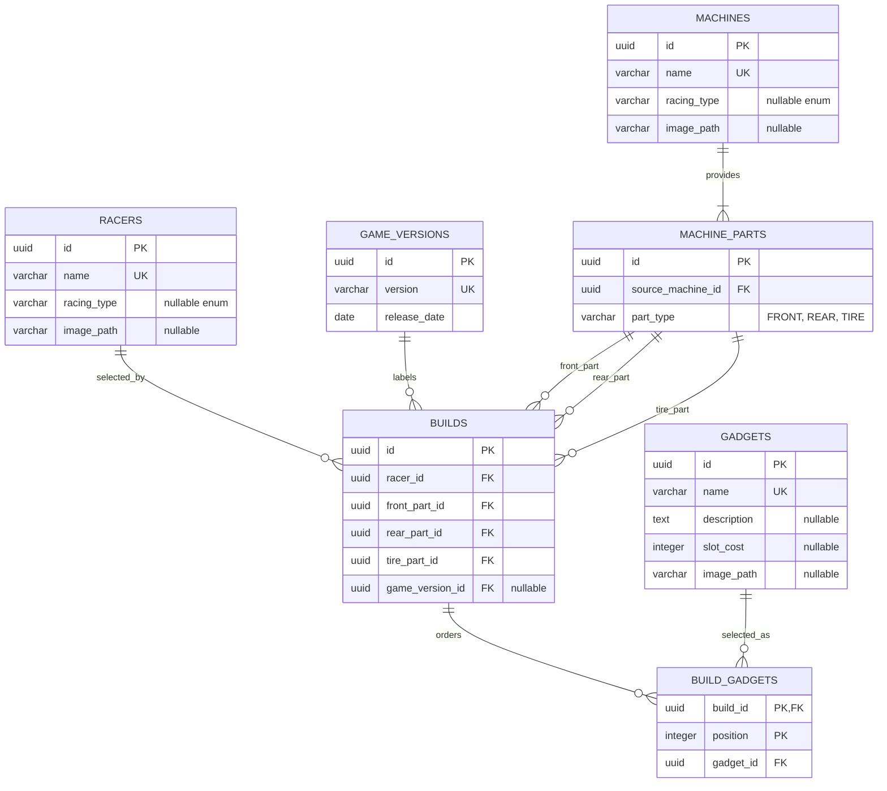

# Game-data schema

This is the implemented relational shape after Flyway V12. It shows the game catalog and the
build references that consume it; user, vote and comment details are intentionally abbreviated.

The current `machine_parts` rows identify selectable components and their source machine only.
They do not yet store the Wiki's front/back display labels or the five part statistics. Gadget
metadata is a current snapshot; it is not version-aware even though some costs and effects changed
between patches.

## Focused improvements

1. Add explicit part labels and five integer stat columns to `machine_parts`, then expose them in
   `MachinePartResponse`. This is the most useful next catalog improvement because mixed builds can
   then show both their generated machine name and calculated base statistics.
2. Add a small `gadget_versions` table keyed by `(gadget_id, game_version_id)` for effect text,
   slot cost and mode restrictions. Keep `gadgets` as stable identity/artwork and resolve rules for
   the build's selected patch.
3. Add provenance fields in a separate catalog-source table rather than embedding URLs in domain
   objects. Suggested fields are entity kind, entity ID, field name, source URL, checked date and a
   short evidence note.
4. Model restricted racers such as Super Sonic only after build context includes race mode. Adding
   him to the general picker now would incorrectly imply that he is valid in every mode.
