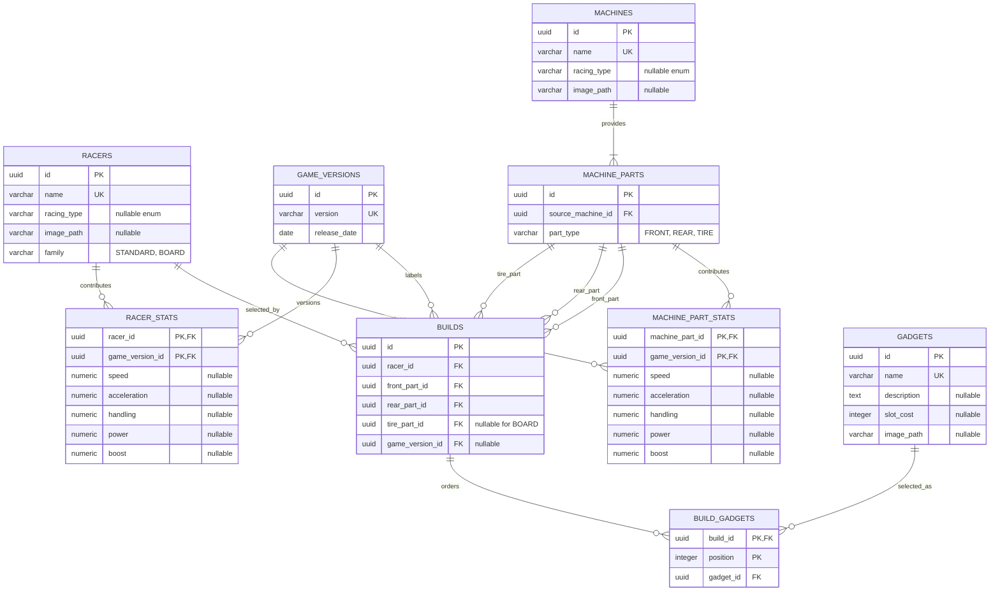

# Game-data schema

This is the implemented relational shape after Flyway V25. It shows the game catalog and the
build references that consume it; user, vote and comment details are intentionally abbreviated.

The current `machine_parts` rows identify selectable components and their source machine only.
They do not yet store the Wiki's front/back display labels. Five base stats live separately in
`machine_part_stats` and `racer_stats`, keyed by entity and game version. Decimal values are retained
without rounding. NULL is unknown, not zero; a missing historical row means all five values are
unknown. Catalog presence does not imply stat availability for every historical version.

V16 deliberately imports no numerical data because the source audit could not establish a verified
Ver. 1.3.1 snapshot. See [the record-level audit](stats-1.3.1-audit.md). V17 independently seeds the
available Ver. 1.4.1 community-sheet snapshot: 35 racers and all three parts for 52 machines.
V19 adds the sourced later-release rows. At the owner's direction, V22 copies that complete current
snapshot into the three older selectable versions because RingLab currently treats their values as
equal. These remain separate database rows, so a future patch can supply changed values without
altering historical builds. Blank and missing rows remain unknown. Future imports must use new
migrations, never modify earlier migrations. No 1.3.2 balance snapshot is seeded.

Base build stats sum racer + front + rear and, for Standard machines, tire per field; any unknown
contribution makes only that resulting field unknown. Standard stock-machine totals sum three
parts, while Board totals sum two; totals are never stored as an
independent value. Builds with no version have no assumed baseline. Missing stats do not affect
build validity or publishing. Base stats and gadget-modified/effective stats are distinct concepts;
numerical gadget effects are intentionally outside this implementation. Gadget
metadata is a current snapshot; it is not version-aware even though some costs and effects changed
between patches.

`MachineFamily` is authoritative source-machine metadata. V25 introduces the family column, and
V26 classifies the verified Extreme Gear catalog as `BOARD`, preserves its FRONT/REAR identifiers,
and removes the structurally invalid generated TIRE rows. Standard machines retain FRONT, REAR,
and TIRE. The application requires every selected part to share one family and rejects both a
missing Standard tire and any tire supplied for a Board.

## Focused improvements

1. Verify a dated historical source and per-part contributions before importing numerical data.
   Part labels and the Extreme Gear composition correction remain separate work.
2. Add a small `gadget_versions` table keyed by `(gadget_id, game_version_id)` for effect text,
   slot cost and mode restrictions. Keep `gadgets` as stable identity/artwork and resolve rules for
   the build's selected patch.
3. Add provenance fields in a separate catalog-source table rather than embedding URLs in domain
   objects. Suggested fields are entity kind, entity ID, field name, source URL, checked date and a
   short evidence note.
4. Model restricted racers such as Super Sonic only after build context includes race mode. Adding
   him to the general picker now would incorrectly imply that he is valid in every mode.
